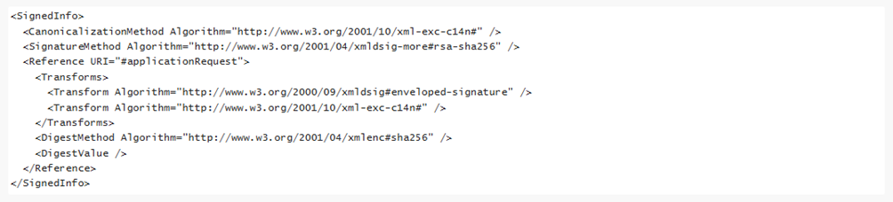
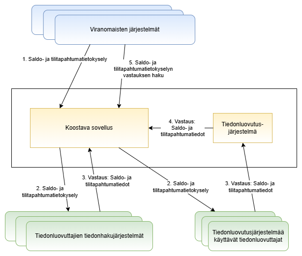

# Keskitetty saldo- ja tilitapahtumajärjestelmä

Tämä dokumentti on osa pankki- ja maksutilien valvontajärjestelmän dokumentaatiota ja ohjeistaa tiedonluovuttajia sekä tiedonhyödyntäjiä saldo- ja tilitapahtumatietojen välittämiseksi pankki- ja maksutilien valvontajärjestelmässä. Tässä dokumentissa kuvataan vaadittavat edellytykset järjestelmän toteuttamiseksi, saldo- ja tilitapahtumatietojen kulku järjestelmässä sekä saldo- ja tilitapahtumatietojen kysely- ja vastaussanomat.

Pankki- ja maksutilien valvontajärjestelmä välittää tiedonhyödyntäjille eli laissa säädetyille viranomaisille tietoa kansalaisten, yritysten ja yhteisöjen pankki-ja maksutileistä. Järjestelmä perustuu lakiin pankki- ja maksutilien valvontajärjestelmästä. Lakimuutos saldo- ja tilitapahtumatietokyselyiden sekä arvopaperitietokyselyiden keskittämisestä pankki- ja maksutilien valvontajärjestelmään tulee voimaan joulukuussa 2025.

Tiedonluovuttajat eli luottolaitokset, maksulaitokset, sähkörahayhteisöt ja kryptovarapalvelun tarjoajat luovuttavat asiakkaidensa pankki- ja maksutilitiedot joko pankki- ja maksutilirekisterin tai oman tiedonhakujärjestelmänsä kautta. Tulli ylläpitää koostavaa sovellusta, joka välittää viranomaisten tietopyynnöt pankki- ja maksutilirekisteriin ja tiedonhakujärjestelmiin sekä siirtää vastaanotetut tiedot viranomaiselle. Saldo- ja tilitapahtumakyselyt toimitetaan joko tiedonluovuttajan tiedonhakujärjestelmään tai suojatulla sähköpostilla tilirekisterin toimijoille. Kyselyihin vastataan joko tiedonluovutusjärjestelmän tai oman tiedonhakujärjestelmän kautta.

### Sisällysluettelo

[1. Yhteystiedot](#luku1)  
[2. Sanasto & lyhenteet](#luku2)  
[3. Varmenteet](#luku3)  
[4. Saldo- ja tilitapahtumatietokyselyn tiedonkulku](#luku4)  
[5. Business Application Header](#luku5)  
[6. Kyselysanoma](#luku6)  
[7. Vastaussanoma](#luku7)  
[8. Virhetilanteet](#luku8)  
[9. Koodisto](#luku9)

## 1. Yhteystiedot <a name="luku1"></a>

Sähköposti: [tilirekisteri@tulli.fi](mailto:tilirekisteri@tulli.fi).

## 2. Sanasto & lyhenteet <a name="luku2"></a>

| Termi    | Selite |
| -------- | ------- |
| Pankki- ja maksutilien valvontajärjestelmä | Kansallinen pankki- ja maksutilien valvontajärjestelmä, joka koostuu tilirekisteristä, tiedonhakujärjestelmistä ja 1.11.2022 alkaen koostavasta sovelluksesta, perustuu lakiin pankki- ja maksutilien valvontajärjestelmästä 571/2019 sekä Euroopan parlamentin ja neuvoston direktiiviin (EU) 2018/843, joka on annettu 30 päivänä toukokuuta 2018 rahoitusjärjestelmän käytön estämisestä rahanpesuun tai terrorismin rahoitukseen.|
| Keskitetty saldo- ja tilitapahtumatietojärjestelmä | Pankki- ja maksutilien valvontajärjestelmästä saatavien saldo- ja tilitapahtumatietojen sekä arvopaperitietojen käsittelytapa, joka perustuu sähköiseen tiedonkäsittelyyn.  |
| Pankki- ja maksutilirekisteri/Tilirekisteri | Pankki- ja maksutilirekisteri (tilirekisteri) on Tullin rakentama järjestelmä, joka koostuu Tilirekisterisovelluksesta ja sen päivitys- ja kyselyrajapinnoista. Tilirekisteriin kerätään maksulaitosten ja sähkörahayhteisöjen sekä Finanssivalvonnalta poikkeusluvan saaneiden luottolaitosten pankki- ja maksutilien asiakkaiden tiedot sekä kryptovarapalvelun tarjoajien asiakkaiden tiedot.  |
| Koostava sovellus | Tullin ylläpitämä automatisoitu tekninen ratkaisu, jonka avulla välitetään pankki- ja maksutilitietoja, tallelokerotietoja, saldo- ja tilitapahtumatietoja ja arvopaperitietoja pankki- ja maksutilien valvontajärjestelmän kautta.    |
| Tiedonhakujärjestelmä | Tiedonhakujärjestelmä tarkoittaa tiedonluovuttajan ylläpitämää sähköistä pankki- ja maksutilien tiedonhakujärjestelmää, jonka avulla tiedonluovuttaja välittää välittömästi ja salassapitosäännösten estämättä pankki- ja maksutilien valvontajärjestelmästä annetun lain 4 §:n 2 momentissa tarkoitettuja tietoja asiakkaistaan toimivaltaiselle viranomaiselle. Tulli määrää lain mukaan tiedonhakujärjestelmästä tekniset vaatimukset ja jokainen tiedonluovuttaja toteuttaa oman tiedonhakujärjestelmän, eli tiedonhakujärjestelmiä on monta.  |
| Tiedonhyödyntäjä | Pankki- ja maksutilien valvontajärjestelmää koskevassa laissa on määritelty toimivaltainen viranomainen ja asianajajayhdistys, joilla on oikeus tehdä kyselyjä pankki- ja maksutilien valvontajärjestelmään. Toimivalta määritellään ajantasaisessa lainsäädännössä.  |
| Tiedonluovuttaja | Tiedonluovuttajalla tarkoitetaan maksulaitosta,  sähkörahayhteisöä, luottolaitosta tai kryptovarapalvelun tarjoajaa, joka toimittaa laissa pankki- ja maksutilien valvontajärjestelmästä määriteltyjä tietoja Tullin ylläpitämän tilirekisterin päivitysrajapinnan kautta tai välittää vastaavia tietoja ylläpitämänsä tiedonhakujärjestelmän kautta. Tiedonluovuttajalla tarkoitetaan myös ulkomaisen maksulaitoksen, sähkörahayhteisön, luottolaitoksen ja virtuaalivaluutan tarjoajan Suomessa sijaitsevaa sivuliikettä. |
| Tiedonluovutusjärjestelmä | Järjestelmä, johon tilirekisteriin päivittävät tiedonluovuttajat toimittavat vastaussanoman saldo- ja tilitapahtumatietokyselyyn.  |
| Saldo |  Pankki- ja maksutilillä kyselyn vastaushetkellä oleva rahamäärä, josta on vähennetty mahdollinen katevaraus.  |
| Tilitapahtumatiedot | Yksityiskohtaisia tietoja toimista, jotka on suoritettu tiettynä ajanjaksona tietyn maksutilin tai IBAN-tilinumerolla yksilöidyn pankkitilin kautta, tai yksityiskohtaisia tietoja kryptovarojen siirroista (kts. pankki- ja maksutilien valvontajärjestelmästä annetun lain 2 §:n 15 kohta). |
| Lisäselvityspyyntö | Tiedonluovuttaja pyytää lisäselvitystä kyselyn tehneeltä viranomaiselta ennen tiedonluovutusta.  |
| Erikseen pyydettävät (lisä)tiedot | Tiedot, joita tiedonluovuttaja ei palauta vastaussanomassa ellei viranomainen erikseen pyydä niitä kyselysanomassaan.  |


## 3. Varmenteet <a name="luku3"></a>

Pankki- ja maksutilien valvontajärjestelmässä ulkoiset yhteydet suojataan varmenteilla. Tiedonluovuttajan tulee ilmoittaa Tullille, mitä varmenteita se käyttää. Varmenteiden tulee olla Tullin ohjeistuksen mukaisia. Tiedonluovuttajan tulee hankkia varmennevaatimukset täyttävät palvelin- ja järjestelmäallekirjoitusvarmenteet ja asentaa ne järjestelmiinsä. Sanomien allekirjoitukseen tarvitaan lisäksi allekirjoitusvarmenne. Teknisesti sama varmenne voi toimia sekä palvelin- että järjestelmäallekirjoitusvarmenteena tai varmenteet voivat olla erillisiä. Tyypillisesti palvelinvarmenne asennetaan tietoliikenneyhteyksiä hoitavaan edustapalvelimeen ja allekirjoitusvarmenne vastaukset muodostavaan taustapalvelimeen.

<details>
<summary>Tiedonhakujärjestelmän varmenteet</summary>
<br>

| Standardi    | Varmenteen nimi |  Käyttötarkoitus  |    
| -------- | ------- | ------- |  
| X.509 (versio 3) | Tiedonhakujärjestelmän tietoliikennevarmenne|  Rajapinnan hyödyntäjän ja tiedonluovuttajan tai tiedonluovuttajan valtuuttaman tahon tunnistaminen  |  
| X.509 (versio 3) | 	Tiedonhakujärjestelmän allekirjoitusvarmenne  |  Sanoman allekirjoittaminen, sanoman muuttumattomuuden varmistaminen, tiedonluovuttajan tunnistaminen  |  

Tiedonhakujärjestelmän kyselyrajapinnan hyödyntäjät sekä tiedonluovuttajat tai tiedonluovuttajan valtuuttamat tahot tunnistetaan X.509-varmenteilla (Tietoliikennevarmenne). Kyselyrajapinnan kysely- ja vastaussanomat allekirjoitetaan XML-allekirjoituksella (Allekirjoitusvarmenne).
</details>

### 3.1 Tiedonluovuttajan allekirjoitusvarmenne <a name="3-1"></a>

Tiedonluovuttajan on allekirjoitettava lähettämänsä sanomat käyttäen x.509 palvelinvarmennetta, josta käy ilmi ko. tiedonluovuttajan Y-tunnus tai ALV-tunnus. Tiedonhakujärjestelmän toteuttajien on myös tarkistettava saapuvien sanomien allekirjoitus. Vastaanottaja ei saa hyväksyä sanomaa ilman hyväksyttävää allekirjoitusta. Allekirjoituksen hyväksyminen edellyttää, että XML-allekirjoitus on validi (kun kyseessä tiedonhakujärjestelmä) ja että
joko   
a) varmenne on Digi- ja väestötietoviraston (DVV) myöntämä, voimassa, eikä esiinny DVV:n ylläpitämällä sulkulistalla ja varmenteen kohteen serialNumber attribuuttina on kyseisen tiedonluovuttajan Y-tunnus tai ALV-tunnus  
tai  
b) varmenne on eIDAS-hyväksytty sivustojen tunnistamisvarmenne, voimassa, eikä esiinny varmenteen tarjoajan ylläpitämällä ajantasaisella sulkulistalla ja varmenteen kohteen organizationIdentifier-attribuuttina on kyseisen tiedonluovuttajan Y-tunnus tai ALV-tunnus.

Huom. Jotta sanomien allekirjoitukset täyttävät alla viitatut Kyberturvallisuuskeskuksen tietoturvavaatimukset, tulee allekirjoituksiin käytettävän varmenteen julkisen avaimen (RSA public key) olla vähintään 3072 bittinen. Allekirjoituksiin käytettävän varmenteen käyttötarkoituksiin myös kuulua ”digitaalinen allekirjoitus”. Nämä seikat tulee huomioida varmennetta tilattaessa.

<details>
<summary>Toimivaltaisen viranomaisen allekirjoitusvarmenne</summary>
<br> 

Toimivaltaisen viranomaisen on allekirjoitettava lähettämänsä sanomat käyttäen x.509 palvelinvarmennetta, josta käy ilmi ko. viranomaisen Y-tunnus. Saapuvien sanomien allekirjoitus on tarkistettava. Vastaanottaja ei saa hyväksyä sanomaa ilman hyväksyttävää allekirjoitusta. Toimivaltaisen viranomaisen allekirjoituksen hyväksyminen edellyttää, että XML-allekirjoitus on validi ja että  
a) varmenne on DVV:n myöntämä, voimassa, eikä esiinny DVV:n ylläpitämällä sulkulistalla  
b) varmenteen kohteen serialNumber attribuuttina on sanoman lähettäneen toimivaltaisen viranomaisen Y-tunnus tai tunnus, joka muodostuu kirjaimista “FI” ja Y-tunnuksen numero-osasta ilman väliviivaa (ALV-tunnuksen muotoinen tunnus).

</details>

<details>
<summary> Tiedonhakujärjestelmän yhteydenottajan tietoliikennevarmenne </summary>
<br> 

Tiedonluovuttaja tai tiedonluovuttajan valtuuttama taho tunnistaa toimivaltaisen viranomaisen, joka ottaa yhteyden tiedonhakujärjestelmän kyselyrajapintaan, palvelinvarmenteen avulla. Yhteys toimivaltaiselta viranomaiselta on hyväksyttävä seuraavin edellytyksin:     
a) Toimivaltaisen viranomaisen varmenteen on myöntänyt DVV  
b) varmenne on voimassa, eikä esiinny DVV:n sulkulistalla  
c) varmenteen kohteen serialNumber attribuuttina on toimivaltaisen viranomaisen tai sen puolesta toimivan valtion palvelukeskuksen Y-tunnus tai tunnus, joka muodostuu kirjaimista “FI” ja Y-tunnuksen numero-osasta ilman väliviivaa (ALV-tunnuksen muotoinen tunnus).  

Huom. Jotta tietoliikenteen suojaus täyttää alla viitatut Kyberturvallisuuskeskuksen tietoturvavaatimukset, tulee käytettävän varmenteen julkisen avaimen (RSA public key) olla vähintään 3072 bittinen. Lisäksi varmenteen tulee olla QWAC (Qualified Website Authentication Certificate) tyyppinen palvelinvarmenne, joka sisältää laajennukset (X509v3 Extended Key Usage: TLS Web Client Authentication, TLS Web Server Authentication). Nämä tulee huomioida varmennetta tilattaessa.

</details>

### 3.2 Tiedonluovuttajan tai tiedonluovuttajan valtuuttaman tahon tietoliikennevarmenne <a name="3-2"></a>

Tietoliikenne on suojattava (salaus ja vastapuolen tunnistus) x.509 (versio 3) varmenteita käyttäen.
Tiedonhakujärjestelmän ollessa kyseessä toimivaltainen viranomainen, joka ottaa yhteyden kyselyrajapintaan, tunnistaa tiedonluovuttajan tai tiedonluovuttajan valtuuttaman tahon palvelinvarmenteen avulla.

Yhteyden muodostukseen on käytettävä palvelinvarmennetta, josta käy ilmi ko. tiedonluovuttajan tai tiedonluovuttajan valtuuttaman tahon Y-tunnus tai ALV-tunnus. Tiedonluovuttajan valtuuttamalla taholla tarkoitetaan esim. palvelukeskusta, jonka tiedonluovuttaja on valtuuttanut puolestaan huolehtimaan ilmoitusten muodostamisesta ja/tai lähettämisestä. Tätä koskeva valtuutus on toimitettava Tullille kirjallisesti.

Allekirjoituksen hyväksyminen edellyttää, että
joko  
a) palvelinvarmenteen on myöntänyt DVV, varmenne on voimassa, eikä esiinny DVV:n sulkulistalla, varmenteen kohteen serialNumber attribuuttina on kyseisen tiedonluovuttajan tai tiedonluovuttajan valtuuttaman tahon Y-tunnus tai ALV-tunnus  
tai  
b) palvelinvarmenne on eIDAS-hyväksytty sivustojen tunnistamisvarmenne, voimassa, eikä esiinny varmenteen tarjoajan ylläpitämällä ajantasaisella sulkulistalla ja varmenteen kohteen organizationIdentifier-attribuuttina on kyseisen tiedonluovuttajan tai tiedonluovuttajan valtuuttaman tahon Y-tunnus tai ALV-tunnus.
Mikäli tiedonluovuttajan palvelinvarmenteessa ja lähtevän sanoman allekirjoitusvarmenteessa käytetään samaa Y-tunnusta tai ALV-tunnusta, voidaan kumpaankin tarkoitukseen käyttää samaa varmennetta.

Huom. Jotta tietoliikenteen suojaus täyttää alla viitatut Kyberturvallisuuskeskuksen tietoturvavaatimukset, tulee käytettävän varmenteen julkisen avaimen (RSA public key) olla vähintään 3072 bittinen. Lisäksi varmenteen tulee olla QWAC (Qualified Website Authentication Certificate) tyyppinen palvelinvarmenne, joka sisältää laajennukset (X509v3 Extended Key Usage: TLS Web Client Authentication, TLS Web Server Authentication). Nämä tulee huomioida varmennetta tilattaessa.

<details>
<summary>XML-allekirjoituksen muodostaminen <a name="xml-allekirjoitus"></a></summary>
<br>

Allekirjoituksen tyyppi on enveloped signature. Signature-elementti sijoitetaan [BAHin](#luku5) Sgntr-elementin alle.

Esimerkki SignedInfo
 

Allekirjoitusalgoritmi on RSA-SHA256 tai RSA-SHA512 ja C14N on Exclusive XML Canonicalization. Reference URI on joko "#applicationRequest" tai "#applicationResponse", riippuen onko kyseessä kysely- vai vastaussanoma. Eli vain "ApplicationRequest" tai "ApplicationResponse" elementti allekirjoitetaan. Allekirjoitusta muodostettaessa laskettavien tiivisteiden (Digest) muodostamiseen tulee käyttää SHA256- tai SHA512 -algoritmia. Huom. Kun kyseessä on vastaussanoma, sen tulee sisältää siihen liittyvän kyselysanoman BusinessApplicationHeaderin (Rltd-elementti), jonka tulee myös olla allekirjoitettu.

Allekirjoituksessa käytettyjen kryptografisten algoritmien on vastattava kryptografiselta vahvuudeltaan vähintään Viestintäviraston määrittelemiä kryptografisia vahvuusvaatimuksia kansalliselle suojaustasolle TL IV. Tämänhetkiset vahvuusvaatimukset on kuvattu dokumentissa https://www.kyberturvallisuuskeskus.fi/sites/default/files/media/regulation/ohje-kryptografiset-vahvuusvaatimukset-kansalliset-suojaustasot.pdf (Dnro: 190/651/2015).

</details>

### 3.3 Yhteyksien suojaaminen <a name="3-3"></a>

Tilirekisterin päivitysrajapinnan ja tiedonhakujärjestelmän kyselyrajapinnan yhteydet on suojattava TLS-salauksella käyttäen TLS-protokollan versiota 1.2 tai korkeampaa. Yhteyden molemmat päät tunnistetaan yllä kuvatuilla palvelinvarmenteilla käyttäen kaksisuuntaista kättelyä. Yhteys on muodostettava käyttäen ephemeral Diffie-Hellman (DHE) avaintenvaihtoa, jossa jokaiselle sessiolle luodaan uusi uniikki yksityinen salausavain. Tämän menettelyn tarkoituksena on taata salaukselle forward secrecy -ominaisuus, jotta salausavaimen paljastuminen ei jälkikäteen johtaisi salattujen tietojen paljastumiseen.
TLS-salauksessa käytettyjen kryptografisten algoritmien on vastattava kryptografiselta vahvuudeltaan vähintään Traficomin määrittelemiä kryptografisia vahvuusvaatimuksia kansalliselle suojaustasolle TL IV. Tämänhetkiset vahvuusvaatimukset on kuvattu dokumentissa https://www.kyberturvallisuuskeskus.fi/sites/default/files/media/regulation/ohje-kryptografiset-vahvuusvaatimukset-kansalliset-suojaustasot.pdf (Dnro: 190/651/2015).

### 3.4 Sallittu HTTP-versio <a name="3-4"></a>

Tilirekisterin päivitysrajapinnan ja tiedonhakujärjestelmän kyselyrajapinnan yhteydet käyttävät HTTP-protokollan versiota 1.1.

### 3.5 Varmenteiden hankinta <a name="3-5"></a>

Varmenteet hakee se taho, joka muodostaa ja välittää vastaukset tiedonhyödyntäjien kyselyihin. Jos käytetään palveluntarjoajaa, joka muodostaa ja välittää sanomat ilmoitusvelvollisen puolesta, palvelinvarmennetta hakee palveluntarjoaja. Tällöin ilmoitusvelvollisen tulee valtuuttaa palveluntarjoaja allekirjoittamaan lähetettävät sanomat.
Mikäli varmenteeseen liittyvä yksityinen avain paljastuu tai sen epäillään joutuneen vääriin käsiin, tulee varmenteen haltijan huolehtia siitä, että varmenne suljetaan välittömästi ja tästä ilmoitetaan Tullille ilman viivytystä. Vastaavasti mikäli varmenne myönnetään vahingossa tai vilpillisesti väärälle taholle, tulee varmenteen oikean kohteen huolehtia siitä, että varmenne suljetaan ja tästä ilmoitetaan Tullille välittömästi varmenteen oikean kohteen tultua tietoiseksi asiasta.

### 3.6 Varmenteiden päivitys <a name="3-6"></a>

Tiedonluovuttajan tulee uusia varmenne hyvissä ajoin ennen sen vanhenemista. Vanhentunutta varmennetta ei voi käyttää. 
Ellei muuta ole sovittu, uusi tai uusittu varmenne tulee toimittaa Tullille sähköisesti kiistämätöntä ja tietoturvallista tiedonsiirtomenetelmää käyttäen viimeistään 1 kk ennen sen käyttöönottoa. Varmenne tulee lähettää Tullin turvasähköpostipalvelua (https://turvaviesti.tulli.fi/) käyttäen osoitteeseen tilirekisteri@tulli.fi.
Pankki- ja maksutilien valvontajärjestelmän laissa pykälässä 8 §:n Tullilla on oikeus saada tiedot maksuttomasti, ja näin ollen tiedonluovuttaja vastaa käyttämänsä varmenteen kustannuksista.

### 3.7 Tietoturvapoikkeamien ilmoitusvelvollisuus <a name="3-7"></a>

Tilirekisterin rajapinnan käyttäjä on velvollinen ilmoittamaan viivytyksettä käyttämiensä varmenteiden tai näiden salaisten avainten vaarantumisesta sekä varmenteen myöntäjälle, että Tullille. Rajapinnan käyttäjä on velvollinen ilmoittamaan viivytyksettä Tullille myös, mikäli rajapintaa käyttävässä tietojärjestelmässä havaitaan tietoturvapoikkeama.
Mikäli tiedonhakujärjestelmän toteuttajan varmenteet tai näiden salaiset avaimet vaarantuvat on tästä ilmoitettava välittömästi varmenteen myöntäjälle ja niille toimivaltaisille viranomaisille, jotka hyödyntävät tiedonhakujärjestelmää. Toimivaltaisille viranomaisille on ilmoitettava myös, jos tiedonhakujärjestelmässä havaitaan tietoturvapoikkeama.
Mikäli tiedonhakujärjestelmää hyödyntävän toimivaltaisen viranomaisen varmenteet tai näiden salaiset avaimet vaarantuvat on tästä ilmoitettava välittömästi varmenteen myöntäjälle ja niille tiedonhakujärjestelmän toteuttajille, joiden toteutusta tiedonhakujärjestelmästä kyseinen toimivaltainen viranomainen hyödyntää.

## 4. Saldo- ja tilitapahtumatietokyselyn tiedonkulku <a name="luku4"></a>

Allaolevassa kuvassa on esitetty yleiskuva saldo- ja tilitapahtumatietokyselyn tiedonkulusta pankki- ja maksutilien valvontajärjestelmässä.

  

1. Viranomaisen järjestelmä lähettää saldo- ja tilitapahtumatietokyselyn koostavan sovelluksen [kyselyrajapintaan](https://github.com/FinnishCustoms-SuomenTulli/account-register-aggregating-application/blob/main/index.md#kyselyrajapinta-kysely). Kyselysanoman sisältö on kuvattu luvussa [Kyselysanoma](#luku6). 
2. Koostava sovellus välittää saldo- ja tilitapahtumatietokyselyn toimijalle, jolle kysely on suunnattu joko rajapinnan kautta tiedonhakujärjestelmään tai turvasähköpostilla tiedonluovutusjärjestelmää käyttävälle toimijalle.  
3. Tiedonluovuttaja vastaa saldo- ja tilitapahtumatietokyselyyn viimeistään seuraavan pankkipäivän aikana. Jos kysely on osoitettu tiedonhakujärjestelmän toteuttaneelle toimijalle, tiedonhakujärjestelmä lähettää vastaussanoman koostavalle sovellukselle rajapinnan kautta. Jos kysely on osoitettu tiedonluovutusjärjestelmää käyttävälle toimijalle, tämä toimittaa vastaussanoman tiedonluovutusjärjestelmään.     
4. Vastaussanoma välittyy tiedonluovutusjärjestelmästä koostavaan sovellukseen.  
5. Viranomainen hakee vastauksen saldo- ja tilitapahtumatietokyselyynsä koostavan sovelluksen rajapinnasta. Vastauksen haussa käytetään koostavan sovelluksen [status](https://github.com/FinnishCustoms-SuomenTulli/account-register-aggregating-application/blob/main/index.md#kyselyrajapinta-status) ja [tulosrajapintoja](https://github.com/FinnishCustoms-SuomenTulli/account-register-aggregating-application/blob/main/index.md#kyselyrajapinta-tulos).

### 4.1 Ohjeita tiedonluovuttajille <a name="4-1"></a>

Saldo- ja tilitapahtumatietokyselyihin on vastattava viipymättä, mutta viimeistään seuraavana pankkipäivänä virka-ajan päättymiseen eli kello 16:15 (EET) mennessä. Mikäli kysely ei tule virka-ajan puitteissa eli kello 8:00-16:15 välillä, määräajan laskenta alkaa seuraavasta pankkipäivästä. Esimerkiksi, jos viranomainen lähettää kyselyn perjantaina kello 18:00, vastaus tulee toimittaa viimeistään seuraavaan tiistaihin kello 16:15 mennessä.

Kun kyseessä on vain saldokysely, vastaus tulee pyrkiä toimittamaan välittömästi. Viimeistään vastaus tulee toimittaa seuraavan pankkipäivän päättymiseen mennessä. Annetun saldotiedon tulee koskea tiedonluovuttajan vastausajankohdan saldoa. Saldotietoa koskevassa vastauksessa tulee olla aikaleima, joka tarkentaa saldon ajankohdan. Saldokyselyissä vakiomuotoisesti pyydetään tilinumeron lisäksi tilillä oleva rahamäärä ja tilin saldoa koskeva päivämäärä ja kellonaika (laki pankki-ja maksutilien valvontajärjestelmästä 17 b §). Tilin saldossa tulee olla huomioitu mahdolliset tiliä koskevat katevaraukset, joiden tulee olla vähennetty tilin saldotiedosta. Poikkeustilanteissa voidaan kysellä myös lisätiedot. Mikäli saldokyselyyn sisältyy lisätietopyyntö, tulee se käsitellä erikseen kaikkien pyydettyjen tietojen toimittamiseksi.

Asianajajan asiakasvaratilien ollessa kyseessä, saldo- ja tilitapahtumatietoja ei palauteta. Asiakasvaratilillä tarkoitetaan asianajajan tai hänen toimistonsa hallussa olevia muille kuin asianajajalle tai hänen toimistolleen kuuluvien raha- ja muiden varojen tilejä. Asianajajan asiakasvaratilejä koskevia saldo- ja tilitapahtumatietoja ei saa luovuttaa keskitetyn sähköisen saldo- ja tilitapahtumajärjestelmän kautta (laki pankki-ja maksutilien valvontajärjestelmästä 17 b § ja 17 d §). Asiakasvaratilin saldo- ja tilitapahtumatietojen selvittämiseksi toimivaltaisen viranomaisen tulisi olla yhteydessä tilin haltijana toimivaan asianajajaan.

Saldo- ja tilitapahtumakyselyitä ei voi tehdä kansainvälisinä kyselyinä.

#### Tiedonluovutusjärjestelmään raportoivat toimijat

Tilirekisteriin päivittäville tiedonluovuttajille saldo- ja tilitapahtumatietokysely toimitetaan suojatulla sähköpostilla (kts. [esimerkkisähköposti](assets/Example_email.png)). Pyyntösanoma on sähköpostin liitteenä XML-muodossa. Mikäli saldo- ja tilitapahtumakyselyn käsittelyssä tulee virhetilanne, tietoja ei jostain syystä löydykään tai kysely menee lisäselvityspyyntöön, tulee rajapintaan toimittaa vastaus ja ilmoittaa kunkin tilanteen mukainen tieto. Vastaus kyselyyn tulee toimittaa XML-muotoisena sanomana Tullin rajapintaan.

Mikäli jostain syystä tietoja haun kohteesta ei löydykään, tiedonluovuttajan tulee vastata kyselyyn NFOU-statuskoodilla.

### 4.2 Lisäselvityspyyntö <a name="4-2"></a>

Jos tiedonluovuttaja katsoo vastaanottamansa kyselyn sellaiseksi, että se tarvitsee lisäselvitystä, voi tiedonluovuttaja palauttaa kyselyyn NRES-statuskoodin (käsittely kesken) ja ottaa suoraan yhteyttä kyselyn lähettäneeseen viranomaiseen pyytääkseen lisätietoja. Lisäselvityspyyntöä varten viranomainen lähettää aina kyselysanoman headerin Fr/OrgId/CtctDtls -elementissä yhteystiedot (nimi, puhelinnumero, sähköposti). 

Tiedonluovuttaja vastaa alkuperäiseen kyselyyn lisäselvityksen käsittelyn jälkeen, jos se on aikarajojen puitteissa mahdollista. Jos kyselyyn ei ehditä vastata aikarajan puitteissa, voi viranomainen tarvittaessa tehdä uuden kyselyn, johon tiedonluovuttaja vastaa sovitusti. Jos tiedonluovuttaja on vastannut kyselyyn NRES, koostava sovellus yrittää uudelleennoutaa vastauksen tiedonluovuttajalta tiedonluovutuksen aikarajan loppuun asti. Tiedonluovutuksen aikarajan umpeuduttua kysely suljetaan.

Esimerkki yhteystietojen välittämisestä: [Esimerkkisanoma](examples/general/example_passing_sender_details.xml)

## 5. Business Application Header <a name="luku5"></a>

ISO 20022 standardin mukainen BusinessApplicationHeaderV01 [head.001.001.01](schemas/head.001.001.01.xsd) sanoma liitetään sekä kysely- että vastaussanomaan. Kenttien käyttö on muutoin samanlaista kysely- ja vastaussanomassa, paitsi kyselysanomassa tulee lähettää yhteystiedot mahdollista lisäselvityspyyntöä varten.

Sanoman Fr-kentän lähettäjätiedoissa on viranomaisen lähettämässä sanomassa viranomaisen tiedot, tiedonluovuttajan lähettämässä sanomassa tiedonluovuttajan tiedot ja Tullin välittämissä sanomissa Tullin tiedot. Vastaavasti To-kentän vastaanottajatiedoissa on Tullin tiedot, kun lähetetään sanoma koostavaan sovellukseen, ja sanoman vastaanottavan viranomaisen tai tiedonluovuttajan tiedot, kun koostava sovellus välittää sanoman eteenpäin.

<table>
  <colgroup><col /><col /><col /><col /></colgroup>
  <tbody>
    <tr>
      <th>Elementin nimi</th>
      <th >min..max</th>
      <th >Tyyppi</th>
      <th >Kuvaus</th>
    </tr>
    <tr>
      <td >BusinessApplicationHeaderV01</td>
      <td >1..1</td>
      <td ></td>
      <td ></td>
    </tr>
    <tr>
      <td >BusinessApplicationHeaderV01<br>
      +Charset
      </td>
      <td >0..1</td>
      <td >UnicodeChartsCode</td>
      <td >"UTF-8"</td>
    </tr>
    <tr>
      <td >BusinessApplicationHeaderV01<br>
      +Fr<br>
      ++OrgId<br>
      +++Id<br>
      ++++OrgId<br>
      +++++Othr<br>
      ++++++Id
      </td>
      <td >1..1</td>
      <td >Max35Text</td>
      <td >Lähettäjän Y-tunnus. Kun tunnusta verrataan sanoman allekirjoitusvarmenteeseen, tulee ottaa huomioon, että varmenteen sisältämä tunnus voi olla joko Y- tai ALV-tunnuksen muodossa.</td>
    </tr>
    <tr>
      <td >BusinessApplicationHeaderV01<br>
      +Fr<br>
      ++OrgId<br>
      +++Id<br>
      ++++OrgId<br>
      +++++Othr<br>
      ++++++SchmeNm<br>
      +++++++Cd
      </td>
      <td >1..1</td>
      <td >ExternalOrganisationIdentification1Code</td>
      <td >"Y", organisaatiotunnuksen tyyppi</td>
    </tr>
    <tr>
      <td >BusinessApplicationHeaderV01<br>
      +Fr<br>
      ++OrgId<br>
      +++CtctDtls<br>
      ++++Nm
      </td>
      <td >0..1</td>
      <td >Max140Text</td>
      <td >Vain viranomaisen kyselysanomassa: Henkilön nimi mahdollista lisäselvityspyyntöä varten</td>
    </tr>
    <tr>
      <td >BusinessApplicationHeaderV01<br>
      +Fr<br>
      ++OrgId<br>
      +++CtctDtls<br>
      ++++PhneNb
      </td>
      <td >0..1</td>
      <td >PhoneNumber</td>
      <td >Vain viranomaisen kyselysanomassa: Puhelinnumero mahdollista lisäselvityspyyntöä varten</td>
    </tr>
    <tr>
      <td >BusinessApplicationHeaderV01<br>
      +Fr<br>
      ++OrgId<br>
      +++CtctDtls<br>
      ++++EmailAdr
      </td>
      <td >0..1</td>
      <td >Max2048Text</td>
      <td >Vain viranomaisen kyselysanomassa: Sähköpostiosoite mahdollista lisäselvityspyyntöä varten</td>
    </tr>
    <tr>
      <td >BusinessApplicationHeaderV01<br>
      +To<br>
      ++OrgId<br>
      +++Id<br>
      ++++OrgId<br>
      +++++Othr<br>
      ++++++Id
      </td>
      <td >1..1</td>
      <td >Max35Text</td>
      <td >Vastaanottajan Y-tunnus</td>
    </tr>
    <tr>
      <td >BusinessApplicationHeaderV01<br>
      +To<br>
      ++OrgId<br>
      +++Id<br>
      ++++OrgId<br>
      +++++Othr<br>
      ++++++SchmeNm<br>
      +++++++Cd
      </td>
      <td >1..1</td>
      <td >ExternalOrganisationIdentification1Code</td>
      <td >"Y", organisaatiotunnuksen tyyppi</td>
    </tr>
    <tr>
      <td >BusinessApplicationHeaderV01<br>
      +BizMsgIdr
      </td>
      <td >1..1</td>
      <td >Max35Text</td>
      <td >Käyttö standardin mukaisesti</td>
    </tr>
    <tr>
      <td >BusinessApplicationHeaderV01<br>
      +MsgDefIdr
      </td>
      <td >1..1</td>
      <td >Max35Text</td>
      <td >Sanoma-id, kyselysanomassa "auth.001.001.01" ja vastaussanomassa "auth.002.001.01"</td>
    </tr>
    <tr>
      <td >BusinessApplicationHeaderV01<br>
      +CreDt
      </td>
      <td >1..1</td>
      <td >ISONormalisedDateTime</td>
      <td >Luomispäivämäärä ja aika. Normalisoitava Z-notaatiolla (UTC)</td>
    </tr>
    <tr>
      <td >BusinessApplicationHeaderV01<br>
      +Sgntr
      </td>
      <td >0..1</td>
      <td >SignatureEnvelope</td>
      <td >
        
Lähettäjän muodostama [XML-allekirjoitus](#xml-allekirjoitus)        
      </td>
    </tr>
    <tr>
      <td >BusinessApplicationHeaderV01<br>
      +Sgntr<br>
      ++Signature<br>
      +++SignatureValue
      </td>
      <td >1..1</td>
      <td >SignatureValueType</td>
      <td >Allekirjoitus</td>
    </tr>
    <tr>
      <td >BusinessApplicationHeaderV01<br>
      +Sgntr<br>
      ++Signature<br>
      +++KeyInfo<br>
      ++++X509Data<br>
      +++++X509Certificate
      </td>
      <td >1..1</td>
      <td >base64Binary</td>
      <td >Sertifikaatti</td>
    </tr>
  </tbody>
</table>

## 6. Kyselysanoma <a name="luku6"></a>

Kyselysanomassa käytetään ISO 20022 sanomaa InformationRequestOpeningV01 [auth.001.001.01](schemas/auth.001.001.01.xsd). InformationRequestOpeningV01 sanoman supplementary data -osiossa käytetään kansallista InformationRequestFIN012 (fin.012.001.04) sanomalaajennosta.

Alla luvussa 6.2 on kuvattu, mitä kenttiä käytetään kyselysanomassa. Alisanoman [fin.012.001.04](schemas/fin.012.001.04.xsd) skeema. Esimerkkejä [kyselysanomasta](examples/queries_and_responses/).

### 6.1 Erityyppisten tietojen hakeminen <a name="6-1"></a>

Keskitetystä saldo- ja tilitapahtumatietojärjestelmästä on mahdollista hakea pelkkiä saldotietoja, pelkkiä tilitapahtumatietoja, tai molempia.

[Esimerkkisanoma](examples/general/example_requesting_only_bal_or_entry_or_both.xml) saldo- ja tilitapahtumatietojen kyselystä.

#### Pelkkien tilitapahtumatietojen haku

Käytetään ajantasaisten tilitapahtumatietojen noutamiseen. Sisältää myös keskeneräiset tapahtumat [Tapahtuman tila: "kesken"]

Vastauksen mukana välitetään aina kaikki muut tiedot, paitsi saldoon (bal-elementti) kuuluvat kentät ja erikseen pyydettävät tiedot.

Pelkkiä tilitapahtumatietoja kyseltäessä sanomaan sisällytetään investigationTypeCode: TRAN. 

#### Pelkkien saldotietojen haku

Käytetään luovutushetken saldotietojen noutamiseen. 

Vastauksen mukana välitetään aina kaikki muut tiedot, paitsi tilitapahtumatietoja (entry-elementti) sisältävät kentät ja erikseen pyydettävät tiedot.

Pelkkiä saldotietoja kyseltäessä sanomaan sisällytetään investigationTypeCode: BALN. Pelkkiä saldotietoja kyseltäessä hakuaikavälin (InvstgtnPrd) sekä alkamispäivä (FrDt) että päättymispäivä (ToDt) ovat kuluva päivä.

#### Saldo- ja tilitapahtumatietojen haku

Käytetään hakuaikavälin tilitapahtumatietojen sekä aikavälin alku- ja loppuhetken saldotiedon noutamiseen. Sisältää myös keskeneräiset tapahtumat [Tapahtuman tila: "kesken"]

Vastauksen mukana välitetään aina kaikki muut tiedot paitsi erikseen pyydettävät tiedot.

Saldo- ja tilitaphtumatietoja kyseltäessä sanomaan sisällytetään erillisinä elementteinä investigationTypeCode: TRAN ja investigationTypeCode: BALN.

### 6.2 InformationRequestOpeningV01 sanoman sisältö <a name="6-2"></a>

<table>
  <colgroup><col /><col /><col /><col /></colgroup>
  <tbody>
    <tr>
      <th>Elementin nimi</th>
      <th >min..max</th>
      <th >Tyyppi</th>
      <th >Kuvaus</th>
    </tr>
    <tr>
      <td >InformationRequestOpeningV01</td>
      <td >1..1</td>
      <td ></td>
      <td ></td>
    </tr>
    <tr>
      <td >
        InformationRequestOpeningV01<br>
        +InvstgtnId
      </td>
      <td >1..1</td>
      <td >Max35Text</td>
      <td >Tapauksen tunniste</td>
    </tr>
    <tr>
      <td >
        InformationRequestOpeningV01<br>
        +LglMndBsis<br>
        ++Prgrph
      </td>
      <td >1..1</td>
      <td >Max35Text</td>
      <td >Laillisuusperuste</td>
    </tr>
    <tr>
      <td >
        InformationRequestOpeningV01<br>
        +LglMndBsis<br>
        ++Dsclmr
      </td>
      <td >0..1</td>
      <td >Max350Text</td>
      <td >Laillisuusperusteen kuvaus</td>
    </tr>
    <tr>  
      <td >
        InformationRequestOpeningV01<br>
        +CnfdtltySts
      </td>
      <td >1..1</td>
      <td >YesNoIndicator</td>
      <td >aina "true"</td>
    </tr>
    <tr>
      <td >
        InformationRequestOpeningV01<br>
        +InvstgtnPrd<br>
        ++Dt<br>
        +++FrDt
      </td>
      <td >1..1</td>
      <td >ISODate</td>
      <td >Hakuaikavälin alkamispäivä. Pelkkää saldoa kyseltäessä aina kuluva päivä.</td>
    </tr>
    <tr>
      <td >
        InformationRequestOpeningV01<br>
        +InvstgtnPrd<br>
        ++Dt<br>
        +++ToDt
      </td>
      <td >1..1</td>
      <td >ISODate</td>
      <td >Hakuaikavälin päättymispäivä. Pelkkää saldoa kyseltäessä aina kuluva päivä.</td>
    </tr>
    <tr>
      <td >
        InformationRequestOpeningV01<br>
        +SchCrit<br>
        ++Acct<br>
        +++Id<br>
        ++++Id<br>
        +++++IBAN
      </td>
      <td >0..1</td>
      <td >IBAN2007Identifier</td>
      <td >Haettavan tilin IBAN-muotoinen tilinumero.<br>
      Käytetään kun hakukohteena olevalla tilillä on IBAN-muotoinen tilinumero.
      </td>
    </tr>
    <tr>
      <td >
        InformationRequestOpeningV01<br>
        +SchCrit<br>
        ++Acct<br>
        +++Id<br>
        ++++Id<br>
        +++++Othr<br>
        ++++++Id
      </td>
      <td >1..1</td>
      <td >Max34Text</td>
      <td >Haettavan tilin tilinumero, jos kyseessä ei ole IBAN-tili.</td>
    </tr>
    <tr>
      <td >
        InformationRequestOpeningV01<br>
        +SchCrit<br>
        ++Acct<br>
        +++Id<br>
        ++++Id<br>
        +++++Othr<br>
        ++++++SchmeNm<br>
        +++++++Cd
      </td>
      <td >1..1</td>
      <td >ExternalAccountIdentification1Code</td>
      <td >"OTHR", jos hakukohteena ei ole IBAN-tili</td>
    </tr>
    <tr>
      <td >
        InformationRequestOpeningV01<br>
        +SchCrit<br>
        ++Acct<br>
        +++InvstgtdPties<br>
        ++++Cd
      </td>
      <td >1..1</td>
      <td >InvestigatedParties1Choice</td>
      <td >"ALLP"</td>
    </tr>
    <tr>
      <td >
        InformationRequestOpeningV01<br>
        +SchCrit<br>
        ++Acct<br>
        +++AuthrtyReqTp<br>
        ++++MsgNmId
      </td>
      <td >1..1</td>
      <td >Max35Text</td>
      <td >Halutun vastaussanoman tunniste. Tilitapahtuma- ja saldotietoja haettaessa camt.052.001.08.</td>
    </tr>
    <tr>
      <td >
        InformationRequestOpeningV01<br>
        +SplmtryData<br>
        ++Envlp<br>
        +++Document<br>
        ++++InfReqFin012<br>
        +++++AuthorityInquiry<br>
        ++++++OfficialId
      </td>
      <td >1..1</td>
      <td >Max140Text</td>
      <td >Kyselyn lähettävän viranomaisen tunniste</td>
    </tr>
    <tr>
      <td >
        InformationRequestOpeningV01<br>
        +SplmtryData<br>
        ++Envlp<br>
        +++Document<br>
        ++++InfReqFin012<br>
        +++++AuthorityInquiry<br>
        ++++++OfficialSuperiorId
      </td>
      <td >1..1</td>
      <td >Max140Text</td>
      <td >Kyselyn hyväksyvän viranomaisen tunniste</td>
    </tr>
        <tr>
      <td >
        InformationRequestOpeningV01<br>
        +SplmtryData<br>
        ++Envlp<br>
        +++Document<br>
        ++++InfReqFin012<br>
        +++++AuthorityInquiry<br>
        ++++++OfficialOrgId
      </td>
      <td >1..1</td>
      <td >Max140Text</td>
      <td >Kyselevän viranomaisen organisaation tunniste</td>
    </tr>
    <tr>
      <td >
        InformationRequestOpeningV01<br>
        +SplmtryData<br>
        ++Envlp<br>
        +++Document<br>
        ++++InfReqFin012<br>
        +++++AdditionalSearchCriteria<br>
        ++++++RequestedDataSources
      </td>
      <td >0..*</td>
      <td >Max35Text</td>
      <td >Tiedonluovuttaja, jolle kysely on osoitettu (Y-tunnus)</td>
    </tr>
    <tr>
      <td >
        InformationRequestOpeningV01<br>
        +SplmtryData<br>
        ++Envlp<br>
        +++Document<br>
        ++++InfReqFin012<br>
        +++++AdditionalSearchCriteria<br>
        ++++++InvestigationType
      </td>
      <td >0..2</td>
      <td >InvestigationTypeCode</td>
      <td >Jos haetaan tilitapahtumia, lähetetään elementti arvolla "TRAN". <br>Jos haetaan saldotietoja, lähetetään elementti arvolla "BALN". <br>Jos haetaan sekä tilitapahtuma- että saldotiedot, lähetetään elementti kahdesti, kerran kummallakin arvolla.</td>
    </tr>
    <tr>
      <td >
        InformationRequestOpeningV01<br>
        +SplmtryData<br>
        ++Envlp<br>
        +++Document<br>
        ++++InfReqFin012<br>
        +++++AdditionalTransactionInformation<br>
        ++++++TransactionFieldCode
      </td>
      <td >0..*</td>
      <td >TransactionFieldCode</td>
      <td >
        
Käytetään, jos vastauksessa halutaan palautettavan erikseen pyydettäviä lisätietoja perustietojen lisäksi. Lista hakuun tarvittaessa sisällytettävistä erikseen pyydettävistä tiedoista: [TransactionFieldCode](#6-3). Huomaa, että CdtLine/Amt tietoa ei ole mahdollista hakea ilman CdtLine/Incl tietoa. </td>
    </tr>
  </tbody>
</table>

### 6.3 TransactionFieldCode: erikseen pyydettävät lisätiedot <a name="6-3"></a>

| Kuvaus                                | Tietue                                  | Koodi            |
|:--------------------------------------|:----------------------------------------|:-----------------|
| Ilmaisin sisältääkö saldo luottorajan | `BkToCstmrAcctRpt/Rpt/Bal/CdtLine/Incl` | BAL_CDTLINE_INCL |
| Käytettävissä oleva luottoraja        | `BkToCstmrAcctRpt/Rpt/Bal/CdtLine/Amt`  | BAL_CDTLINE_AMT  |

[Esimerkkisanoma](examples/general/example_request_additional_info.xml) erikseen pyydettävistä lisätiedoista. Erikseen pyydettäviä lisätietoja ei voi pyytää pelkässä tilitapahtumakyselyssä. Koostava sovellus palauttaa viranomaiselle virhekoodin 4, jos viranomainen yrittää tehdä näin.


## 7. Vastaussanoma <a name="luku7"></a>

Vastaussanomassa käytetään ISO 20022 sanomaa InformationRequestResponseV01 [auth.002.001.01](schemas/auth.002.001.01.xsd). Taulukossa on kuvattu sanoman tietueiden käyttö.

### 7.1 InformationRequestResponseV01 <a name="7-1"></a>
|Nimi|Tyyppi|Käytössä|[min..max]|Kuvaus|
|:---|:---|:---|:---|:---|
|InformationRequestResponseV01| | | | |
|&nbsp;&nbsp;&nbsp;&nbsp;RspnId|Max35Text|Kyllä|[1..1]|Vastaussanoman id|
|&nbsp;&nbsp;&nbsp;&nbsp;InvstgtnId|Max35Text|Kyllä|[1..1]|Kyselysanomassa toimitettu Case Id|
|&nbsp;&nbsp;&nbsp;&nbsp;RspnSts|StatusResponse1Code|Kyllä|[1..1]|Vastaussanoman status, "COMP"|
|&nbsp;&nbsp;&nbsp;&nbsp;SchCrit|SearchCriteria1Choice|Kyllä|[1..1]|Kyselysanomassa esiintynyt Document/InfReqOpng/SchCrit sellaisenaan|
|&nbsp;&nbsp;&nbsp;&nbsp;RtrInd|ReturnIndicator1|Kyllä|[0..*]| ks. ReturnIndicator1 käyttö alla. |
|&nbsp;&nbsp;&nbsp;&nbsp;SplmtryData|SupplementaryData1|Kyllä|[0..1]||

#### <a name="return-indicator1"></a> ReturnIndicator1 käyttö

ReturnIndicator1 sisältää yksittäisen hakutulostyypin esiintymän. 

|XPath|Tyyppi|Kuvaus|
|:---|:---|:---|
|RtrInd/AuthrtyReqTp/MsgNmId|Max35Text|Sisältää sanomalaajennuksen sanoma-id:n (camt.052.001.08)|
|RtrInd/InvstgtnRslt|InvestigationResult1Choice|Palautetaan `Rslt` elementti tyyppiä SupplementaryDataEnvelope1, joka sisältää joko [camt.052.001.08](#7-2), [fin.fault](#8-1) tai `InvstgtnSts` koodilla `NFOU`.

Alisanomaa fin.fault käyttävät ainoastaan kyselyihin tiedonluovutusjärjestelmän kautta vastaavat toimijat.

Alla luvussa 7.2 on kuvattu, mitä kenttiä käytetään vastaussanoman alisanomassa camt.052.001.08. Alisanoman [camt.052.001.08](schemas/camt.052.001.08.xsd) skeema. Esimerkkejä [vastaussanomasta](examples/queries_and_responses). 

Kaikki perustiedot tulee luovuttaa, jos ne ovat saatavilla tiedonluovuttajalla. Vain erikseen pyydettävät lisätiedot luovutetaan ainoastaan silloin, kun niitä on erikseen pyydetty kyselysanomassa. 

Jos tilitapahtuman aika on tiedonluovuttajalla tallennettu päivämäärätasolla ilman kellonaikaa, kellonajaksi merkitään kyseisen päivän klo 24.00 Suomen aikaa, esimerkiksi 2026-03-12T24:00:00+02:00.

Jos pyydetyllä hakuaikavälillä ei tililtä löydy lainkaan tilitapahtumia, BkToCstmrAcctRpt/Rpt/Ntry-elementtiä ei palauteta vastaussanomassa.

Vastaussanoman sisältö on samanlainen kaikilla tiedonluovuttajilla riippumatta siitä, onko tiedonluovuttaja toteuttanut tiedonhakujärjestelmän vai luovuttaa tiedot tiedonluovutusjärjestelmään. Ainoastaan vastaussanoman toimitustavat eroavat toisistaan. 

### 7.2 Alisanoman camt.052.001.08 sisältö <a name="7-2"></a>


<table>
  <colgroup><col /><col /><col /></colgroup>
  <tbody>
    <tr>
      <th>Elementin nimi</th>
      <th>Tyyppi</th>
      <th>Kuvaus</th>
    </tr>
    <tr>
      <td>
        BkToCstmrAcctRpt<br>
        +GrpHdr<br>
        ++MsgId
      </td>
      <td>Max35Text</td>
      <td>Viestin yksilöllinen tunniste.</td>
    </tr>
    <tr>
      <td>
        BkToCstmrAcctRpt<br>
        +GrpHdr<br>
        ++CreDtTm
      </td>
      <td>ISODateTime</td>
      <td>Viestin luontipäivämäärä ja -aika.</td>
    </tr>
    <tr>
      <td>
        BkToCstmrAcctRpt<br>
        +GrpHdr<br>
        ++MsgRcpt<br>
        +++Nm
      </td>
      <td>Max140Text</td>
      <td>Viestin lähettävän tiedonluovuttajan nimi.</td>
    </tr>
    <tr>
      <td>
        BkToCstmrAcctRpt<br>
        +GrpHdr<br>
        ++MsgRcpt<br>
        +++Id<br>
        ++++OrgId<br>
        +++++Othr<br>
        ++++++Id
      </td>
      <td>Max256Text</td>
      <td>Viestin lähettävän tiedonluovuttajan Y-tunnus.</td>
    </tr>
    <tr>
      <td>
        BkToCstmrAcctRpt<br>
        +GrpHdr<br>
        ++MsgRcpt<br>
        +++Id<br>
        ++++OrgId<br>
        +++++Othr<br>
        ++++++SchmeNm<br>
        +++++++Cd
      </td>
      <td>Max35Text</td>
      <td>"Y"</td>
    </tr>
    <tr>
      <td>
        BkToCstmrAcctRpt<br>
        +GrpHdr<br>
        ++AddtlInf
      </td>
      <td>Max500Text</td>
      <td>Lähettäjän antamat lisätiedot.</td>
    </tr>
    <tr>
      <td>
        BkToCstmrAcctRpt<br>
        +Rpt<br>
        ++Id
      </td>
      <td>Max35Text</td>
      <td>Raportin yksilöllinen tunniste.</td>
    </tr>
    <tr>
      <td>
        BkToCstmrAcctRpt<br>
        +Rpt<br>
        ++CreDtTm
      </td>
      <td>ISODateTime</td>
      <td>Raportin luontipäivämäärä ja -aika.</td>
    </tr>
    <tr>
      <td>
        BkToCstmrAcctRpt<br>
        +Rpt<br>
        ++FrToDt<br>
        +++FrDtTm
      </td>
      <td>ISODateTime</td>
      <td>Raportin kattaman aikavälin alkupäivä.</td>
    </tr>
    <tr>
      <td>
        BkToCstmrAcctRpt<br>
        +Rpt<br>
        ++FrToDt<br>
        +++ToDtTm
      </td>
      <td>ISODateTime</td>
      <td>Raportin kattaman aikavälin päättymispäivä.</td>
    </tr>
    <tr>
      <td>
        BkToCstmrAcctRpt<br>
        +Rpt<br>
        ++ElctrncSeqNb
      </td>
      <td>Number</td>
      <td>Raportin järjestysnumero, oletusarvo 1.</td>
    </tr>
    <tr>
      <td>
        BkToCstmrAcctRpt<br>
        +Rpt<br>
        ++LglSeqNb
      </td>
      <td>Number</td>
      <td>Raportin järjestysnumero, oletusarvo 1.</td>
    </tr>
    <tr>
      <td>
        BkToCstmrAcctRpt<br>
        +Rpt<br>
        ++Acct<br>
        +++Id<br>
        ++++IBAN
      </td>
      <td>IBAN2007Identifier</td>
      <td>IBAN-muotoinen tilinumero tilille, josta raportti on laadittu.</td>
    </tr>
    <tr>
      <td>
        BkToCstmrAcctRpt<br>
        +Rpt<br>
        ++Acct<br>
        +++Id<br>
        ++++Othr<br>
        +++++Id
      </td>
      <td>Max34Text</td>
      <td>Ei-IBAN-muotoinen tilinumero tilille, josta raportti on laadittu.</td>
    </tr>
    <tr>
      <td>
        BkToCstmrAcctRpt<br>
        +Rpt<br>
        ++Acct<br>
        +++Svcr<br>
        ++++FinInstnId<br>
        +++++BICFI
      </td>
      <td>BICFIDec2014Identifier</td>
      <td>Tilin tarjoavan pankin BIC.</td>
    </tr>
    <tr>
      <td>
        BkToCstmrAcctRpt<br>
        +Rpt<br>
        ++Acct<br>
        +++Svcr<br>
        ++++FinInstnId<br>
        +++++Nm
      </td>
      <td>Max140Text</td>
      <td>Tilin tarjoavan pankin nimi.</td>
    </tr>
    <tr>
      <td>
        BkToCstmrAcctRpt<br>
        +Rpt<br>
        ++Acct<br>
        +++Svcr<br>
        ++++FinInstnId<br>
        +++++Othr<br>
        ++++++Id
      </td>
      <td>Max140Text</td>
      <td>Tilin tarjoavan pankin Y-tunnus.</td>
    </tr>
    <tr>
      <td>
        BkToCstmrAcctRpt<br>
        +Rpt<br>
        ++Acct<br>
        +++Svcr<br>
        ++++FinInstnId<br>
        +++++Othr<br>
        ++++++SchmeNm<br>
        +++++++Cd
      </td>
      <td>Max140Text</td>
      <td>"Y"</td>
    </tr>
    <tr>
      <td>
        BkToCstmrAcctRpt<br>
        +Rpt<br>
        ++Ntry<br>
        +++NtryRef
      </td>
      <td>Max35Text</td>
      <td>Tapahtuman yksilöivä tunniste.</td>
    </tr>
    <tr>
      <td>
        BkToCstmrAcctRpt<br>
        +Rpt<br>
        ++Ntry<br>
        +++CdtDbtInd
      </td>
      <td>CreditDebitCode</td>
      <td>Ilmaisee, onko tapahtuma kredit tai debit.</td>
    </tr>
    <tr>
      <td>
        BkToCstmrAcctRpt<br>
        +Rpt<br>
        ++Ntry<br>
        +++RvslInd
      </td>
      <td>TrueFalseIndicator</td>
      <td>Ilmaisee, onko tapahtuma korjaus.</td>
    </tr>
    <tr>
      <td>
        BkToCstmrAcctRpt<br>
        +Rpt<br>
        ++Ntry<br>
        +++BookgDt<br>
        ++++DtTm
      </td>
      <td>ISODateTime</td>
      <td>Päivämäärä ja kellonaika, jolloin tapahtuma kirjattiin tilille.</td>
    </tr>
    <tr>
      <td>
        BkToCstmrAcctRpt<br>
        +Rpt<br>
        ++Ntry<br>
        +++Amt
      </td>
      <td>ActiveOrHistoricCurrencyAndAmount</td>
      <td>Tapahtuman rahamäärä ja valuutta.</td>
    </tr>
    <tr>
      <td>
        BkToCstmrAcctRpt<br>
        +Rpt<br>
        ++Ntry<br>
        +++ValDt<br>
        ++++DtTm
      </td>
      <td>ISODateTime</td>
      <td>Tapahtuman arvopäivä ja kellonaika.</td>
    </tr>
    <tr>
      <td>
        BkToCstmrAcctRpt<br>
        +Rpt<br>
        ++Ntry<br>
        +++AcctSvcrRef
      </td>
      <td>Max35Text</td>
      <td>Tiliä hoitavan laitoksen antama viite.</td>
    </tr>
    <tr>
      <td>
        BkToCstmrAcctRpt<br>
        +Rpt<br>
        ++Ntry<br>
        +++BkTxCd<br>
        ++++Prtry<br>
        +++++Cd
      </td>
      <td>Max35Text</td>
      <td>Pankin sisäinen tapahtumakoodi.</td>
    </tr>
    <tr>
      <td>
        BkToCstmrAcctRpt<br>
        +Rpt<br>
        ++Ntry<br>
        +++BkTxCd<br>
        ++++Domn<br>
        +++++Cd
      </td>
      <td>ExternalBankTransactionDomain1Code</td>
      <td>Pankkitapahtuman standardoitu koodialue.</td>
    </tr>
    <tr>
      <td>
        BkToCstmrAcctRpt<br>
        +Rpt<br>
        ++Ntry<br>
        +++BkTxCd<br>
        ++++Domn<br>
        +++++Fmly<br>
        ++++++Cd
      </td>
      <td>ExternalBankTransactionFamily1Code</td>
      <td>Pankkitapahtuman standardoitu koodiperhe.</td>
    </tr>
    <tr>
      <td>
        BkToCstmrAcctRpt<br>
        +Rpt<br>
        ++Ntry<br>
        +++BkTxCd<br>
        ++++Domn<br>
        +++++Fmly<br>
        ++++++SubFmlyCd
      </td>
      <td>ExternalBankTransactionSubFamily1Code</td>
      <td>Pankkitapahtuman standardoitu alikoodi.</td>
    </tr>
    <tr>
      <td>
        BkToCstmrAcctRpt<br>
        +Rpt<br>
        ++Ntry<br>
        +++Sts<br>
        ++++Cd
      </td>
      <td>ExternalEntryStatus1Code</td>
      <td>Tapahtuman tila (esim. kirjattu, kesken).</td>
    </tr>
    <tr>
      <td>
        BkToCstmrAcctRpt<br>
        +Rpt<br>
        ++Ntry<br>
        +++NtryDtls<br>
        ++++Btch<br>
        +++++MsgId
      </td>
      <td>Max35Text</td>
      <td>Koontitapahtuman tunniste.</td>
    </tr>
    <tr>
      <td>
        BkToCstmrAcctRpt<br>
        +Rpt<br>
        ++Ntry<br>
        +++NtryDtls<br>
        ++++Btch<br>
        +++++PmtInfId
      </td>
      <td>Max35Text</td>
      <td>Maksutiedon tunniste.</td>
    </tr>
    <tr>
      <td>
        BkToCstmrAcctRpt<br>
        +Rpt<br>
        ++Ntry<br>
        +++NtryDtls<br>
        ++++Btch<br>
        +++++NbOfTxs
      </td>
      <td>Max15NumericText</td>
      <td>Koontitapahtumien lukumäärä.</td>
    </tr>
    <tr>
      <td>
        BkToCstmrAcctRpt<br>
        +Rpt<br>
        ++Ntry<br>
        +++NtryDtls<br>
        ++++Btch<br>
        +++++TtlAmt
      </td>
      <td>ActiveOrHistoricCurrencyAndAmount</td>
      <td>Koontitapahtumien kokonaissumma ja valuutta.</td>
    </tr>
    <tr>
      <td>
        BkToCstmrAcctRpt<br>
        +Rpt<br>
        ++Ntry<br>
        +++NtryDtls<br>
        ++++Btch<br>
        +++++CdtDbtInd
      </td>
      <td>CreditDebitCode</td>
      <td>Ilmaisee, onko koontitapahtuma kredit tai debit.</td>
    </tr>
    <tr>
      <td>
        BkToCstmrAcctRpt<br>
        +Rpt<br>
        ++Ntry<br>
        +++NtryDtls<br>
        ++++TxDtls<br>
        +++++AmtDtls<br>
        ++++++TxAmt<br>
        +++++++Amt
      </td>
      <td>ActiveOrHistoricCurrencyAndAmount</td>
      <td>Tapahtuman summa ja valuutta.</td>
    </tr>
    <tr>
      <td>
        BkToCstmrAcctRpt<br>
        +Rpt<br>
        ++Ntry<br>
        +++NtryDtls<br>
        ++++TxDtls<br>
        +++++AmtDtls<br>
        ++++++TxAmt<br>
        +++++++CcyXchg<br>
        ++++++++SrcCcy
      </td>
      <td>ActiveOrHistoricCurrencyCode</td>
      <td>Tapahtuman alkuperäinen valuutta.</td>
    </tr>
    <tr>
    <tr>
      <td>
        BkToCstmrAcctRpt<br>
        +Rpt<br>
        ++Ntry<br>
        +++NtryDtls<br>
        ++++TxDtls<br>
        +++++AmtDtls<br>
        ++++++TxAmt<br>
        +++++++CcyXchg<br>
        ++++++++UnitCcy
      </td>
      <td>ActiveOrHistoricCurrencyCode</td>
      <td>Vaihtokurssin laskennallinen perusvaluutta.</td>
    </tr>
    <tr>
      <td>
        BkToCstmrAcctRpt<br>
        +Rpt<br>
        ++Ntry<br>
        +++NtryDtls<br>
        ++++TxDtls<br>
        +++++AmtDtls<br>
        ++++++TxAmt<br>
        +++++++CcyXchg<br>
        ++++++++XchgRate
      </td>
      <td>BaseOneRate</td>
      <td>Käytetty valuuttakurssi.</td>
    </tr>
    <tr>
      <td>
        BkToCstmrAcctRpt<br>
        +Rpt<br>
        ++Ntry<br>
        +++NtryDtls<br>
        ++++TxDtls<br>
        +++++CdtDbtInd
      </td>
      <td>CreditDebitCode</td>
      <td>Ilmaisee, onko tapahtuma kredit tai debit.</td>
    </tr>
    <tr>
      <td>
        BkToCstmrAcctRpt<br>
        +Rpt<br>
        ++Ntry<br>
        +++NtryDtls<br>
        ++++TxDtls<br>
        +++++RmtInf<br>
        ++++++Ustrd
      </td>
      <td>Max140Text</td>
      <td>Rakenteeton viestitieto.</td>
    </tr>
    <tr>
      <td>
        BkToCstmrAcctRpt<br>
        +Rpt<br>
        ++Ntry<br>
        +++NtryDtls<br>
        ++++TxDtls<br>
        +++++RmtInf<br>
        ++++++Strd<br>
        +++++++CdtrRefInf<br>
        ++++++++Ref
      </td>
      <td>Max35Text</td>
      <td>Saajan viitetiedot.</td>
    </tr>
    <tr>
      <td>
        BkToCstmrAcctRpt<br>
        +Rpt<br>++Ntry<br>
        +++NtryDtls<br>
        ++++TxDtls<br>
        +++++Refs<br>
        ++++++InstrId
      </td>
      <td>Max35Text</td>
      <td>Alkuperäisen osapuolen antama tunniste.</td>
    </tr>
    <tr>
      <td>
        BkToCstmrAcctRpt<br>
        +Rpt<br>
        ++Ntry<br>
        +++NtryDtls<br>
        ++++TxDtls<br>
        +++++Purp<br>
        ++++++(Cd/Prtry)
      </td>
      <td>ExternalPurpose1Code</td>
      <td>Tapahtuman syy tai tarkoitus.</td>
    </tr>
    <tr>
      <td>
        BkToCstmrAcctRpt<br>
        +Rpt<br>
        ++Ntry<br>
        +++NtryDtls<br>
        ++++TxDtls<br>
        +++++RltdPties<br>
        ++++++DbtrAcct<br>
        +++++++Id<br>
        ++++++++IBAN
      </td>
      <td>IBAN2007Identifier</td>
      <td>Maksajan tilin IBAN.</td>
    </tr>
    <tr>
      <td>
        BkToCstmrAcctRpt<br>
        +Rpt<br>
        ++Ntry<br>
        +++NtryDtls<br>
        ++++TxDtls<br>
        +++++RltdPties<br>
        ++++++DbtrAcct<br>
        +++++++Id<br>
        ++++++++Othr<br>
        +++++++++Id
      </td>
      <td>Max34Text</td>
      <td>Maksajan tilinumero, jos kyseessä ei ole IBAN-tili.</td>
    </tr>
    <tr>
      <td>
        BkToCstmrAcctRpt<br>
        +Rpt<br>
        ++Ntry<br>
        +++NtryDtls<br>
        ++++TxDtls<br>
        +++++RltdPties<br>
        ++++++CdtrAcct<br>
        +++++++Id<br>
        ++++++++IBAN
      </td>
      <td>IBAN2007Identifier</td>
      <td>Saajan tilin IBAN.</td>
    </tr>
    <tr>
      <td>
        BkToCstmrAcctRpt<br>
        +Rpt<br>
        ++Ntry<br>
        +++NtryDtls<br>
        ++++TxDtls<br>
        +++++RltdPties<br>
        ++++++CdtrAcct<br>
        +++++++Id<br>
        ++++++++Othr<br>
        +++++++++Id
      </td>
      <td>Max34Text</td>
      <td>Saajan tilinumero, jos kyseessä ei ole IBAN-tili.</td>
    </tr>
    <tr>
      <td>
        BkToCstmrAcctRpt<br>
        +Rpt<br>
        ++Ntry<br>
        +++NtryDtls<br>
        ++++TxDtls<br>
        +++++RltdPties<br>
        ++++++Dbtr<br>
        +++++++Pty<br>
        ++++++++Nm
      </td>
      <td>Max140Text</td>
      <td>Maksajan nimi.</td>
    </tr>
    <tr>
      <td>
        BkToCstmrAcctRpt<br>
        +Rpt<br>
        ++Ntry<br>
        +++NtryDtls<br>
        ++++TxDtls<br>
        +++++RltdPties<br>
        ++++++Cdtr<br>
        +++++++Pty<br>
        ++++++++Nm
      </td>
      <td>Max140Text</td>
      <td>Saajan nimi.</td>
    </tr>
    <tr>
      <td>
        BkToCstmrAcctRpt<br>
        +Rpt<br>
        ++Ntry<br>
        +++NtryDtls<br>
        ++++TxDtls<br>
        +++++RltdPties<br>
        ++++++CdtrAcct<br>
        +++++++Tp<br>
        ++++++++Cd
      </td>
      <td>ExternalCashAccountType1Code</td>
      <td>Saajan tilin tyypin koodi.</td>
    </tr>
    <tr>
      <td>
        BkToCstmrAcctRpt<br>
        +Rpt<br>
        ++Ntry<br>
        +++NtryDtls<br>
        ++++TxDtls<br>
        +++++RltdPties<br>
        ++++++CdtrAcct<br>
        +++++++Tp<br>
        ++++++++Prtry
      </td>
      <td>Max35Text</td>
      <td>Saajan tilin tyypin kuvaus.</td>
    </tr>
    <tr>
      <td>
        BkToCstmrAcctRpt<br>
        +Rpt<br>
        ++Ntry<br>
        +++NtryDtls<br>
        ++++TxDtls<br>
        +++++RltdAgts<br>
        ++++++DbtrAgt<br>
        +++++++FinInstnId<br>
        ++++++++BICFI
      </td>
      <td>BICFIDec2014Identifier</td>
      <td>Maksajan pankin BIC-koodi.</td>
    </tr>
    <tr>
      <td>
        BkToCstmrAcctRpt<br>
        +Rpt<br>
        ++Ntry<br>
        +++NtryDtls<br>
        ++++TxDtls<br>
        +++++RltdAgts<br>
        ++++++CdtrAgt<br>
        +++++++FinInstnId<br>
        ++++++++BICFI
      </td>
      <td>BICFIDec2014Identifier</td>
      <td>Saajan pankin BIC-koodi.</td>
    </tr>
    <tr>
      <td>
        BkToCstmrAcctRpt<br>
        +Rpt<br>
        ++Ntry<br>
        +++NtryDtls<br>
        ++++TxDtls<br>
        +++++RltdDts<br>
        ++++++AccptncDtTm
      </td>
      <td>ISODateTime</td>
      <td>Maksupäivä ja -aika.</td>
    </tr>
    <tr>
      <td>
        BkToCstmrAcctRpt<br>
        +Rpt<br>
        ++TxsSummry<br>
        +++TtlNtries<br>
        ++++NbOfNtries
      </td>
      <td>Max15NumericText</td>
      <td>Tapahtumien kokonaismäärä.</td>
    </tr>
    <tr>
      <td>
        BkToCstmrAcctRpt<br>
        +Rpt<br>
        ++TxsSummry<br>
        +++TtlNtries<br>
        ++++TtlNetNtry<br>
        +++++Amt
      </td>
      <td>NonNegativeDecimalNumber</td>
      <td>Tapahtumien nettosumma.</td>
    </tr>
    <tr>
      <td>
        BkToCstmrAcctRpt<br>
        +Rpt<br>
        ++TxsSummry<br>
        +++TtlNtries<br>
        ++++TtlNetNtry<br>
        +++++CdDbtInd
      </td>
      <td>CreditDebitCode</td>
      <td>Ilmaisee, onko tapahtuma kredit tai debit.</td>
    </tr>
    <tr>
      <td>BkToCstmrAcctRpt<br>+Rpt<br>++TxsSummry<br>+++TtlCdtNtries<br>++++NbOfNtries</td>
      <td>Max15NumericText</td>
      <td>Kredit-tapahtumien lukumäärä.</td>
    </tr>
    <tr>
      <td>BkToCstmrAcctRpt<br>+Rpt<br>++TxsSummry<br>+++TtlDbtNtries<br>++++NbOfNtries</td>
      <td>Max15NumericText</td>
      <td>Debit-tapahtumien lukumäärä.</td>
    </tr>
    <tr>
      <td>
        BkToCstmrAcctRpt<br>
        +Rpt<br>
        ++Bal<br>
        +++Tp<br>
        ++++CdOrPrtry<br>
        +++++Cd
      </td>
      <td>ExternalBalanceType1Code</td>
      <td>Saldotyypin koodi (esim. alku-, loppusaldo).</td>
    </tr>
    <tr>
      <td>
        BkToCstmrAcctRpt<br>
        +Rpt<br>
        ++Bal<br>
        +++Amt
      </td>
      <td>ActiveOrHistoricCurrencyAndAmount</td>
      <td>Saldon määrä ja valuutta.</td>
    </tr>
    <tr>
      <td>
        BkToCstmrAcctRpt<br>
        +Rpt<br>
        ++Bal<br>
        +++CdtDbtInd
      </td>
      <td>CreditDebitCode</td>
      <td>Ilmaisee, onko saldo kredit vai debit.</td>
    </tr>
    <tr>
      <td>
        BkToCstmrAcctRpt<br>
        +Rpt<br>
        ++Bal<br>
        +++Dt<br>
        ++++DtTm
      </td>
      <td>ISODateTime</td>
      <td>Saldon päivämäärä ja kellonaika.</td>
    </tr>
    <tr>
      <td>BkToCstmrAcctRpt<br>+Rpt<br>++Bal<br>+++CdtLine<br>++++Incl</td>
      <td>TrueFalseIndicator</td>
      <td>
        
Ilmaisin, sisältääkö saldo luottorajan. Erikseen pyydettävä lisätieto, joka palautetaan ainoastaan jos sitä on pyydetty kyselyssä, ks. [TransactionFieldCode](#6-3)
      </td>
    </tr>
    <tr>
      <td>BkToCstmrAcctRpt<br>+Rpt<br>++Bal<br>+++CdtLine<br>++++Amt</td>
      <td>ActiveOrHistoricCurrencyAndAmount</td>
      <td>
      
Käytettävissä olevan luottorajan määrä ja valuutta. Erikseen pyydettävä lisätieto, joka palautetaan ainoastaan jos sitä on pyydetty kyselyssä, ks. [TransactionFieldCode](#6-3)
      </td>
    </tr>
  </tbody>
</table>


## 8. Virhetilanteet <a name="luku8"></a>


<table>
  <colgroup><col /><col /><col /><col /></colgroup>
  <tbody>
    <tr>
      <th>Virhetilanne</th>
      <th >faultcode</th>
      <th  colspan="1">faultstring</th>
      <th  colspan="1">detail</th>
      <th  colspan="1">Virhekoodi</th>
    </tr>
    <tr>
      <td >Asynkronisesti aloitettu kysely on kadonnut</td>
      <td >SOAP-ENV:Server</td>
      <td  colspan="1">The query has been lost. Please re-send initial query.</td>
      <td  colspan="1"><code>&lt;errorcode&gt;1&lt;/errorcode&gt;</code></td>
      <td>1</td>
    </tr>
    <tr>
      <td >XML-allekirjoitus on virheellinen</td>
      <td >SOAP-ENV:Client</td>
      <td  colspan="1">The provided signature is invalid.</td>
      <td  colspan="1"><code>&lt;errorcode&gt;2&lt;/errorcode&gt;</code></td>
      <td>2</td>
    </tr>
    <tr>
      <td >Transaktio hylätty liian tiheän pollausvälin johdosta</td>
      <td >SOAP-ENV:Client</td>
      <td  colspan="1">Too many requests</td>
      <td  colspan="1"><code>&lt;errorcode&gt;3&lt;/errorcode&gt;</code></td>
      <td>3</td>
    </tr>
    <tr>
      <td >Sanomassa on validointivirheit&auml;, esimerkiksi virheellinen investigation period</td>
      <td >SOAP-ENV:Client</td><td  colspan="1">Bad Request</td>
      <td  colspan="1">
        <p>1 kpl ValidationError-elementti&auml; per validointivirhe esim.</p>
        <p><code>&lt;errorcode&gt;4&lt;/errorcode&gt;</code><br /><code>&lt;ValidationError&gt;</code><code>Validaatiovirheen kuvaus&lt;/ValidationError&gt;</code></p>
      </td>
      <td>4</td>
    </tr>
    <tr>
      <td >Sanoman indikoimalla käyttäjällä ei ole käyttöoikeutta</td>
      <td >SOAP-ENV:Client</td><td  colspan="1">Unauthorized</td>
      <td  colspan="1">
        <p><code>&lt;errorcode&gt;5&lt;/errorcode&gt;</code><br /></p>
      </td>
      <td>5</td>
    </tr>
    <tr>
      <td >Vastaussanoman koko on liian suuri (yli 5 Mb)</td>
      <td >SOAP-ENV:Client</td><td  colspan="1">Query response size is too large. Please refine the query.</td>
      <td  colspan="1">
        <p><code>&lt;errorcode&gt;6&lt;/errorcode&gt;</code><br /></p>
      </td>
      <td>6</td>
    </tr>
    <tr>
      <td >Vastaussanoma sisältää useita osumia</td>
      <td >SOAP-ENV:Client</td><td  colspan="1">Query response has multiple hits. Please refine the query.</td>
      <td  colspan="1">
        <p><code>&lt;errorcode&gt;7&lt;/errorcode&gt;</code><br /></p>
      </td>
      <td>7</td>
    </tr>
        <tr>
      <td >Vastausta ei ole toimitettu kyselyn käsittelyaikarajan sisällä. Kysely on suljettu.</td>
      <td >SOAP-ENV:Server</td><td  colspan="1">Query has expired and is closed</td>
      <td  colspan="1">
        <p><code>&lt;errorcode&gt;8&lt;/errorcode&gt;</code><br /></p>
      </td>
      <td>8</td>
    </tr>
    <tr>
      <td  colspan="1">Palvelimen virhe</td>
      <td  colspan="1">SOAP-ENV:Server</td>
      <td  colspan="1">Internal Server Error</td>
      <td  colspan="1"><code>&lt;errorcode&gt;0&lt;/errorcode&gt;</code></td>
      <td>0</td>
    </tr>
  </tbody>
</table>

Jos tiedonhakujärjestelmä ei vastaa aikarajan kuluessa, palauttaa koostava sovellus viranomaiselle virhekoodin 1.

<details>
<summary>8.1 Virhetilanteiden raportointi tiedonluovutusjärjestelmään <a name="8-1"></a></summary>
<br>

Tiedonluovutusjärjestelmään virhetilanteet raportoidaan [fin.fault](schemas/fin.fault.xsd) sanoman avulla.

Fault-alisanoman sisällyttäminen sanomaan kuvattu [luvussa 7.1](#7-1)

Esimerkki 8.1. Virhekoodi 4 raportointi

```
<fault:Document xmlns:fault="urn:fin.fault">
    <fault:QueryFaultResponse>
        <fault:QueryFault>
            <fault:FaultString>Bad Request</fault:FaultString>
            <fault:ErrorCode>4</fault:ErrorCode>
            <fault:ValidationError>Validation error 1</fault:ValidationError>
        </fault:QueryFault>
    </fault:QueryFaultResponse>
</fault:Document>
```

</details>


## 9. Koodisto <a name="luku9"></a>

ISO 20022 ulkoinen koodisto ks. [External code sets](assets/iso20022.org/)
