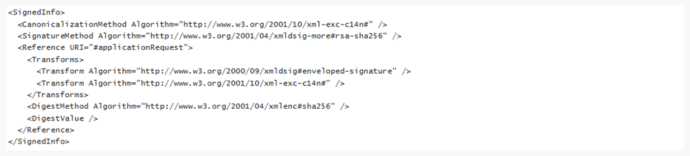

# Centralised system for account balance and transaction information

*Document version 0.1*

This document is part of the Bank and Payment Account Monitoring System documentation. The document instructs data suppliers and data users on transmission of account balance and transaction information in the Bank and Payment Account Monitoring System. In this document, there is described the prerequisites for the implementation of the system, the flow of balance and transaction information in the system and the balance and account information query and response messages.

The Bank and Payment Account Monitoring system transmits information on the bank and payment accounts of citizens, businesses and corporations to the competent authorities provided for in the Act on the Bank and Payment Accounts Monitoring System. The system is based on the Act on the Bank and Payment Accounts Monitoring System. Legal amendment of centralizing the account balance, transaction and securities information queries to the Bank and Payment Account Monitoring System will enter into force in December 2025.

Credit institutions, payment institutions, electric money institutions and providers of crypto-assets, i.e. data suppliers, provide the information on their customers bank and payment accounts either via the Bank and Payment Account Register or their own data retrieval systems. Customs maintains the aggregating application that transmits the information requests by the authorities to the Bank and Payment Account Register and data retrieval systems and transports the received information to the authorities. The account balance and transaction queries are delivered either to the data suppliers data retrieval system or via a secured email to the Account Register participants. The queries are replied to either via the data disclosure system or the data suppliers own data retrieval system.

## Contact information

Email: [tilirekisteri@tulli.fi](mailto:tilirekisteri@tulli.fi).

## Certificates

External connections are secured through certificates in the Bank and Payment Account Monitoring System. Data suppliers must notify Customs as to what certificates they use. Certificates must comply with the instructions from Customs. Data suppliers must obtain signature certificates for servers and systems that meet the requirements set out for certificates, and install the certificates in their systems. Technically, an individual certificate can be used for signatures for servers as well as systems. Separate certificates can also be used. The EIDAS certificate profile that is used is in both cases WAC, website authentication certificate. Typically, server certificates are installed in front-end servers that administer data communications, whereas signature certificates are installed in back end servers that generate replies.

Certificates of the data retrieval system

 

| Standard    | Name of the certificate |  Purpose  |    
| -------- | ------- | ------- |  
| X.509 (versio 3) | Data traffic certificate of the data retrieval system |  Interface Data traffic certificate of the data utiliser or the party authorised by the data utiliser  |  
| X.509 (versio 3) | 	Signature certificate of the data retrieval system  |  Signing the messages, verification of the authenticity of messages, identification of the data supplier  |  

The utilisers of the data retrieval system interface and the data suppliers or the parties authorised by the data supplier are identified with X.509 certificates (Data traffic certificate). The query and response messages of the query interface are signed using XML signatures (Signature certificate).

### Signature certificate of the data supplier

The outgoing messages must be automatically signed using x.509 (version 3) server certificate showing the Business ID or VAT identifier of the data supplier concerned. Acceptance of the signature requires that either         
 a) the certificate was issued by the Digital and Population Data Services Agency, the certificate is valid and is not included in the certificate revocation list of the Digital and Population Data Services Agency, and the serialNumber attribute of the Subject field of the certificate consists of the Business ID or VAT number of the data supplier     
or     
 b) the certificate is an eIDAS-approved website identification certificate, the certificate is valid and is not included in the certificate revocation list of party providing the certificate, and the organizationIdentifier attribute of the Subject field of the certificate consists of the Business ID or VAT number of the data supplier.  

Please note: For the message signatures to meet the information security requirements of the National Cyber Security Centre referred to below, the RSA public key of the certificate used for signatures must have at least 3072 bits. The uses of the certificate used for signatures must also include “digital signature”. These factors must be taken into account when ordering a certificate.

Signature certificate of the competent authority

  

The competent authority must sign the messages it sends using the server certificate x.509 that indicates the Business ID of the authority. The signatures in incoming messages must be checked. The recipient cannot accept a message without an acceptable signature. Accepting the competent authority’s signature requires that the XML signature is valid and that  
a) the signature certificate used for the signature was issued by the Digital and Population Data Services Agency, the certificate is valid and is not included in the certificate revocation list maintained by the Digital and Population Data Services Agency  
b) the serialNumber attribute of the Subject field of the certificate consists of the Business ID of the competent authority that sent the message or of the identifier that is formed of the letters “FI” and the digit part of the authority’s Business ID without the hyphen (ID in the format of a VAT-number).

 Data traffic certificate of the party making the contact 

  

The data supplier or the party authorised by the data supplier identifies the competent authority contacting the query interface of the data retrieval system with the help of the server certificate. A contact made by the competent authority must be accepted provided that  
a) the certificate of the competent authority was issued by the Digital and Population Data Services Agency  
b) the certificate is valid and is not included in the certificate revocation list of the Digital and Population Data Services Agency  
c) the serialNumber attribute of the Subject field of the certificate consists of the Business ID of the competent authority or the state service centre acting on its behalf, or of the identifier that is formed of the letters “FI” and the digit part of the authority’s or the centre’s Business ID without the hyphen (ID in the format of a VAT-number).

Please note: For the protection of data communications to meet the information security requirements of the National Cyber Security Centre referred to below, the RSA public key of the certificate used must have at least 3072 bits. In addition, the server certificate must be of type QWAC (Qualified Website Authentication Certificate), which includes extensions (X509v3 Extended Key Usage: TLS Web Client Authentication, TLS Web Server Authentication). These factors must be taken into account when ordering a certificate.

### Data traffic certificate of the data supplier or the party authorised by the data supplier

Data traffic must be protected (encryption and counterpart identification) using x.509 (version 3) certificates. Regarding the data retrieval system, the competent authority contacting the query interface identifies the data supplier or the party authorised by the data supplier with the help of the server certificate.

Connections must be established using a server certificate showing the Business ID or VAT identifier of the data supplier or the party authorised by the data supplier. The party authorised by the data supplier refers, for example, to a service centre which the data supplier has authorised to compile and/or send the reports on its behalf. Such authorisation must be sent to Customs in writing.

Acceptance of the signature requires that either  
a) the server certificate was issued by the Digital and Population Data Services Agency, the certificate is valid and is not included in the certificate revocation list of the Digital and Population Data Services Agency, and the serialNumber attribute of the subject of the certificate consists of the Business ID or VAT number of the data supplier or the party authorised by the data supplier  
or  
b) the server certificate is an eIDAS-approved website identification certificate, the certificate is valid and is not included in the certificate revocation list of party providing the certificate, and the organizationIdentifier attribute of the subject of the certificate consists of the Business ID or VAT identifier of the data supplier or the party authorised by the data supplier.

If the same Business ID or VAT number is used in the data traffic certificate and outgoing message signature certificate of the data supplier, the same certificate can be used for both purposes.

Please note: For the protection of data communications to meet the information security requirements of the National Cyber Security Centre referred to below, the RSA public key of the certificate used must have at least 3072 bits. In addition, the server certificate must be of type QWAC (Qualified Website Authentication Certificate), which includes extensions (X509v3 Extended Key Usage: TLS Web Client Authentication, TLS Web Server Authentication). These factors must be taken into account when ordering a certificate. 

Forming XML signature of data  retrieval system

 

The signature is of the enveloped signature type. The signature element is placed in [BAH](#luku5) Sgntr-elementin alle.

Example SignedInfo
 

The signature algorithm therefore is RSA-SHA256 or RSA-SHA512 and C14N is Exclusive XML Canonicalization. The reference URI is “#applicationRequest” or “#applicationResponse“, depending on if it’s a query or response message. Only “ApplicationRequest” or “ApplicationResponse” element is signed. When forming the signature, either the SHA256 or SHA512 algorithm must be used for establishing the digests to be calculated.

In terms of cryptographic strength, the cryptographic algorithms used in signatures must correspond at least with the cryptographic strength requirements set out by the Finnish Transport and Communications Agency as concerns national protection level TL IV. Current strength requirements are described in the Finnish-language document available at https://www.kyberturvallisuuskeskus.fi/sites/default/files/media/regulation/ohje-kryptografiset-vahvuusvaatimukset-kansalliset-suojaustasot.pdf (Dnro: 190/651/2015).

### Protecting the connections

The connections of the Account Register data updating interface must be protected with TLS encryption using version 1.2 or later of the TLS protocol. Both ends of the connection are identified with the server certificates described above, using two-way handshaking. The connection must be established using the ephemeral Diffie-Hellman (DHE) key exchange protocol where a new unique private encryption key is created for each session. The purpose of this procedure is to ensure that encryption has the forward secrecy feature so that possible discovery of the encryption key would not subsequently lead to a disclosure of the encrypted information.

The cryptographic algorithms used in TLS encryption must have a cryptographic strength at least equal to the cryptographic strength requirements specified by the Finnish Transport and Communications Agency Traficom for national protection level TL IV. The current strength requirements are described (in Finnish) in the document https://www.kyberturvallisuuskeskus.fi/sites/default/files/media/regulation/ohje-kryptografiset-vahvuusvaatimukset-kansalliset-suojaustasot.pdf (Dnro: 190/651/2015).

### Permitted HTTP-version

The connections of the data updating interface use HTTP version 1.1.

### Applying for certificates

Certificates are to be acquired by the party that generates and transmits replies to queries submitted by data users. If a service provider is used for building and transmitting messages on behalf of the party obligated to provide information, the server certificate is to be acquired by the service provider. In such cases, the party obligated to provide information must authorize the service provider to sign the messages to be sent. If a private key related to a certificate is revealed or it is suspected that the key has fallen into the wrong hands, the certificate holder must see to that the certificate is immediately revoked and that Customs is notified of this without delay. Correspondingly, if a certificate is accidentally or fraudulently granted to an incorrect party, the correct certificate subject must see to that the certificate is revoked and that Customs is notified of this immediately after the correct certificate subject has become aware of the matter.

### Renewal of the certificates

Certificates must be renewed in good time before their expiry. An expired certificate cannot be used. Unless otherwise agreed, a new or renewed certificate is to be submitted electronically to Customs using a data-secure method of transfer no later than one month before the certificate is to be taken into use. Certificates are to submitted using the Customs secure email service (https://turvaviesti.tulli.fi/) to tilirekisteri@tulli.fi. Section 8 of the Act on the Bank and Payment Accounts Control System provides that Customs has the right to obtain information free of charge. Therefore, data suppliers are responsible for the costs relating to their certificates.

### Duty to report information security deviations

The user of the Account Register interface is obliged to immediately report to both the party issuing the certificate and Customs any cases of the certificates or their secret keys having been compromised. The user of the interface is also obliged to immediately report to Customs any information security deviations observed in the information system using the interface. If the certificates or private key of the party implementing the data retrieval system are compromised, the party issuing the certificate and the competent authorities utilising the data retrieval system must be immediately informed of this. The competent authorities must also be informed if an information security deviation is observed in the data retrieval system. If the certificates or private key of the competent authority utilising the data retrieval system are compromised, the party issuing the certificate and the parties implementing the data retrieval system whose implementation of the data retrieval system is utilised by the competent authority concerned must be immediately informed of this.

## 5. Business Application Header 

ISO 20022 standard BusinessApplicationHeaderV01 [head.001.001.01](https://github.com/FinnishCustoms-SuomenTulli/account-register-information-query/blob/master/schemas/head.001.001.01.xsd) is attached to both the query and the response message. The fields are otherwise used in a similar way in both the query and the response message, except contact details must be sent in the query message in case the data provider needs to ask additional information.

The sender details in Fr fields contain the authority's information when an authority sends a message, the data provider's information when the data provider sends a message and Finnish Customs' information when Finnish Customs forwards a message. Respectively receiver details in To fields contain Finnish Customs' information when a message is sent to aggregating application (koostava sovellus), and the information of the authority or the data provider when aggregating application forwards the message.

<table>
  <colgroup><col /><col /><col /><col /></colgroup>
  <tbody>
    <tr>
      <th>Element name</th>
      <th >min..max</th>
      <th >Type</th>
      <th >Description</th>
    </tr>
    <tr>
      <td >BusinessApplicationHeaderV01</td>
      <td >1..1</td>
      <td ></td>
      <td ></td>
    </tr>
    <tr>
      <td >BusinessApplicationHeaderV01 
      +Charset
      </td>
      <td >0..1</td>
      <td >UnicodeChartsCode</td>
      <td >"UTF-8"</td>
    </tr>
    <tr>
      <td >BusinessApplicationHeaderV01 
      +Fr 
      ++OrgId 
      +++Id 
      ++++OrgId 
      +++++Othr 
      ++++++Id
      </td>
      <td >1..1</td>
      <td >Max35Text</td>
      <td >Sender's business ID (Y-tunnus). When comparing the business ID with the ID contained in the signature certificate, it must be noted that the ID in the certificate can be in either business ID or VAT-number format.</td>
    </tr>
    <tr>
      <td >BusinessApplicationHeaderV01 
      +Fr 
      ++OrgId 
      +++Id 
      ++++OrgId 
      +++++Othr 
      ++++++SchmeNm 
      +++++++Cd
      </td>
      <td >1..1</td>
      <td >ExternalOrganisationIdentification1Code</td>
      <td >"Y", type of the organisation identification</td>
    </tr>
    <tr>
      <td >BusinessApplicationHeaderV01 
      +Fr 
      ++OrgId 
      +++CtctDtls 
      ++++Nm
      </td>
      <td >0..1</td>
      <td >Max140Text</td>
      <td >Only in the authority's query message: Person's name for the possible request for additional information</td>
    </tr>
    <tr>
      <td >BusinessApplicationHeaderV01 
      +Fr 
      ++OrgId 
      +++CtctDtls 
      ++++PhneNb
      </td>
      <td >0..1</td>
      <td >PhoneNumber</td>
      <td >Only in the authority's query message: Phone number for the possible request for additional information</td>
    </tr>
    <tr>
      <td >BusinessApplicationHeaderV01 
      +Fr 
      ++OrgId 
      +++CtctDtls 
      ++++EmailAdr
      </td>
      <td >0..1</td>
      <td >Max2048Text</td>
      <td >Only in the authority's query message: Email address for the possible request for additional information</td>
    </tr>
    <tr>
      <td >BusinessApplicationHeaderV01 
      +To 
      ++OrgId 
      +++Id 
      ++++OrgId 
      +++++Othr 
      ++++++Id
      </td>
      <td >1..1</td>
      <td >Max35Text</td>
      <td >Receiver's business ID</td>
    </tr>
    <tr>
      <td >BusinessApplicationHeaderV01 
      +To 
      ++OrgId 
      +++Id 
      ++++OrgId 
      +++++Othr 
      ++++++SchmeNm 
      +++++++Cd
      </td>
      <td >1..1</td>
      <td >ExternalOrganisationIdentification1Code</td>
      <td >"Y", type of the organisation identification</td>
    </tr>
    <tr>
      <td >BusinessApplicationHeaderV01 
      +BizMsgIdr
      </td>
      <td >1..1</td>
      <td >Max35Text</td>
      <td >Use in accordance with the standard</td>
    </tr>
    <tr>
      <td >BusinessApplicationHeaderV01 
      +MsgDefIdr
      </td>
      <td >1..1</td>
      <td >Max35Text</td>
      <td >Message id, "auth.001.001.01" in the query message and "auth.002.001.01" in the response message</td>
    </tr>
    <tr>
      <td >BusinessApplicationHeaderV01 
      +CreDt
      </td>
      <td >1..1</td>
      <td >ISONormalisedDateTime</td>
      <td >The date and time of creation. Must be normalised using Z notation (UTC).</td>
    </tr>
    <tr>
      <td >BusinessApplicationHeaderV01 
      +Sgntr
      </td>
      <td >0..1</td>
      <td >SignatureEnvelope</td>
      <td >
        
The [XML signature](#xml-allekirjoitus) formed by the business message sender        
      </td>
    </tr>
    <tr>
      <td >BusinessApplicationHeaderV01 
      +Sgntr 
      ++Signature 
      +++SignatureValue
      </td>
      <td >1..1</td>
      <td >SignatureValueType</td>
      <td >Signature</td>
    </tr>
    <tr>
      <td >BusinessApplicationHeaderV01 
      +Sgntr 
      ++Signature 
      +++KeyInfo 
      ++++X509Data 
      +++++X509Certificate
      </td>
      <td >1..1</td>
      <td >base64Binary</td>
      <td >Certificate</td>
    </tr>
  </tbody>
</table>

## 6. Query message 

The query message uses ISO 20022 message InformationRequestOpeningV01 [auth.001.001.01](https://github.com/FinnishCustoms-SuomenTulli/account-register-information-query/blob/master/assets/iso20022org/auth.001.001.01.xsd). InformationRequestOpeningV01 message's supplementary data contains the national message extension InformationRequestFIN012 (fin.012.001.04).

The fields used in the query message are described in chapter 6.2 below. Schema for submessage [fin.012.001.04](schemas/fin.012.001.04.xsd). Examples of the [query message](examples/queries).

### 6.1 Requesting different kinds of information 

It is possible to request only account balance information, only account transaction information, or both from the centralised account balance and transaction information system.

[Example message](examples/general/example_requesting_only_bal_or_entry_or_both.xml) of requesting account balance and transaction information.

#### Requesting only account transaction information

Käytetään ajantasaisten tilitapahtumatietojen noutamiseen. Sisältää myös keskeneräiset tapahtumat [Tapahtuman tila: "kesken"]

Kyselyn mukana välitetään aina kaikki muut tiedot, paitsi saldo (bal-elementti) sisältämät kentät ja lisätiedot.

Pelkkiä tilitaphtumatietoja kyseltäessä sanomaan sisällytetään investigationTypeCode: TRAN. 

#### Requesting only account balance information

Käytetään luovutushetken saldotietojen noutamiseen. 

Kyselyn mukana välitetään aina kaikki muut tiedot, paitsi tilitapahtuma (entry-elementti) sisältämät kentät ja lisätiedot.

Pelkkiä saldotietoja kyseltäessä sanomaan sisällytetään investigationTypeCode: BALN.

#### Requesting both account balance and transaction information

Käytetään hakuaikavälin tilitapahtumatietojen sekä aikavälin alku- ja loppuhetken saldotiedon noutamiseen. Sisältää myös keskeneräiset tapahtumat [Tapahtuman tila: "kesken"]

Kyselyn mukana välitetään aina kaikki muut tiedot paitsi lisätiedot.

Saldo- ja tilitaphtumatietoja kyseltäessä sanomaan sisällytetään erilllisinä elementteinä investigationTypeCode: TRAN ja investigationTypeCode: BALN.

### 6.2 InformationRequestOpeningV01 message content 

<table>
  <colgroup><col /><col /><col /><col /></colgroup>
  <tbody>
    <tr>
      <th>Element name</th>
      <th >min..max</th>
      <th >Type</th>
      <th >Description</th>
    </tr>
    <tr>
      <td >InformationRequestOpeningV01</td>
      <td >1..1</td>
      <td ></td>
      <td ></td>
    </tr>
    <tr>
      <td >
        InformationRequestOpeningV01 
        +InvstgtnId
      </td>
      <td >1..1</td>
      <td >Max35Text</td>
      <td >Investigation identification</td>
    </tr>
    <tr>
      <td >
        InformationRequestOpeningV01 
        +LglMndBsis 
        ++Prgrph
      </td>
      <td >1..1</td>
      <td >Max35Text</td>
      <td >Legal mandate basis</td>
    </tr>
    <tr>
      <td >
        InformationRequestOpeningV01 
        +CnfdtltySts
      </td>
      <td >1..1</td>
      <td >YesNoIndicator</td>
      <td >always "true"</td>
    </tr>
    <tr>
      <td >
        InformationRequestOpeningV01 
        +InvstgtnPrd 
        ++Dt 
        +++FrDt
      </td>
      <td >1..1</td>
      <td >ISODate</td>
      <td >Investigation period start date</td>
    </tr>
    <tr>
      <td >
        InformationRequestOpeningV01 
        +InvstgtnPrd 
        ++Dt 
        +++ToDt
      </td>
      <td >1..1</td>
      <td >ISODate</td>
      <td >Investigation period end date</td>
    </tr>
    <tr>
      <td >
        InformationRequestOpeningV01 
        +SchCrit 
        ++Acct 
        +++Id 
        ++++Id 
        +++++IBAN
      </td>
      <td >0..1</td>
      <td >IBAN2007Identifier</td>
      <td >Account identification of the requested account in IBAN format. 
      Used only when the requested account has an IBAN account indentification.
      </td>
    </tr>
    <tr>
      <td >
        InformationRequestOpeningV01 
        +SchCrit 
        ++Acct 
        +++Id 
        ++++Id 
        +++++Othr 
        ++++++Id
      </td>
      <td >1..1</td>
      <td >Max34Text</td>
      <td >Account identification of the requested account, if the account is not an IBAN account.</td>
    </tr>
    <tr>
      <td >
        InformationRequestOpeningV01 
        +SchCrit 
        ++Acct 
        +++Id 
        ++++Id 
        +++++Othr 
        ++++++SchmeNm 
        +++++++Cd
      </td>
      <td >1..1</td>
      <td >ExternalAccountIdentification1Code</td>
      <td >"OTHR", if requesting non-IBAN account</td>
    </tr>
    <tr>
      <td >
        InformationRequestOpeningV01 
        +SchCrit 
        ++Acct 
        +++InvstgtdPties 
        ++++Cd
      </td>
      <td >1..1</td>
      <td >InvestigatedParties1Choice</td>
      <td >"ALLP"</td>
    </tr>
    <tr>
      <td >
        InformationRequestOpeningV01 
        +SchCrit 
        ++Acct 
        +++AuthrtyReqTp 
        ++++MsgNmId
      </td>
      <td >1..1</td>
      <td >Max35Text</td>
      <td >Message identification of the requested response message. camt.052.001.08 when requesting account balance and transaction information.</td>
    </tr>
    <tr>
      <td >
        InformationRequestOpeningV01 
        +SplmtryData 
        ++Envlp 
        +++Document 
        ++++InfReqFin012 
        +++++AuthorityInquiry 
        ++++++OfficialId
      </td>
      <td >1..1</td>
      <td >Max140Text</td>
      <td >Identification of official sending the request</td>
    </tr>
    <tr>
      <td >
        InformationRequestOpeningV01 
        +SplmtryData 
        ++Envlp 
        +++Document 
        ++++InfReqFin012 
        +++++AuthorityInquiry 
        ++++++OfficialSuperiorId
      </td>
      <td >1..1</td>
      <td >Max140Text</td>
      <td >Identification of official approving the request</td>
    </tr>
        <tr>
      <td >
        InformationRequestOpeningV01 
        +SplmtryData 
        ++Envlp 
        +++Document 
        ++++InfReqFin012 
        +++++AuthorityInquiry 
        ++++++OfficialOrgId
      </td>
      <td >1..1</td>
      <td >Max140Text</td>
      <td >Organisation identification of the requesting authority</td>
    </tr>
    <tr>
      <td >
        InformationRequestOpeningV01 
        +SplmtryData 
        ++Envlp 
        +++Document 
        ++++InfReqFin012 
        +++++AdditionalSearchCriteria 
        ++++++RequestedDataSources
      </td>
      <td >0..*</td>
      <td >Max35Text</td>
      <td >Data supplier to whom the request is directed (Business ID)</td>
    </tr>
    <tr>
      <td >
        InformationRequestOpeningV01 
        +SplmtryData 
        ++Envlp 
        +++Document 
        ++++InfReqFin012 
        +++++AdditionalSearchCriteria 
        ++++++InvestigationType
      </td>
      <td >0..2</td>
      <td >InvestigationTypeCode</td>
      <td >If requesting account transaction information, the element is sent with value "TRAN".  If requesting account balance information, the element is send with value "BALN".  If requesting both account balance and transaction information, the element is sent twice, once with each value.</td>
    </tr>
    <tr>
      <td >
        InformationRequestOpeningV01 
        +SplmtryData 
        ++Envlp 
        +++Document 
        ++++InfReqFin012 
        +++++AdditionalTransactionInformation 
        ++++++TransactionFieldCode
      </td>
      <td >0..*</td>
      <td >TransactionFieldCode</td>
      <td >
        
Used if requesting additional information to be returned in the response in addition to the basic information. List of additional information that can be included in the response if needed: [TransactionFieldCode](#6-3) </td>
    </tr>
  </tbody>
</table>

### 6.3 TransactionFieldCode: additional information requested separately 

| Description                                             | Field                                   | Code             |
|:--------------------------------------------------------|:----------------------------------------|:-----------------|
| Indicator whether account balance includes credit limit | `BkToCstmrAcctRpt/Rpt/Bal/CdtLine/Incl` | BAL_CDTLINE_INCL |
| Available credit limit                                  | `BkToCstmrAcctRpt/Rpt/Bal/CdtLine/Amt`  | BAL_CDTLINE_AMT  |

[Example message](examples/general/example_request_additional_info.xml) of separately requesting additional information.

