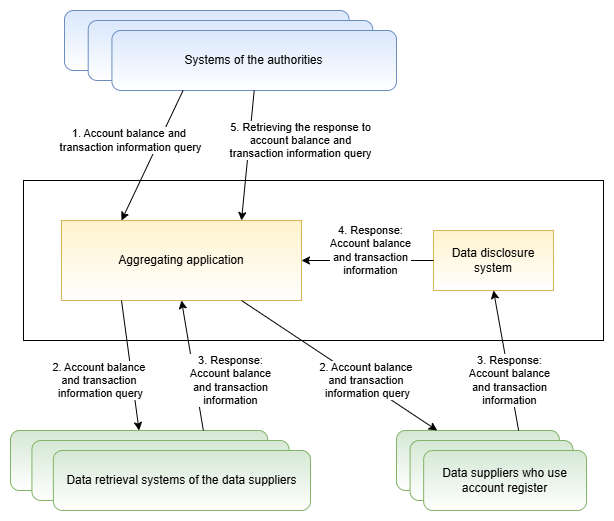

# Centralised system for account balance and transaction information

*Document version 0.1*

This document is part of the Bank and Payment Account Monitoring System documentation. The document instructs data suppliers and data users on transmission of account balance and transaction information in the Bank and Payment Account Monitoring System. In this document, there is described the prerequisites for the implementation of the system, the flow of balance and transaction information in the system and the balance and account information query and response messages.

The Bank and Payment Account Monitoring system transmits information on the bank and payment accounts of citizens, businesses and corporations to the competent authorities provided for in the Act on the Bank and Payment Accounts Monitoring System. The system is based on the Act on the Bank and Payment Accounts Monitoring System. Legal amendment of centralizing the account balance, transaction and securities information queries to the Bank and Payment Account Monitoring System will enter into force in December 2025.

Credit institutions, payment institutions, electric money institutions and providers of crypto-assets, i.e. data suppliers, provide the information on the bank and payment accounts of their customers either via the Bank and Payment Account Register or their own data retrieval systems. Customs maintains the aggregating application that transmits the information requests by the authorities to the Bank and Payment Account Register and data retrieval systems and transports the received information to the authorities. The account balance and transaction queries are delivered either to the data retrieval systems of the data suppliers  or via a secured email to the Account Register participants. The queries are replied to either via the data disclosure system or the data supplier's own data retrieval system.

### Table of contents

[1. Contact information](#luku1)  
[2. Glossary & abbreviations](#luku2)  
[3. Certificates](#luku3)  
[4. Data flow of the account balance and transaction information query](#luku4)  
[5. Business Application Header](#luku5)  
[6. Query message](#luku6)  
[7. Response message](#luku7)  
[8. Error situations](#luku8)  

## 1. Contact information 

Email: [tilirekisteri@tulli.fi](mailto:tilirekisteri@tulli.fi).

## 2. Glossary and abbreviations 

| Term    | Definition |
| -------- | ------- |
| Bank and Payment Account Monitoring System | National Bank and Payment Account Monitoring System that consists of the Account Register, data retrieval systems and, from 1.11.2022 onwards, the aggregating application. The system is based on the Finnish Act on the Bank and Payment Account Monitoring 571/2019 and on Directive (EU) 2018/843 of the European Parliament and of the Council of 30 May 2018 on the prevention of the use of the financial system for the purposes of money laundering or terrorist financing. |
| Centralised system for account balance and transaction information | Electronic data processing method for account balance, transaction and securities information received from the Bank and Payment Account Monitoring System.  |
| Bank and Payment Account Register / Account Register | The Bank and Payment Account Register (the Account Register) is a system created by Customs. It consists of the Account Register application and the related update and query interfaces. In the Account Register there is gathered the bank and payment account information of the customers of payment institutions, electronic money institutions, and credit institutions that have been granted an exemption by the Financial Supervisory Authority, as well as the customer information of providers of crypto-assets.  |
| Aggregating application | The aggregating application is an automated technical solution maintained by Customs that transmits the data of bank and payment accounts, safe-deposit boxes, balances, transactions and securities in the Bank and Payment Account Monitoring System. |
| Data retrieval system | The term “data retrieval system” refers to the digital bank and payment accounts control system that enables parties handing over information to provide information on their customers, as referred to in section 4, subsection 2 of the Finnish Act on the Bank and Payment Accounts Monitoring System, to the competent authority. The system facilitates immediate provision of information notwithstanding regulations on secrecy. According to legislation, Finnish Customs determines the technical requirements for the interface. Operators implement their own versions of the data retrieval system, which means that there several systems.   |
| Data user | The Act on the Bank and Payment Accounts Control System determines the competent authority and bar association that are authorised to submit enquiries to the Account Register. Competence is specified in the up-to-date legislation.  |
| Data supplier | “Data supplier” refers to a payment institution, electronic money institution or provider of virtual currency that submits data specified in the Act on the Bank and Payment Accounts Control System to the Account Register maintained by Finnish  Customs through the update interface, or that transmits such data through its own data retrieval system. “Data supplier” also refers to a Finnish branch office of a foreign payment institution, electronic money institution, credit institution or provider of virtual currency. |
| Data disclosure system | Data suppliers updating the information to the Account Register deliver the response messages to account balance and transaction information queries to the data disclosure system. |
| Account balance |  The amount of money available on a bank and payment account at the time of the reply. Possible authorizations should be deducted from the amount.  |
| Transaction information | Detailed information on transactions carried out during a specific period of time through a specific payment account, or bank account identified by an IBAN account number, or detailed information on transfers of crypto assets (see section 2, subsection 15 of the Finnish Act on the Bank and Payment Accounts Control System). |
| Request for clarification | The data supplier requests further clarification from the authority that made the query before providing the information requested.  |
| Separately requested (additional) information | Information that is not returned in the response message of the data supplier unless the authority making the query has specifically requested for the additional information.  |

## 3. Certificates 

External connections are secured through certificates in the Bank and Payment Account Monitoring System. Data suppliers must notify Customs as to what certificates they use. Certificates must comply with the instructions from Customs. Data suppliers must obtain signature certificates for servers and systems that meet the requirements set out for certificates, and install the certificates in their systems. Technically, an individual certificate can be used for signatures for servers as well as systems. Separate certificates can also be used. The EIDAS certificate profile that is used is in both cases WAC, website authentication certificate. Typically, server certificates are installed in front-end servers that administer data communications, whereas signature certificates are installed in back end servers that generate replies.

Certificates of the data retrieval system

 

| Standard    | Name of the certificate |  Purpose  |    
| -------- | ------- | ------- |  
| X.509 (versio 3) | Data traffic certificate of the data retrieval system |  Interface Data traffic certificate of the data utiliser or the party authorised by the data utiliser  |  
| X.509 (versio 3) | 	Signature certificate of the data retrieval system  |  Signing the messages, verification of the authenticity of messages, identification of the data supplier  |  

The utilisers of the data retrieval system interface and the data suppliers or the parties authorised by the data supplier are identified with X.509 certificates (Data traffic certificate). The query and response messages of the query interface are signed using XML signatures (Signature certificate).

### 3.1 Signature certificate of the data supplier 

The outgoing messages must be automatically signed using x.509 (version 3) server certificate showing the Business ID or VAT identifier of the data supplier concerned. Acceptance of the signature requires that either         
 a) the certificate was issued by the Digital and Population Data Services Agency, the certificate is valid and is not included in the certificate revocation list of the Digital and Population Data Services Agency, and the serialNumber attribute of the Subject field of the certificate consists of the Business ID or VAT number of the data supplier     
or     
 b) the certificate is an eIDAS-approved website identification certificate, the certificate is valid and is not included in the certificate revocation list of party providing the certificate, and the organizationIdentifier attribute of the Subject field of the certificate consists of the Business ID or VAT number of the data supplier.  

Please note: For the message signatures to meet the information security requirements of the National Cyber Security Centre referred to below, the RSA public key of the certificate used for signatures must have at least 3072 bits. The uses of the certificate used for signatures must also include “digital signature”. These factors must be taken into account when ordering a certificate.

Signature certificate of the competent authority

  

The competent authority must sign the messages it sends using the server certificate x.509 that indicates the Business ID of the authority. The signatures in incoming messages must be checked. The recipient cannot accept a message without an acceptable signature. Accepting the competent authority’s signature requires that the XML signature is valid and that  
a) the signature certificate used for the signature was issued by the Digital and Population Data Services Agency, the certificate is valid and is not included in the certificate revocation list maintained by the Digital and Population Data Services Agency  
b) the serialNumber attribute of the Subject field of the certificate consists of the Business ID of the competent authority that sent the message or of the identifier that is formed of the letters “FI” and the digit part of the authority’s Business ID without the hyphen (ID in the format of a VAT-number).

 Data traffic certificate of the party making the contact 

  

The data supplier or the party authorised by the data supplier identifies the competent authority contacting the query interface of the data retrieval system with the help of the server certificate. A contact made by the competent authority must be accepted provided that  
a) the certificate of the competent authority was issued by the Digital and Population Data Services Agency  
b) the certificate is valid and is not included in the certificate revocation list of the Digital and Population Data Services Agency  
c) the serialNumber attribute of the Subject field of the certificate consists of the Business ID of the competent authority or the state service centre acting on its behalf, or of the identifier that is formed of the letters “FI” and the digit part of the authority’s or the centre’s Business ID without the hyphen (ID in the format of a VAT-number).

Please note: For the protection of data communications to meet the information security requirements of the National Cyber Security Centre referred to below, the RSA public key of the certificate used must have at least 3072 bits. In addition, the server certificate must be of type QWAC (Qualified Website Authentication Certificate), which includes extensions (X509v3 Extended Key Usage: TLS Web Client Authentication, TLS Web Server Authentication). These factors must be taken into account when ordering a certificate.

### 3.2 Data traffic certificate of the data supplier or the party authorised by the data supplier 

Data traffic must be protected (encryption and counterpart identification) using x.509 (version 3) certificates. Regarding the data retrieval system, the competent authority contacting the query interface identifies the data supplier or the party authorised by the data supplier with the help of the server certificate.

Connections must be established using a server certificate showing the Business ID or VAT identifier of the data supplier or the party authorised by the data supplier. The party authorised by the data supplier refers, for example, to a service centre which the data supplier has authorised to compile and/or send the reports on its behalf. Such authorisation must be sent to Customs in writing.

Acceptance of the signature requires that either  
a) the server certificate was issued by the Digital and Population Data Services Agency, the certificate is valid and is not included in the certificate revocation list of the Digital and Population Data Services Agency, and the serialNumber attribute of the subject of the certificate consists of the Business ID or VAT number of the data supplier or the party authorised by the data supplier  
or  
b) the server certificate is an eIDAS-approved website identification certificate, the certificate is valid and is not included in the certificate revocation list of party providing the certificate, and the organizationIdentifier attribute of the subject of the certificate consists of the Business ID or VAT identifier of the data supplier or the party authorised by the data supplier.

If the same Business ID or VAT number is used in the data traffic certificate and outgoing message signature certificate of the data supplier, the same certificate can be used for both purposes.

Please note: For the protection of data communications to meet the information security requirements of the National Cyber Security Centre referred to below, the RSA public key of the certificate used must have at least 3072 bits. In addition, the server certificate must be of type QWAC (Qualified Website Authentication Certificate), which includes extensions (X509v3 Extended Key Usage: TLS Web Client Authentication, TLS Web Server Authentication). These factors must be taken into account when ordering a certificate. 

Forming XML signature of data  retrieval system

 

The signature is of the enveloped signature type. The signature element is placed in [BAH](#luku5) Sgntr-elementin alle.

Example SignedInfo
 

The signature algorithm therefore is RSA-SHA256 or RSA-SHA512 and C14N is Exclusive XML Canonicalization. The reference URI is “#applicationRequest” or “#applicationResponse“, depending on if it’s a query or response message. Only “ApplicationRequest” or “ApplicationResponse” element is signed. When forming the signature, either the SHA256 or SHA512 algorithm must be used for establishing the digests to be calculated.

In terms of cryptographic strength, the cryptographic algorithms used in signatures must correspond at least with the cryptographic strength requirements set out by the Finnish Transport and Communications Agency as concerns national protection level TL IV. Current strength requirements are described in the Finnish-language document available at https://www.kyberturvallisuuskeskus.fi/sites/default/files/media/regulation/ohje-kryptografiset-vahvuusvaatimukset-kansalliset-suojaustasot.pdf (Dnro: 190/651/2015).

### 3.3 Protecting the connections 

The connections of the Account Register data updating interface must be protected with TLS encryption using version 1.2 or later of the TLS protocol. Both ends of the connection are identified with the server certificates described above, using two-way handshaking. The connection must be established using the ephemeral Diffie-Hellman (DHE) key exchange protocol where a new unique private encryption key is created for each session. The purpose of this procedure is to ensure that encryption has the forward secrecy feature so that possible discovery of the encryption key would not subsequently lead to a disclosure of the encrypted information.

The cryptographic algorithms used in TLS encryption must have a cryptographic strength at least equal to the cryptographic strength requirements specified by the Finnish Transport and Communications Agency Traficom for national protection level TL IV. The current strength requirements are described (in Finnish) in the document https://www.kyberturvallisuuskeskus.fi/sites/default/files/media/regulation/ohje-kryptografiset-vahvuusvaatimukset-kansalliset-suojaustasot.pdf (Dnro: 190/651/2015).

### 3.4 Permitted HTTP-version 

The connections of the data updating interface use HTTP version 1.1.

### 3.5 Applying for certificates 

Certificates are to be acquired by the party that generates and transmits replies to queries submitted by data users. If a service provider is used for building and transmitting messages on behalf of the party obligated to provide information, the server certificate is to be acquired by the service provider. In such cases, the party obligated to provide information must authorize the service provider to sign the messages to be sent. If a private key related to a certificate is revealed or it is suspected that the key has fallen into the wrong hands, the certificate holder must see to that the certificate is immediately revoked and that Customs is notified of this without delay. Correspondingly, if a certificate is accidentally or fraudulently granted to an incorrect party, the correct certificate subject must see to that the certificate is revoked and that Customs is notified of this immediately after the correct certificate subject has become aware of the matter.

### 3.6 Renewal of the certificates 

Certificates must be renewed in good time before their expiry. An expired certificate cannot be used. Unless otherwise agreed, a new or renewed certificate is to be submitted electronically to Customs using a data-secure method of transfer no later than one month before the certificate is to be taken into use. Certificates are to submitted using the Customs secure email service (https://turvaviesti.tulli.fi/) to tilirekisteri@tulli.fi. Section 8 of the Act on the Bank and Payment Accounts Control System provides that Customs has the right to obtain information free of charge. Therefore, data suppliers are responsible for the costs relating to their certificates.

### 3.7 Duty to report information security deviations 

The user of the Account Register interface is obliged to immediately report to both the party issuing the certificate and Customs any cases of the certificates or their secret keys having been compromised. The user of the interface is also obliged to immediately report to Customs any information security deviations observed in the information system using the interface. If the certificates or private key of the party implementing the data retrieval system are compromised, the party issuing the certificate and the competent authorities utilising the data retrieval system must be immediately informed of this. The competent authorities must also be informed if an information security deviation is observed in the data retrieval system. If the certificates or private key of the competent authority utilising the data retrieval system are compromised, the party issuing the certificate and the parties implementing the data retrieval system whose implementation of the data retrieval system is utilised by the competent authority concerned must be immediately informed of this.

## 4. Data flow of the account balance and transaction information query 

Figure below presents the overall picture of the data flow for account balance and transaction information query in the bank and payment account monitoring system.

  

1. Authority's system sends an account balance and transaction information query to the [query interface](https://github.com/FinnishCustoms-SuomenTulli/account-register-aggregating-application/blob/main/index_en.md#4-2) of the aggregating application. Content of the query message is described in chapter [Query message](#luku6). 
2. The aggregating application forwards the account balance and transaction information query to the party it is directed to either via the data retrieval system interface or via secure email to a party using the Account Register.  
3. The data supplier responds to the account balance and transaction information query during the next banking day at the latest. If the query was directed to a data supplier that is using a data retrieval system, the party responds by sending a response message to the aggregating application interface. If the query was directed to a data supplier that is using the Account Register, they deliver the response message via the data disclosure system.     
4. The data disclosure system forwards the message to the aggregating application.  
5. The authority retrieves the response to their account balance and transaction information query using the aggregating application's [status](https://github.com/FinnishCustoms-SuomenTulli/account-register-aggregating-application/blob/main/index_en.md#4-3) and [result APIs](https://github.com/FinnishCustoms-SuomenTulli/account-register-aggregating-application/blob/main/index_en.md#4-4).

### 4.1 Instructions to the data suppliers 

The account balance and transaction queries are to be replied promptly but no later than by the end of business hours, i.e. by 4:15 p.m. (EET), on the next banking day. In case, the query is not received during the business hours, i.e. between 8:00 a.m. and 4:15 p.m., the counting of the time limit starts from the next banking day. For example, if the authority sends the query on Friday afternoon at 6:00 p.m. the response needs to be delivered latest by 4:15 p.m. on the next Tuesday. The Finnish time zone applies to the time limits.

When only the account balance is queried the response should be provided immediately. Latest, the response needs to be delivered by the end of the next banking day. The balance information provided must relate to the account balance at the time of the data supplier's response. A response regarding balance information must include a time stamp specifying the point of time of the account balance. In a query requesting account balance information there is requested by standard the amount of money in the account, the date and time related to the balance and the account number (according to the section 17 b of the Finnish Act on Bank and Payment Accounts). The account balance must take into account any authorizations that may apply for the account. The authorizations must have been deducted from the account balance information. In an exceptional case, the authority may also request the separately requested (additional) information. In case there is a request for additional information included in the balance information query the query should be processed separately in order to deliver all requested data.

In case of a lawyer’s customer asset account, the account balance and transaction information is not returned. The customer asset account refers to accounts held by a lawyer or their office for funds and other assets that do not belong to the lawyer or their office. The account balance and transaction information regarding a lawyer’s customer asset account may not be disclosed via the centralized system for account balance and transaction information (according to the section 17 b and d of the Finnish Act on the Bank and Payment Account System). To clarify the account balance and transaction information the competent authority should contact directly the lawyer acting as the account holder.

The account balance and transaction queries can not be made as international queries.

#### Data suppliers reporting to the data disclosure system

Data suppliers reporting to the Account Register receive the account balance and transaction information queries via a secured email ([example email](assets/Example_email.png)). The query message is attached in the email as XML-format. In case there is an error situation, the information for some reason is not found, or request for clarification is needed, the response needs to be delivered to the interface providing the information on the situation. The response to the query needs to be delivered as a message in XML-format to the interface of Customs.
In case for some reason the information of the searched is not found the data supplier should reply to the query with the status code NFOU.

### 4.2 Request for clarification 

If the data supplier considers that a query they have received requires clarification, the data supplier can respond to the query with status code NRES (processing) and contact the requesting authority directly to ask for more information. The authority always sends their contact information (name, phone number, email address) in the query message header element Fr/OrgId/CtctDtls in case clarification is needed.

The data supplier responds to the original query after the clarification if the time limit allows it. If it is not possible to respond to the query within the time limit, the authority can, if needed, make another query, to which the data supplier responds as agreed. If the data supplier has responded to the query with NRES, the aggregating application tries to retrieve the response again from the data supplier until the time limit is reached. After the time limit for supplying data is reached, the query is closed.

Example of forwarding contact information: [Example message](examples/general/example_passing_contact_details.xml)

## 5. Business Application Header 

ISO 20022 standard BusinessApplicationHeaderV01 [head.001.001.01](https://github.com/FinnishCustoms-SuomenTulli/account-register-information-query/blob/master/schemas/head.001.001.01.xsd) is attached to both the query and the response message. The fields are otherwise used in a similar way in both the query and the response message, except contact details must be sent in the query message in case the data supplier needs to ask additional information.

The sender details in Fr fields contain the authority's information when an authority sends a message, the data supplier's information when the data supplier sends a message and Finnish Customs' information when Finnish Customs forwards a message. Respectively receiver details in To fields contain Finnish Customs' information when a message is sent to aggregating application (koostava sovellus), and the information of the authority or the data supplier when aggregating application forwards the message.

<table>
  <colgroup><col /><col /><col /><col /></colgroup>
  <tbody>
    <tr>
      <th>Element name</th>
      <th >min..max</th>
      <th >Type</th>
      <th >Description</th>
    </tr>
    <tr>
      <td >BusinessApplicationHeaderV01</td>
      <td >1..1</td>
      <td ></td>
      <td ></td>
    </tr>
    <tr>
      <td >BusinessApplicationHeaderV01 
      +Charset
      </td>
      <td >0..1</td>
      <td >UnicodeChartsCode</td>
      <td >"UTF-8"</td>
    </tr>
    <tr>
      <td >BusinessApplicationHeaderV01 
      +Fr 
      ++OrgId 
      +++Id 
      ++++OrgId 
      +++++Othr 
      ++++++Id
      </td>
      <td >1..1</td>
      <td >Max35Text</td>
      <td >Sender's business ID (Y-tunnus). When comparing the business ID with the ID contained in the signature certificate, it must be noted that the ID in the certificate can be in either business ID or VAT-number format.</td>
    </tr>
    <tr>
      <td >BusinessApplicationHeaderV01 
      +Fr 
      ++OrgId 
      +++Id 
      ++++OrgId 
      +++++Othr 
      ++++++SchmeNm 
      +++++++Cd
      </td>
      <td >1..1</td>
      <td >ExternalOrganisationIdentification1Code</td>
      <td >"Y", type of the organisation identification</td>
    </tr>
    <tr>
      <td >BusinessApplicationHeaderV01 
      +Fr 
      ++OrgId 
      +++CtctDtls 
      ++++Nm
      </td>
      <td >0..1</td>
      <td >Max140Text</td>
      <td >Only in the authority's query message: Person's name for the possible request for additional information</td>
    </tr>
    <tr>
      <td >BusinessApplicationHeaderV01 
      +Fr 
      ++OrgId 
      +++CtctDtls 
      ++++PhneNb
      </td>
      <td >0..1</td>
      <td >PhoneNumber</td>
      <td >Only in the authority's query message: Phone number for the possible request for additional information</td>
    </tr>
    <tr>
      <td >BusinessApplicationHeaderV01 
      +Fr 
      ++OrgId 
      +++CtctDtls 
      ++++EmailAdr
      </td>
      <td >0..1</td>
      <td >Max2048Text</td>
      <td >Only in the authority's query message: Email address for the possible request for additional information</td>
    </tr>
    <tr>
      <td >BusinessApplicationHeaderV01 
      +To 
      ++OrgId 
      +++Id 
      ++++OrgId 
      +++++Othr 
      ++++++Id
      </td>
      <td >1..1</td>
      <td >Max35Text</td>
      <td >Receiver's business ID</td>
    </tr>
    <tr>
      <td >BusinessApplicationHeaderV01 
      +To 
      ++OrgId 
      +++Id 
      ++++OrgId 
      +++++Othr 
      ++++++SchmeNm 
      +++++++Cd
      </td>
      <td >1..1</td>
      <td >ExternalOrganisationIdentification1Code</td>
      <td >"Y", type of the organisation identification</td>
    </tr>
    <tr>
      <td >BusinessApplicationHeaderV01 
      +BizMsgIdr
      </td>
      <td >1..1</td>
      <td >Max35Text</td>
      <td >Use in accordance with the standard</td>
    </tr>
    <tr>
      <td >BusinessApplicationHeaderV01 
      +MsgDefIdr
      </td>
      <td >1..1</td>
      <td >Max35Text</td>
      <td >Message id, "auth.001.001.01" in the query message and "auth.002.001.01" in the response message</td>
    </tr>
    <tr>
      <td >BusinessApplicationHeaderV01 
      +CreDt
      </td>
      <td >1..1</td>
      <td >ISONormalisedDateTime</td>
      <td >The date and time of creation. Must be normalised using Z notation (UTC).</td>
    </tr>
    <tr>
      <td >BusinessApplicationHeaderV01 
      +Sgntr
      </td>
      <td >0..1</td>
      <td >SignatureEnvelope</td>
      <td >
        
The [XML signature](#xml-allekirjoitus) formed by the business message sender        
      </td>
    </tr>
    <tr>
      <td >BusinessApplicationHeaderV01 
      +Sgntr 
      ++Signature 
      +++SignatureValue
      </td>
      <td >1..1</td>
      <td >SignatureValueType</td>
      <td >Signature</td>
    </tr>
    <tr>
      <td >BusinessApplicationHeaderV01 
      +Sgntr 
      ++Signature 
      +++KeyInfo 
      ++++X509Data 
      +++++X509Certificate
      </td>
      <td >1..1</td>
      <td >base64Binary</td>
      <td >Certificate</td>
    </tr>
  </tbody>
</table>

## 6. Query message 

The query message uses ISO 20022 message InformationRequestOpeningV01 [auth.001.001.01](https://github.com/FinnishCustoms-SuomenTulli/account-register-information-query/blob/master/assets/iso20022org/auth.001.001.01.xsd). InformationRequestOpeningV01 message's supplementary data contains the national message extension InformationRequestFIN012 (fin.012.001.04).

The fields used in the query message are described in chapter 6.2 below. Schema for submessage [fin.012.001.04](schemas/fin.012.001.04.xsd). Examples of the [query message](examples/queries).

### 6.1 Requesting different kinds of information 

The query message uses ISO 20022 message InformationRequestOpeningV01 [auth.001.001.01](https://github.com/FinnishCustoms-SuomenTulli/account-register-information-query/blob/master/assets/iso20022org/auth.001.001.01.xsd). InformationRequestOpeningV01 message's supplementary data contains the national message extension InformationRequestFIN012 (fin.012.001.04).

The fields used in the query message are described in chapter 6.2 below. Schema for submessage [fin.012.001.04](schemas/fin.012.001.04.xsd). Examples of the [query message](examples/queries).

### 6.1 Requesting different kinds of information 

It is possible to request only account balance information, only account transaction information, or both from the centralised account balance and transaction information system.

[Example message](examples/general/example_requesting_only_bal_or_entry_or_both.xml) of requesting account balance and transaction information.

#### Requesting only account transaction information

Used for retrieving up-to-date account transaction information. Includes also incomplete transactions [Transaction status: "Pending"]

All other information is always included in the response except the fields including balance information (bal element) and separately requested information.

When requesting only account transaction information the investigationTypeCode: TRAN is included in the query message. 

#### Requesting only account balance information

Used for retrieving latest (response time) balance information. 

All other information is always included in the response except the fields including transaction information (entry element) and separately requested information.

When requesting only account balance information the investigationTypeCode: BALN is included in the query message.

#### Requesting both account balance and transaction information

Used for retrieving account transaction information from the investigation period, and account balance information at investigation period start and end time. Includes also incomplete transactions [Transaction status: "Pending"]

All other information is always included in the response except separately requested information.

When requesting both account balance and transaction information the investigationTypeCode is included twice in the query message: once with value TRAN and once with value BALN.

### 6.2 InformationRequestOpeningV01 message content 

<table>
  <colgroup><col /><col /><col /><col /></colgroup>
  <tbody>
    <tr>
      <th>Element name</th>
      <th >min..max</th>
      <th >Type</th>
      <th >Description</th>
    </tr>
    <tr>
      <td >InformationRequestOpeningV01</td>
      <td >1..1</td>
      <td ></td>
      <td ></td>
    </tr>
    <tr>
      <td >
        InformationRequestOpeningV01 
        +InvstgtnId
      </td>
      <td >1..1</td>
      <td >Max35Text</td>
      <td >Investigation identification</td>
    </tr>
    <tr>
      <td >
        InformationRequestOpeningV01 
        +LglMndBsis 
        ++Prgrph
      </td>
      <td >1..1</td>
      <td >Max35Text</td>
      <td >Legal mandate basis</td>
    </tr>
    <tr>
      <td >
        InformationRequestOpeningV01 
        +CnfdtltySts
      </td>
      <td >1..1</td>
      <td >YesNoIndicator</td>
      <td >always "true"</td>
    </tr>
    <tr>
      <td >
        InformationRequestOpeningV01 
        +InvstgtnPrd 
        ++Dt 
        +++FrDt
      </td>
      <td >1..1</td>
      <td >ISODate</td>
      <td >Investigation period start date</td>
    </tr>
    <tr>
      <td >
        InformationRequestOpeningV01 
        +InvstgtnPrd 
        ++Dt 
        +++ToDt
      </td>
      <td >1..1</td>
      <td >ISODate</td>
      <td >Investigation period end date</td>
    </tr>
    <tr>
      <td >
        InformationRequestOpeningV01 
        +SchCrit 
        ++Acct 
        +++Id 
        ++++Id 
        +++++IBAN
      </td>
      <td >0..1</td>
      <td >IBAN2007Identifier</td>
      <td >Account identification of the requested account in IBAN format. 
      Used only when the requested account has an IBAN account indentification.
      </td>
    </tr>
    <tr>
      <td >
        InformationRequestOpeningV01 
        +SchCrit 
        ++Acct 
        +++Id 
        ++++Id 
        +++++Othr 
        ++++++Id
      </td>
      <td >1..1</td>
      <td >Max34Text</td>
      <td >Account identification of the requested account, if the account is not an IBAN account.</td>
    </tr>
    <tr>
      <td >
        InformationRequestOpeningV01 
        +SchCrit 
        ++Acct 
        +++Id 
        ++++Id 
        +++++Othr 
        ++++++SchmeNm 
        +++++++Cd
      </td>
      <td >1..1</td>
      <td >ExternalAccountIdentification1Code</td>
      <td >"OTHR", if requesting non-IBAN account</td>
    </tr>
    <tr>
      <td >
        InformationRequestOpeningV01 
        +SchCrit 
        ++Acct 
        +++InvstgtdPties 
        ++++Cd
      </td>
      <td >1..1</td>
      <td >InvestigatedParties1Choice</td>
      <td >"ALLP"</td>
    </tr>
    <tr>
      <td >
        InformationRequestOpeningV01 
        +SchCrit 
        ++Acct 
        +++AuthrtyReqTp 
        ++++MsgNmId
      </td>
      <td >1..1</td>
      <td >Max35Text</td>
      <td >Message identification of the requested response message. camt.052.001.08 when requesting account balance and transaction information.</td>
    </tr>
    <tr>
      <td >
        InformationRequestOpeningV01 
        +SplmtryData 
        ++Envlp 
        +++Document 
        ++++InfReqFin012 
        +++++AuthorityInquiry 
        ++++++OfficialId
      </td>
      <td >1..1</td>
      <td >Max140Text</td>
      <td >Identification of official sending the request</td>
    </tr>
    <tr>
      <td >
        InformationRequestOpeningV01 
        +SplmtryData 
        ++Envlp 
        +++Document 
        ++++InfReqFin012 
        +++++AuthorityInquiry 
        ++++++OfficialSuperiorId
      </td>
      <td >1..1</td>
      <td >Max140Text</td>
      <td >Identification of official approving the request</td>
    </tr>
        <tr>
      <td >
        InformationRequestOpeningV01 
        +SplmtryData 
        ++Envlp 
        +++Document 
        ++++InfReqFin012 
        +++++AuthorityInquiry 
        ++++++OfficialOrgId
      </td>
      <td >1..1</td>
      <td >Max140Text</td>
      <td >Organisation identification of the requesting authority</td>
    </tr>
    <tr>
      <td >
        InformationRequestOpeningV01 
        +SplmtryData 
        ++Envlp 
        +++Document 
        ++++InfReqFin012 
        +++++AdditionalSearchCriteria 
        ++++++RequestedDataSources
      </td>
      <td >0..*</td>
      <td >Max35Text</td>
      <td >Data supplier to whom the request is directed (Business ID)</td>
    </tr>
    <tr>
      <td >
        InformationRequestOpeningV01 
        +SplmtryData 
        ++Envlp 
        +++Document 
        ++++InfReqFin012 
        +++++AdditionalSearchCriteria 
        ++++++InvestigationType
      </td>
      <td >0..2</td>
      <td >InvestigationTypeCode</td>
      <td >If requesting account transaction information, the element is sent with value "TRAN".  If requesting account balance information, the element is send with value "BALN".  If requesting both account balance and transaction information, the element is sent twice, once with each value.</td>
    </tr>
    <tr>
      <td >
        InformationRequestOpeningV01 
        +SplmtryData 
        ++Envlp 
        +++Document 
        ++++InfReqFin012 
        +++++AdditionalTransactionInformation 
        ++++++TransactionFieldCode
      </td>
      <td >0..*</td>
      <td >TransactionFieldCode</td>
      <td >
        
Used if requesting separately requested additional information to be returned in the response in addition to the basic information. List of additional information that can be included in the response if needed: [TransactionFieldCode](#6-3) </td>
    </tr>
  </tbody>
</table>

### 6.3 TransactionFieldCode: separately requested additional information 

| Description                                             | Field                                   | Code             |
|:--------------------------------------------------------|:----------------------------------------|:-----------------|
| Indicator whether account balance includes credit limit | `BkToCstmrAcctRpt/Rpt/Bal/CdtLine/Incl` | BAL_CDTLINE_INCL |
| Available credit limit                                  | `BkToCstmrAcctRpt/Rpt/Bal/CdtLine/Amt`  | BAL_CDTLINE_AMT  |

[Example message](examples/general/example_request_additional_info.xml) of separately requesting additional information.

## 7. Response message 

The response message uses ISO 20022 message InformationRequestResponseV01 [auth.002.001.01](https://github.com/FinnishCustoms-SuomenTulli/account-register-information-query/blob/master/assets/iso20022org/auth.002.001.01.xsd). InformationRequestResponseV01 message's supplementary data contains ISO 20022 message camt.052.001.08.

The fields used in the reponse message are described in chapter 7.1 below. Schema for submessage [camt.052.001.08](schemas/camt.052.001.08.xsd). Examples of the [response message](examples/queries).

The content of the response message is similar for all data suppliers regardless of whether they have implemented a data retrieval system or an interface to account register. Only the method for delivering the response message is different.

### 7.1 Content of submessage camt.052.001.08 

<table>
  <colgroup><col /><col /><col /></colgroup>
  <tbody>
    <tr>
      <th>Element name</th>
      <th>Type</th>
      <th>Description</th>
    </tr>
    <tr>
      <td>
        BkToCstmrAcctRpt 
        +GrpHdr 
        ++MsgId
      </td>
      <td>Max35Text</td>
      <td>Unique message identification.</td>
    </tr>
    <tr>
      <td>
        BkToCstmrAcctRpt 
        +GrpHdr 
        ++CreDtTm
      </td>
      <td>ISODateTime</td>
      <td>Message creation date and time.</td>
    </tr>
    <tr>
      <td>
        BkToCstmrAcctRpt 
        +GrpHdr 
        ++AddtlInf
      </td>
      <td>Max500Text</td>
      <td>Additional information given by the sender.</td>
    </tr>
    <tr>
      <td>
        BkToCstmrAcctRpt 
        +Rpt 
        ++Id
      </td>
      <td>Max35Text</td>
      <td>Unique identification of the report.</td>
    </tr>
    <tr>
      <td>
        BkToCstmrAcctRpt 
        +Rpt 
        ++CreDtTm
      </td>
      <td>ISODateTime</td>
      <td>Report creation date and time.</td>
    </tr>
    <tr>
      <td>
        BkToCstmrAcctRpt 
        +Rpt 
        ++FrToDt 
        +++FrDtTm
      </td>
      <td>ISODateTime</td>
      <td>Start date of the time period covered by the report.</td>
    </tr>
    <tr>
      <td>
        BkToCstmrAcctRpt 
        +Rpt 
        ++FrToDt 
        +++ToDtTm
      </td>
      <td>ISODateTime</td>
      <td>End date of the time period covered by the report.</td>
    </tr>
    <tr>
      <td>
        BkToCstmrAcctRpt 
        +Rpt 
        ++Acct 
        +++Id 
        ++++IBAN
      </td>
      <td>IBAN2007Identifier</td>
      <td>IBAN of the account on the report.</td>
    </tr>
    <tr>
      <td>BkToCstmrAcctRpt +Rpt ++Acct +++Othr ++++Id</td>
      <td>Max34Text</td>
      <td>Other (than IBAN) account identification of the account on the report.</td>
    </tr>
    <tr>
      <td>BkToCstmrAcctRpt +Rpt ++Ntry +++CdtDbtInd</td>
      <td>CreditDebitCode</td>
      <td>Indicator whether the transaction is debit or credit.</td>
    </tr>
    <tr>
      <td>BkToCstmrAcctRpt +Rpt ++Ntry +++RvslInd</td>
      <td>TrueFalseIndicator</td>
      <td>Indicator is the transaction a correction.</td>
    </tr>
    <tr>
      <td>BkToCstmrAcctRpt +Rpt ++Ntry +++BookgDt ++++Dt</td>
      <td>ISODate</td>
      <td>Booking date of the transaction to the account.</td>
    </tr>
    <tr>
      <td>BkToCstmrAcctRpt +Rpt ++Ntry +++Amt</td>
      <td>ActiveOrHistoricCurrencyAndAmount</td>
      <td>Transaction amount and currency.</td>
    </tr>
    <tr>
      <td>BkToCstmrAcctRpt +Rpt ++Ntry +++ValDt ++++ValDt (Dt)</td>
      <td>ISODate</td>
      <td>Value date of the transaction.</td>
    </tr>
    <tr>
      <td>BkToCstmrAcctRpt +Rpt ++Ntry +++AcctSvcrRef</td>
      <td>Max35Text</td>
      <td>Account servicer reference.</td>
    </tr>
    <tr>
      <td>BkToCstmrAcctRpt +Rpt ++Ntry +++BkTxCd ++++Prtry +++++Cd</td>
      <td>Max35Text</td>
      <td>Bank's internal transaction code.</td>
    </tr>
    <tr>
      <td>BkToCstmrAcctRpt +Rpt ++Ntry +++BkTxCd ++++Domm +++++Cd</td>
      <td>ExternalBankTransactionDomain1Code</td>
      <td>Bank transaction's standardised code family.</td>
    </tr>
    <tr>
      <td>BkToCstmrAcctRpt +Rpt ++Ntry +++sts ++++Cd</td>
      <td>ExternalEntryStatus1Code</td>
      <td>Transaction status (for example booked, pending).</td>
    </tr>
    <tr>
      <td>BkToCstmrAcctRpt +Rpt ++Ntry +++NtryDtls ++++Btch +++++MsgId</td>
      <td>Max35Text</td>
      <td>Identification of the batch transaction.</td>
    </tr>
    <tr>
      <td>BkToCstmrAcctRpt +Rpt ++Ntry +++NtryDtls ++Btch +++PmtInfId</td>
      <td>Max35Text</td>
      <td>Identification of the payment information.</td>
    </tr>
    <tr>
      <td>BkToCstmrAcctRpt +Rpt ++Ntry +++NtryDtls ++Btch +++NbOfTxs</td>
      <td>Max15NumericText</td>
      <td>Number of batch transactions.</td>
    </tr>
    <tr>
      <td>BkToCstmrAcctRpt +Rpt ++Ntry +++NtryDtls ++Btch +++TtlAmt</td>
      <td>ActiveOrHistoricCurrencyAndAmount</td>
      <td>Total amount of batch transactions.</td>
    </tr>
    <tr>
      <td>BkToCstmrAcctRpt +Rpt ++Ntry ++NtryDtls +++AmtDtls ++++TxAmt +++++Amt</td>
      <td>ActiveOrHistoricCurrencyAndAmount</td>
      <td>Transaction amount.</td>
    </tr>
    <tr>
      <td>BkToCstmrAcctRpt +Rpt ++Ntry +++NtryDtls ++TxDtls +++AmtDtls ++++TxAmt +++++CcyXchg ++++++UnitCcy</td>
      <td>ActiveOrHistoricCurrencyCode</td>
      <td>Original currency of the transaction.</td>
    </tr>
    <tr>
      <td>BkToCstmrAcctRpt +Rpt ++Ntry +++NtryDtls ++++TxDtls +++++AmtDtls ++++++TxAmt +++++++CcyXchg ++++++++XchgRate</td>
      <td>BaseOneRate</td>
      <td>Currency exchange rate that was used.</td>
    </tr>
    <tr>
      <td>BkToCstmrAcctRpt +Rpt ++Ntry +++NtryDtls ++++TxDtls +++++RmtInf ++++++Ustrd</td>
      <td>Max140Text</td>
      <td>Unstructured message information.</td>
    </tr>
    <tr>
      <td>BkToCstmrAcctRpt +Rpt ++Ntry +++NtryDtls ++++TxDtls +++++RmtInf ++++++Strd +++++++CdtrRefInf ++++++++Ref</td>
      <td>Max35Text</td>
      <td>Receiveräs reference information.</td>
    </tr>
    <tr>
      <td>BkToCstmrAcctRpt +Rpt ++Ntry +++NtryDtls ++++TxDtls +++++Refs ++++++InstrId</td>
      <td>Max35Text</td>
      <td>Identification given by the original party.</td>
    </tr>
    <tr>
      <td>BkToCstmrAcctRpt +Rpt ++Ntry +++NtryDtls ++++TxDtls +++++Purp ++++++(Cd/Prtry)</td>
      <td>ExternalPurpose1Code</td>
      <td>Transaction purpose.</td>
    </tr>
    <tr>
      <td>BkToCstmrAcctRpt +Rpt ++Ntry +++NtryDtls ++++TxDtls +++++RltdPties ++++++DbtrAcct +++++++Id ++++++++IBAN</td>
      <td>IBAN2007Identifier</td>
      <td>Payer's account IBAN.</td>
    </tr>
    <tr>
      <td>BkToCstmrAcctRpt +Rpt ++Ntry +++NtryDtls ++++TxDtls +++++RltdPties ++++++CdtrAcct +++++++Id ++++++++IBAN</td>
      <td>IBAN2007Identifier</td>
      <td>Receiver's account IBAN.</td>
    </tr>
    <tr>
      <td>BkToCstmrAcctRpt +Rpt ++Ntry +++NtryDtls ++++TxDtls +++++RltdPties ++++++Dbtr +++++++Pty ++++++++Nm</td>
      <td>Max140Text</td>
      <td>Payer's name.</td>
    </tr>
    <tr>
      <td>BkToCstmrAcctRpt +Rpt ++Ntry +++NtryDtls ++++TxDtls +++++RltdPties ++++++Cdtr +++++++Pty ++++++++Nm</td>
      <td>Max140Text</td>
      <td>Receiver's name.</td>
    </tr>
    <tr>
      <td>BkToCstmrAcctRpt +Rpt ++Ntry +++NtryDtls ++++TxDtls +++++RltdPties ++++++CdtrAcct +++++++Tp ++++++++Cd</td>
      <td>ExternalCashAccountType1Code</td>
      <td>Receiver's account type code.</td>
    </tr>
    <tr>
      <td>BkToCstmrAcctRpt +Rpt ++Ntry +++NtryDtls ++++TxDtls +++++RltdPties ++++++CdtrAcct +++++++Tp ++++++++Prtry</td>
      <td>Max35Text</td>
      <td>Receiver's account type description.</td>
    </tr>
    <tr>
      <td>BkToCstmrAcctRpt +Rpt ++Ntry +++NtryDtls ++++TxDtls +++++RltdAgts ++++++DbtrAgt +++++++FinInstnId ++++++++BICFI</td>
      <td>BICFIDec2014Identifier</td>
      <td>Payer's bank's BIC.</td>
    </tr>
    <tr>
      <td>BkToCstmrAcctRpt +Rpt ++Ntry +++NtryDtls ++++TxDtls +++++RltdAgts ++++++CdtrAgt +++++++FinInstnId ++++++++BICFI</td>
      <td>BICFIDec2014Identifier</td>
      <td>Receiver's bank's BIC.</td>
    </tr>
    <tr>
      <td>BkToCstmrAcctRpt +Rpt ++TxsSummry +++TtlNtries ++++NbOfNtries</td>
      <td>Max15NumericText</td>
      <td>Total number of transactions.</td>
    </tr>
    <tr>
      <td>BkToCstmrAcctRpt +Rpt ++TxsSummry +++TtlNtries ++++TtlNetNtry +++++Amt</td>
      <td>NonNegativeDecimalNumber</td>
      <td>Net amount of transactions.</td>
    </tr>
    <tr>
      <td>BkToCstmrAcctRpt +Rpt ++TxsSummry +++TtlCdtNtries ++++NbOfNtries</td>
      <td>Max15NumericText</td>
      <td>Number of credit transactions.</td>
    </tr>
    <tr>
      <td>BkToCstmrAcctRpt +Rpt ++TxsSummry +++TtlDbtNtries ++++NbOfNtries</td>
      <td>Max15NumericText</td>
      <td>Number of debit transactions.</td>
    </tr>
    <tr>
      <td>BkToCstmrAcctRpt +Rpt ++Bal +++Tp ++++CdOrPrtry +++++Cd</td>
      <td>ExternalBalanceType1Code</td>
      <td>Balance type code (for example opening or closing balance).</td>
    </tr>
    <tr>
      <td>BkToCstmrAcctRpt +Rpt ++Bal +++Amt</td>
      <td>ActiveOrHistoricCurrencyAndAmount</td>
      <td>Balance amount.</td>
    </tr>
    <tr>
      <td>BkToCstmrAcctRpt +Rpt ++Bal +++CdtDbtInd</td>
      <td>CreditDebitCode</td>
      <td>Indicator whether the balance is credit or debit.</td>
    </tr>
    <tr>
      <td>BkToCstmrAcctRpt +Rpt ++Bal +++Dt ++++Dt</td>
      <td>DateAndDateTime2Choice</td>
      <td>Balance date.</td>
    </tr>
    <tr>
      <td>BkToCstmrAcctRpt +Rpt ++Bal +++CdtLine ++++Incl</td>
      <td>TrueFalseIndicator</td>
      <td>
        
Indicator whether account balance includes credit limit. Separately requested additional information that is returned only if it is requested in the query, see [TransactionFieldCode](#6-3)
      </td>
    </tr>
    <tr>
      <td>BkToCstmrAcctRpt +Rpt ++Bal +++CdtLine ++++Amt</td>
      <td>ActiveOrHistoricCurrencyAndAmount</td>
      <td>
      
Available credit limit. Separately requested additional information that is returned only if it is requested in the query, see [TransactionFieldCode](#6-3)
      </td>
    </tr>
  </tbody>
</table>

## 8. Error situations 

<table>
  <colgroup><col /><col /><col /><col /></colgroup>
  <tbody>
    <tr>
      <th>Error condition</th>
      <th >Fault code</th>
      <th  colspan="1">Fault string</th>
      <th  colspan="1">Detail</th>
      <th  colspan="1">Error code</th>
    </tr>
    <tr>
      <td >The asynchronously initiated query has been lost</td>
      <td >SOAP-ENV:Server</td>
      <td  colspan="1">The query has been lost. Please re-send initial query.</td>
      <td  colspan="1"><code>&lt;errorcode&gt;1&lt;/errorcode&gt;</code></td>
      <td>1</td>
    </tr>
    <tr>
      <td >The XML signature is invalid</td>
      <td >SOAP-ENV:Client</td>
      <td  colspan="1">The provided signature is invalid.</td>
      <td  colspan="1"><code>&lt;errorcode&gt;2&lt;/errorcode&gt;</code></td>
      <td>2</td>
    </tr>
    <tr>
      <td >The transaction was rejected due to a too frequent polling interval</td>
      <td >SOAP-ENV:Client</td>
      <td  colspan="1">Too many requests</td>
      <td  colspan="1"><code>&lt;errorcode&gt;3&lt;/errorcode&gt;</code></td>
      <td>3</td>
    </tr>
    <tr>
      <td >There are validation errors in the message, for example incorrect investigation period</td>
      <td >SOAP-ENV:Client</td><td  colspan="1">Bad Request</td>
      <td  colspan="1">
        
1 ValidationError element per validation error eg.

        
<code>&lt;errorcode&gt;4&lt;/errorcode&gt;</code> <code>&lt;ValidationError&gt;</code><code>Description of validation error&lt;/ValidationError&gt;</code>

      </td>
      <td>4</td>
    </tr>
    <tr>
      <td >The user indicated in the message does not have access rights</td>
      <td >SOAP-ENV:Client</td><td  colspan="1">Unauthorized</td>
      <td  colspan="1">
        
<code>&lt;errorcode&gt;5&lt;/errorcode&gt;</code> 

      </td>
      <td>5</td>
    </tr>
    <tr>
      <td >Query response size is too large (over 5 Mb)</td>
      <td >SOAP-ENV:Client</td><td  colspan="1">Query response size is too large. Please refine the query.</td>
      <td  colspan="1">
        
<code>&lt;errorcode&gt;6&lt;/errorcode&gt;</code> 

      </td>
      <td>6</td>
    </tr>
    <tr>
      <td >Query response has multiple hits</td>
      <td >SOAP-ENV:Client</td><td  colspan="1">Query response has multiple hits. Please refine the query.</td>
      <td  colspan="1">
        
<code>&lt;errorcode&gt;7&lt;/errorcode&gt;</code> 

      </td>
      <td>7</td>
    </tr>
        <tr>
      <td >The response has not been submitted within the query processing time limit. The query is closed.</td>
      <td >SOAP-ENV:Server</td><td  colspan="1">Query has expired and is closed</td>
      <td  colspan="1">
        
<code>&lt;errorcode&gt;8&lt;/errorcode&gt;</code> 

      </td>
      <td>8</td>
    </tr>
    <tr>
      <td  colspan="1">Server error</td>
      <td  colspan="1">SOAP-ENV:Server</td>
      <td  colspan="1">Internal Server Error</td>
      <td  colspan="1"><code>&lt;errorcode&gt;0&lt;/errorcode&gt;</code></td>
      <td>0</td>
    </tr>
  </tbody>
</table>

If a data retrieval system does not respond within the time limit the aggregation application returns the error code 1 to the the authority.

