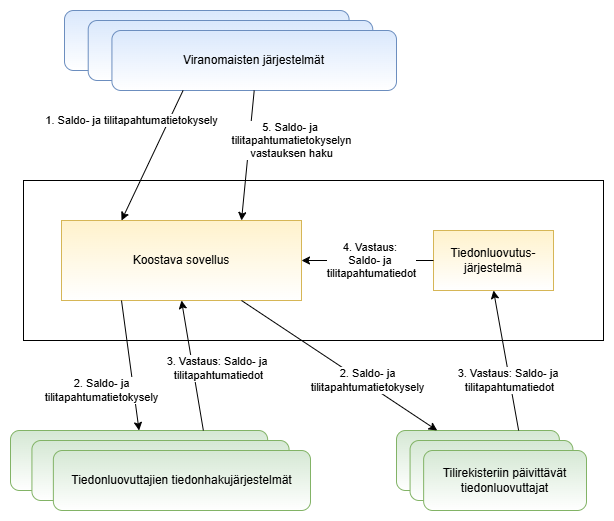

# Centraliserat informationssystem för saldo och kontotransaktioner

*Dokumentversion 0.2*

Detta dokument är en del av dokumentationen av övervakningssystemet för bank- och betalkonton och instruerar uppgiftslämnare och användare av information i förmedling av uppgifter om saldo och kontotransaktioner i övervakningssystemet för bank- och betalkonton. Detta dokument beskriver kraven för implementering av systemet, flödet av information om saldo och kontotransaktioner i systemet samt fråge- och svarsmeddelanden om saldo och kontotransaktioner.

Övervakningssystemet för bank- och betalkonton förmedlar information om medborgares, företags och enheters bank- och betalkonton till användare av informationen, dvs. till lagstadgade myndigheter. Systemet grundas på lagen om ett övervakningssystem för bank- och betalkonton. Lagändringen om centralisering av förfrågningar om saldo och kontotransaktioner samt om värdepapper till övervakningssystemet för bank- och betalkonton träder i kraft i december 2025.

Uppgiftslämnare, dvs. kreditinstitut, betalningsinstitut, institut för elektroniska pengar och leverantörer av kryptotillgångstjänster, överlåter sina kunders bank- och betalkontouppgifter antingen via bank- och betalkontoregistret eller genom sitt eget datasöksystem. Tullen upprätthåller ett sammanställningsprogram som förmedlar myndigheters begäranden om uppgifter till bank- och betalkontoregistret samt överför de mottagna uppgifterna till myndigheten. Förfrågningar om saldo och kontotransaktioner skickas antingen till uppgiftslämnarens datasöksystem eller via skyddad e-post till kontoregistrets operatörer. Förfrågningar besvaras antingen genom ett system för utlämnande av uppgifter eller genom ett eget datasöksystem.

### Innehållsförteckning

[1. Kontaktuppgifter](#luku1)  
[2. Ordlista & förkortningar](#luku2)  
[3. Certifikat](#luku3)  
[4. Dataflöde för saldo och kontotransaktioner](#luku4)  
[5. Business Application Header](#luku5)  
[6. Frågemeddelande](#luku6)  
[7. Svarsmeddelandea](#luku7)  
[8. Felsituationer](#luku8)  

## 1. Kontaktuppgifter 

E-post: [tilirekisteri@tulli.fi](mailto:tilirekisteri@tulli.fi).

## 2. Ordlista & förkortningar 

| Term    | Förklaring |
| -------- | ------- |
| Övervakningssystem för bank- och betalkonton | Det nationella övervakningssystemet för bank- och betalkonton, som består av ett kontoregister, datasöksystem och från och med 1.11.2022 ett sammanställningsprogram, grundas på lagen om ett övervakningssystem för bank- och betalkonton 571/2019 och på Europaparlamentets och rådets direktiv (EU) 2018/843 av den 30 maj 2018 om förhindrande av användning av det finansiella systemet för penningtvätt eller finansiering av terrorism.|
| Centraliserat informationssystem för saldo och kontotransaktioner | Förfarande för hantering av uppgifter om saldo och kontotransaktioner från övervakningssystemet för bank- och betalkonton samt uppgifter om värdepapper, vilket baseras på elektronisk informationshantering. |
| Bank- och betalkontoregister/Kontoregister| Bank- och betalkontoregistret (kontoregistret) är ett system som byggts upp av Tullen, som består av applikationen Kontoregister och dess uppdaterings- och frågegränssnitt. Kontoregistret samlar in uppgifter om kunder som har bank- och betalkonton hos betalningsinstitut och institut för elektroniska pengar samt hos kreditinstitut som beviljats dispens av Finansinspektionen, samt kunduppgifter från leverantörer av kryptotillgångstjänster.  |
| Sammanställningsprogram | En automatiserad teknisk lösning som upprätthålls av Tullen, med vilken man förmedlar uppgifter om bank- och betalkonton, bankfack, saldo och kontotransaktioner samt om värdepapper via övervakningssystemet för bank- och betalkonton.    |
| Datasöksystem | Datasöksystem avser ett elektroniskt datasöksystem för bank- och betalkonton som administreras av uppgiftslämnaren, och med vilken uppgiftslämnaren direkt och utan hinder av sekretessbestämmelserna förmedlar information om sina kunder, som avses i lagen om ett övervakningssystem för bank- och betalkonton 4 § 2 mom. till behörig myndighet. Enligt lagen bestämmer Tullen de tekniska kraven på datasöksystemet och varje uppgiftslämnare realiserar sitt eget datasöksystem, så det finns alltså många datasöksystem.  |
| Användare av information | Lagen om ett övervakningssystem för bank- och betalkonton fastställer behörig myndighet samt advokatförening, vilka har rätt att begära information från övervakningssystemet för bank- och betalkonton. Behörighet definieras i gällande lagstiftning.  |
| Uppgiftslämnare | Uppgiftslämnare avser betalningsinstitut, institut för elektroniska pengar, kreditinstitut eller leverantör av kryptotillgångstjänster som tillhandahåller uppgifter som definieras i lagen om övervakningssystemet för bank- och betalkonton via kontoregistrets uppdateringsgränssnitt som upprätthålls av Tullen eller förmedlar motsvarande uppgifter via datasöksystemet som den upprätthåller. Uppgiftslämnare avser också filialkontor i Finland som innehas av ett utländskt betalningsinstitut, institut för elektroniska pengar, kreditinstitut och tillhandahållare av virtuella valutor. |
| Tiedonluovutusjärjestelmä | Järjestelmä, johon tilirekisteriin päivittävät tiedonluovuttajat toimittavat vastaussanoman saldo- ja tilitapahtumatietokyselyyn.  |
| Saldo |  Pankki- ja maksutilillä kyselyn vastaushetkellä oleva rahamäärä, josta on vähennetty mahdollinen katevaraus.  |
| Tilitapahtumatiedot | Yksityiskohtaisia tietoja toimista, jotka on suoritettu tiettynä ajanjaksona tietyn maksutilin tai IBAN-tilinumerolla yksilöidyn pankkitilin kautta, tai yksityiskohtaisia tietoja kryptovarojen siirroista (kts. pankki- ja maksutilien valvontajärjestelmästä annetun lain 2 §:n 15 kohta). |
| Lisäselvityspyyntö | Tiedonluovuttaja pyytää lisäselvitystä kyselyn tehneeltä viranomaiselta ennen tiedonluovutusta.  |
| Erikseen pyydettävät (lisä)tiedot | Tiedot, joita tiedonluovuttaja ei palauta vastaussanomassa ellei viranomainen erikseen pyydä niitä kyselysanomassaan.  |

## 3. Varmenteet 

Pankki- ja maksutilien valvontajärjestelmässä ulkoiset yhteydet suojataan varmenteilla. Tiedonluovuttajan tulee ilmoittaa Tullille, mitä varmenteita se käyttää. Varmenteiden tulee olla Tullin ohjeistuksen mukaisia. Tiedonluovuttajan tulee hankkia varmennevaatimukset täyttävät palvelin- ja järjestelmäallekirjoitusvarmenteet ja asentaa ne järjestelmiinsä. Sanomien allekirjoitukseen tarvitaan lisäksi allekirjoitusvarmenne. Teknisesti sama varmenne voi toimia sekä palvelin- että järjestelmäallekirjoitusvarmenteena tai varmenteet voivat olla erillisiä. Tyypillisesti palvelinvarmenne asennetaan tietoliikenneyhteyksiä hoitavaan edustapalvelimeen ja allekirjoitusvarmenne vastaukset muodostavaan taustapalvelimeen.

Tiedonhakujärjestelmän varmenteet

 

| Standardi    | Varmenteen nimi |  Käyttötarkoitus  |    
| -------- | ------- | ------- |  
| X.509 (versio 3) | Tiedonhakujärjestelmän tietoliikennevarmenne|  Rajapinnan hyödyntäjän ja tiedonluovuttajan tai tiedonluovuttajan valtuuttaman tahon tunnistaminen  |  
| X.509 (versio 3) | 	Tiedonhakujärjestelmän allekirjoitusvarmenne  |  Sanoman allekirjoittaminen, sanoman muuttumattomuuden varmistaminen, tiedonluovuttajan tunnistaminen  |  

Tiedonhakujärjestelmän kyselyrajapinnan hyödyntäjät sekä tiedonluovuttajat tai tiedonluovuttajan valtuuttamat tahot tunnistetaan X.509-varmenteilla (Tietoliikennevarmenne). Kyselyrajapinnan kysely- ja vastaussanomat allekirjoitetaan XML-allekirjoituksella (Allekirjoitusvarmenne).

### 3.1 Tiedonluovuttajan allekirjoitusvarmenne 

Tiedonluovuttajan on allekirjoitettava lähettämänsä sanomat käyttäen x.509 palvelinvarmennetta, josta käy ilmi ko. tiedonluovuttajan Y-tunnus tai ALV-tunnus. Tiedonhakujärjestelmän toteuttajien on myös tarkistettava saapuvien sanomien allekirjoitus. Vastaanottaja ei saa hyväksyä sanomaa ilman hyväksyttävää allekirjoitusta. Allekirjoituksen hyväksyminen edellyttää, että XML-allekirjoitus on validi (kun kyseessä tiedonhakujärjestelmä) ja että
joko   
a) varmenne on Digi- ja väestötietoviraston (DVV) myöntämä, voimassa, eikä esiinny DVV:n ylläpitämällä sulkulistalla ja varmenteen kohteen serialNumber attribuuttina on kyseisen tiedonluovuttajan Y-tunnus tai ALV-tunnus  
tai  
b) varmenne on eIDAS-hyväksytty sivustojen tunnistamisvarmenne, voimassa, eikä esiinny varmenteen tarjoajan ylläpitämällä ajantasaisella sulkulistalla ja varmenteen kohteen organizationIdentifier-attribuuttina on kyseisen tiedonluovuttajan Y-tunnus tai ALV-tunnus.

Huom. Jotta sanomien allekirjoitukset täyttävät alla viitatut Kyberturvallisuuskeskuksen tietoturvavaatimukset, tulee allekirjoituksiin käytettävän varmenteen julkisen avaimen (RSA public key) olla vähintään 3072 bittinen. Allekirjoituksiin käytettävän varmenteen käyttötarkoituksiin myös kuulua ”digitaalinen allekirjoitus”. Nämä seikat tulee huomioida varmennetta tilattaessa.

Toimivaltaisen viranomaisen allekirjoitusvarmenne

  

Toimivaltaisen viranomaisen on allekirjoitettava lähettämänsä sanomat käyttäen x.509 palvelinvarmennetta, josta käy ilmi ko. viranomaisen Y-tunnus. Saapuvien sanomien allekirjoitus on tarkistettava. Vastaanottaja ei saa hyväksyä sanomaa ilman hyväksyttävää allekirjoitusta. Toimivaltaisen viranomaisen allekirjoituksen hyväksyminen edellyttää, että XML-allekirjoitus on validi ja että  
a) varmenne on DVV:n myöntämä, voimassa, eikä esiinny DVV:n ylläpitämällä sulkulistalla  
b) varmenteen kohteen serialNumber attribuuttina on sanoman lähettäneen toimivaltaisen viranomaisen Y-tunnus tai tunnus, joka muodostuu kirjaimista “FI” ja Y-tunnuksen numero-osasta ilman väliviivaa (ALV-tunnuksen muotoinen tunnus).

 Tiedonhakujärjestelmän yhteydenottajan tietoliikennevarmenne 

  

Tiedonluovuttaja tai tiedonluovuttajan valtuuttama taho tunnistaa toimivaltaisen viranomaisen, joka ottaa yhteyden tiedonhakujärjestelmän kyselyrajapintaan, palvelinvarmenteen avulla. Yhteys toimivaltaiselta viranomaiselta on hyväksyttävä seuraavin edellytyksin:     
a) Toimivaltaisen viranomaisen varmenteen on myöntänyt DVV  
b) varmenne on voimassa, eikä esiinny DVV:n sulkulistalla  
c) varmenteen kohteen serialNumber attribuuttina on toimivaltaisen viranomaisen tai sen puolesta toimivan valtion palvelukeskuksen Y-tunnus tai tunnus, joka muodostuu kirjaimista “FI” ja Y-tunnuksen numero-osasta ilman väliviivaa (ALV-tunnuksen muotoinen tunnus).  

Huom. Jotta tietoliikenteen suojaus täyttää alla viitatut Kyberturvallisuuskeskuksen tietoturvavaatimukset, tulee käytettävän varmenteen julkisen avaimen (RSA public key) olla vähintään 3072 bittinen. Lisäksi varmenteen tulee olla QWAC (Qualified Website Authentication Certificate) tyyppinen palvelinvarmenne, joka sisältää laajennukset (X509v3 Extended Key Usage: TLS Web Client Authentication, TLS Web Server Authentication). Nämä tulee huomioida varmennetta tilattaessa.

### 3.2 Tiedonluovuttajan tai tiedonluovuttajan valtuuttaman tahon tietoliikennevarmenne 

Tietoliikenne on suojattava (salaus ja vastapuolen tunnistus) x.509 (versio 3) varmenteita käyttäen.
Tiedonhakujärjestelmän ollessa kyseessä toimivaltainen viranomainen, joka ottaa yhteyden kyselyrajapintaan, tunnistaa tiedonluovuttajan tai tiedonluovuttajan valtuuttaman tahon palvelinvarmenteen avulla.

Yhteyden muodostukseen on käytettävä palvelinvarmennetta, josta käy ilmi ko. tiedonluovuttajan tai tiedonluovuttajan valtuuttaman tahon Y-tunnus tai ALV-tunnus. Tiedonluovuttajan valtuuttamalla taholla tarkoitetaan esim. palvelukeskusta, jonka tiedonluovuttaja on valtuuttanut puolestaan huolehtimaan ilmoitusten muodostamisesta ja/tai lähettämisestä. Tätä koskeva valtuutus on toimitettava Tullille kirjallisesti.

Allekirjoituksen hyväksyminen edellyttää, että
joko  
a) palvelinvarmenteen on myöntänyt DVV, varmenne on voimassa, eikä esiinny DVV:n sulkulistalla, varmenteen kohteen serialNumber attribuuttina on kyseisen tiedonluovuttajan tai tiedonluovuttajan valtuuttaman tahon Y-tunnus tai ALV-tunnus  
tai  
b) palvelinvarmenne on eIDAS-hyväksytty sivustojen tunnistamisvarmenne, voimassa, eikä esiinny varmenteen tarjoajan ylläpitämällä ajantasaisella sulkulistalla ja varmenteen kohteen organizationIdentifier-attribuuttina on kyseisen tiedonluovuttajan tai tiedonluovuttajan valtuuttaman tahon Y-tunnus tai ALV-tunnus.
Mikäli tiedonluovuttajan palvelinvarmenteessa ja lähtevän sanoman allekirjoitusvarmenteessa käytetään samaa Y-tunnusta tai ALV-tunnusta, voidaan kumpaankin tarkoitukseen käyttää samaa varmennetta.

Huom. Jotta tietoliikenteen suojaus täyttää alla viitatut Kyberturvallisuuskeskuksen tietoturvavaatimukset, tulee käytettävän varmenteen julkisen avaimen (RSA public key) olla vähintään 3072 bittinen. Lisäksi varmenteen tulee olla QWAC (Qualified Website Authentication Certificate) tyyppinen palvelinvarmenne, joka sisältää laajennukset (X509v3 Extended Key Usage: TLS Web Client Authentication, TLS Web Server Authentication). Nämä tulee huomioida varmennetta tilattaessa.

Tiedonhakujärjestelmän XML-allekirjoituksen muodostaminen 

 

Allekirjoituksen tyyppi on enveloped signature. Signature-elementti sijoitetaan [BAHin](#luku5) Sgntr-elementin alle.

Esimerkki SignedInfo
 

Allekirjoitusalgoritmi on RSA-SHA256 tai RSA-SHA512 ja C14N on Exclusive XML Canonicalization. Reference URI on joko "#applicationRequest" tai "#applicationResponse", riippuen onko kyseessä kysely- vai vastaussanoma. Eli vain "ApplicationRequest" tai "ApplicationResponse" elementti allekirjoitetaan. Allekirjoitusta muodostettaessa laskettavien tiivisteiden (Digest) muodostamiseen tulee käyttää SHA256- tai SHA512 -algoritmia. Huom. Kun kyseessä on vastaussanoma, sen tulee sisältää siihen liittyvän kyselysanoman BusinessApplicationHeaderin (Rltd-elementti), jonka tulee myös olla allekirjoitettu.

Allekirjoituksessa käytettyjen kryptografisten algoritmien on vastattava kryptografiselta vahvuudeltaan vähintään Viestintäviraston määrittelemiä kryptografisia vahvuusvaatimuksia kansalliselle suojaustasolle TL IV. Tämänhetkiset vahvuusvaatimukset on kuvattu dokumentissa https://www.kyberturvallisuuskeskus.fi/sites/default/files/media/regulation/ohje-kryptografiset-vahvuusvaatimukset-kansalliset-suojaustasot.pdf (Dnro: 190/651/2015).

### 3.3 Yhteyksien suojaaminen 

Tilirekisterin päivitysrajapinnan ja tiedonhakujärjestelmän kyselyrajapinnan yhteydet on suojattava TLS-salauksella käyttäen TLS-protokollan versiota 1.2 tai korkeampaa. Yhteyden molemmat päät tunnistetaan yllä kuvatuilla palvelinvarmenteilla käyttäen kaksisuuntaista kättelyä. Yhteys on muodostettava käyttäen ephemeral Diffie-Hellman (DHE) avaintenvaihtoa, jossa jokaiselle sessiolle luodaan uusi uniikki yksityinen salausavain. Tämän menettelyn tarkoituksena on taata salaukselle forward secrecy -ominaisuus, jotta salausavaimen paljastuminen ei jälkikäteen johtaisi salattujen tietojen paljastumiseen.
TLS-salauksessa käytettyjen kryptografisten algoritmien on vastattava kryptografiselta vahvuudeltaan vähintään Traficomin määrittelemiä kryptografisia vahvuusvaatimuksia kansalliselle suojaustasolle TL IV. Tämänhetkiset vahvuusvaatimukset on kuvattu dokumentissa https://www.kyberturvallisuuskeskus.fi/sites/default/files/media/regulation/ohje-kryptografiset-vahvuusvaatimukset-kansalliset-suojaustasot.pdf (Dnro: 190/651/2015).

### 3.4 Sallittu HTTP-versio 

Tilirekisterin päivitysrajapinnan ja tiedonhakujärjestelmän kyselyrajapinnan yhteydet käyttävät HTTP-protokollan versiota 1.1.

### 3.5 Varmenteiden hankinta 

Varmenteet hakee se taho, joka muodostaa ja välittää vastaukset tiedonhyödyntäjien kyselyihin. Jos käytetään palveluntarjoajaa, joka muodostaa ja välittää sanomat ilmoitusvelvollisen puolesta, palvelinvarmennetta hakee palveluntarjoaja. Tällöin ilmoitusvelvollisen tulee valtuuttaa palveluntarjoaja allekirjoittamaan lähetettävät sanomat.
Mikäli varmenteeseen liittyvä yksityinen avain paljastuu tai sen epäillään joutuneen vääriin käsiin, tulee varmenteen haltijan huolehtia siitä, että varmenne suljetaan välittömästi ja tästä ilmoitetaan Tullille ilman viivytystä. Vastaavasti mikäli varmenne myönnetään vahingossa tai vilpillisesti väärälle taholle, tulee varmenteen oikean kohteen huolehtia siitä, että varmenne suljetaan ja tästä ilmoitetaan Tullille välittömästi varmenteen oikean kohteen tultua tietoiseksi asiasta.

### 3.6 Varmenteiden päivitys 

Tiedonluovuttajan tulee uusia varmenne hyvissä ajoin ennen sen vanhenemista. Vanhentunutta varmennetta ei voi käyttää. 
Ellei muuta ole sovittu, uusi tai uusittu varmenne tulee toimittaa Tullille sähköisesti kiistämätöntä ja tietoturvallista tiedonsiirtomenetelmää käyttäen viimeistään 1 kk ennen sen käyttöönottoa. Varmenne tulee lähettää Tullin turvasähköpostipalvelua (https://turvaviesti.tulli.fi/) käyttäen osoitteeseen tilirekisteri@tulli.fi.
Pankki- ja maksutilien valvontajärjestelmän laissa pykälässä 8 §:n Tullilla on oikeus saada tiedot maksuttomasti, ja näin ollen tiedonluovuttaja vastaa käyttämänsä varmenteen kustannuksista.

### 3.7 Tietoturvapoikkeamien ilmoitusvelvollisuus 

Tilirekisterin rajapinnan käyttäjä on velvollinen ilmoittamaan viivytyksettä käyttämiensä varmenteiden tai näiden salaisten avainten vaarantumisesta sekä varmenteen myöntäjälle, että Tullille. Rajapinnan käyttäjä on velvollinen ilmoittamaan viivytyksettä Tullille myös, mikäli rajapintaa käyttävässä tietojärjestelmässä havaitaan tietoturvapoikkeama.
Mikäli tiedonhakujärjestelmän toteuttajan varmenteet tai näiden salaiset avaimet vaarantuvat on tästä ilmoitettava välittömästi varmenteen myöntäjälle ja niille toimivaltaisille viranomaisille, jotka hyödyntävät tiedonhakujärjestelmää. Toimivaltaisille viranomaisille on ilmoitettava myös, jos tiedonhakujärjestelmässä havaitaan tietoturvapoikkeama.
Mikäli tiedonhakujärjestelmää hyödyntävän toimivaltaisen viranomaisen varmenteet tai näiden salaiset avaimet vaarantuvat on tästä ilmoitettava välittömästi varmenteen myöntäjälle ja niille tiedonhakujärjestelmän toteuttajille, joiden toteutusta tiedonhakujärjestelmästä kyseinen toimivaltainen viranomainen hyödyntää.

## 4. Saldo- ja tilitapahtumatietokyselyn tiedonkulku 

Allaolevassa kuvassa on esitetty yleiskuva saldo- ja tilitapahtumatietokyselyn tiedonkulusta pankki- ja maksutilien valvontajärjestelmässä.

  

1. Viranomaisen järjestelmä lähettää saldo- ja tilitapahtumatietokyselyn koostavan sovelluksen [kyselyrajapintaan](https://github.com/FinnishCustoms-SuomenTulli/account-register-aggregating-application/blob/main/index.md#kyselyrajapinta-kysely). Kyselysanoman sisältö on kuvattu luvussa [Kyselysanoma](#luku6). 
2. Koostava sovellus välittää saldo- ja tilitapahtumatietokyselyn toimijalle, jolle kysely on suunnattu joko rajapinnan kautta tiedonhakujärjestelmään tai turvasähköpostilla tilirekisterin toimijalle.  
3. Tiedonluovuttaja vastaa saldo- ja tilitapahtumatietokyselyyn viimeistään seuraavan pankkipäivän aikana. Jos kysely on osoitettu tiedonhakujärjestelmän toteuttaneelle toimijalle, tiedonhakujärjestelmä lähettää vastaussanoman koostavalle sovellukselle rajapinnan kautta. Jos kysely on osoitettu tilirekisteriä käyttävälle toimijalle, tämä toimittaa vastaussanoman tiedonluovutusjärjestelmään.     
4. Vastaussanoma välittyy tiedonluovutusjärjestelmästä koostavaan sovellukseen.  
5. Viranomainen hakee vastauksen saldo- ja tilitapahtumatietokyselyynsä koostavan sovelluksen rajapinnasta. Vastauksen haussa käytetään koostavan sovelluksen [status](https://github.com/FinnishCustoms-SuomenTulli/account-register-aggregating-application/blob/main/index.md#kyselyrajapinta-status) ja [tulosrajapintoja](https://github.com/FinnishCustoms-SuomenTulli/account-register-aggregating-application/blob/main/index.md#kyselyrajapinta-tulos).

### 4.1 Ohjeita tiedonluovuttajille 

Saldo- ja tilitapahtumatietokyselyihin on vastattava viipymättä, mutta viimeistään seuraavana pankkipäivänä virka-ajan päättymiseen eli kello 16:15 (EET) mennessä. Mikäli kysely ei tule virka-ajan puitteissa eli kello 8:00-16:15 välillä, määräajan laskenta alkaa seuraavasta pankkipäivästä. Esimerkiksi, jos viranomainen lähettää kyselyn perjantaina kello 18:00, vastaus tulee toimittaa viimeistään seuraavaan tiistaihin kello 16:15 mennessä.

Kun kyseessä on vain saldokysely, vastaus tulee pyrkiä toimittamaan välittömästi. Viimeistään vastaus tulee toimittaa seuraavan pankkipäivän päättymiseen mennessä. Annetun saldotiedon tulee koskea tiedonluovuttajan vastausajankohdan saldoa. Saldotietoa koskevassa vastauksessa tulee olla aikaleima, joka tarkentaa saldon ajankohdan. Saldokyselyissä vakiomuotoisesti pyydetään tilinumeron lisäksi tilillä oleva rahamäärä ja tilin saldoa koskeva päivämäärä ja kellonaika (laki pankki-ja maksutilien valvontajärjestelmästä 17 b §). Tilin saldossa tulee olla huomioitu mahdolliset tiliä koskevat katevaraukset, joiden tulee olla vähennetty tilin saldotiedosta. Poikkeustilanteissa voidaan kysellä myös lisätiedot. Mikäli saldokyselyyn sisältyy lisätietopyyntö, tulee se käsitellä erikseen kaikkien pyydettyjen tietojen toimittamiseksi.

Asianajajan asiakasvaratilien ollessa kyseessä, saldo- ja tilitapahtumatietoja ei palauteta. Asiakasvaratilillä tarkoitetaan asianajajan tai hänen toimistonsa hallussa olevia muille kuin asianajajalle tai hänen toimistolleen kuuluvien raha- ja muiden varojen tilejä. Asianajajan asiakasvaratilejä koskevia saldo- ja tilitapahtumatietoja ei saa luovuttaa keskitetyn sähköisen saldo- ja tilitapahtumajärjestelmän kautta (laki pankki-ja maksutilien valvontajärjestelmästä 17 b § ja 17 d §). Asiakasvaratilin saldo- ja tilitapahtumatietojen selvittämiseksi toimivaltaisen viranomaisen tulisi olla yhteydessä tilin haltijana toimivaan asianajajaan.

Saldo- ja tilitapahtumakyselyitä ei voi tehdä kansainvälisinä kyselyinä.

#### Tiedonluovutusjärjestelmään raportoivat toimijat

Tilirekisteriin päivittäville tiedonluovuttajille saldo- ja tilitapahtumatietokysely toimitetaan suojatulla sähköpostilla (kts. [esimerkkisähköposti](assets/Example_email.png)). Pyyntösanoma on sähköpostin liitteenä XML-muodossa. Mikäli saldo- ja tilitapahtumakyselyn käsittelyssä tulee virhetilanne, tietoja ei jostain syystä löydykään tai kysely menee lisäselvityspyyntöön, tulee rajapintaan toimittaa vastaus ja ilmoittaa kunkin tilanteen mukainen tieto. Vastaus kyselyyn tulee toimittaa XML-muotoisena sanomana Tullin rajapintaan.

Mikäli jostain syystä tietoja haun kohteesta ei löydykään, tiedonluovuttajan tulee vastata kyselyyn NFOU-statuskoodilla.

### 4.2 Lisäselvityspyyntö 

Jos tiedonluovuttaja katsoo vastaanottamansa kyselyn sellaiseksi, että se tarvitsee lisäselvitystä, voi tiedonluovuttaja palauttaa kyselyyn NRES-statuskoodin (käsittely kesken) ja ottaa suoraan yhteyttä kyselyn lähettäneeseen viranomaiseen pyytääkseen lisätietoja. Lisäselvityspyyntöä varten viranomainen lähettää aina kyselysanoman headerin Fr/OrgId/CtctDtls -elementissä yhteystiedot (nimi, puhelinnumero, sähköposti). 

Tiedonluovuttaja vastaa alkuperäiseen kyselyyn lisäselvityksen käsittelyn jälkeen, jos se on aikarajojen puitteissa mahdollista. Jos kyselyyn ei ehditä vastata aikarajan puitteissa, voi viranomainen tarvittaessa tehdä uuden kyselyn, johon tiedonluovuttaja vastaa sovitusti. Jos tiedonluovuttaja on vastannut kyselyyn NRES, koostava sovellus yrittää uudelleennoutaa vastauksen tiedonluovuttajalta tiedonluovutuksen aikarajan loppuun asti. Tiedonluovutuksen aikarajan umpeuduttua kysely suljetaan.

Esimerkki yhteystietojen välittämisestä: [Esimerkkisanoma](examples/general/example_passing_contact_details.xml)

## 5. Business Application Header 

ISO 20022 standardin mukainen BusinessApplicationHeaderV01 [head.001.001.01](https://github.com/FinnishCustoms-SuomenTulli/account-register-information-query/blob/master/schemas/head.001.001.01.xsd) sanoma liitetään sekä kysely- että vastaussanomaan. Kenttien käyttö on muutoin samanlaista kysely- ja vastaussanomassa, paitsi kyselysanomassa tulee lähettää yhteystiedot mahdollista lisäselvityspyyntöä varten.

Sanoman Fr-kentän lähettäjätiedoissa on viranomaisen lähettämässä sanomassa viranomaisen tiedot, tiedonluovuttajan lähettämässä sanomassa tiedonluovuttajan tiedot ja Tullin välittämissä sanomissa Tullin tiedot. Vastaavasti To-kentän vastaanottajatiedoissa on Tullin tiedot, kun lähetetään sanoma koostavaan sovellukseen, ja sanoman vastaanottavan viranomaisen tai tiedonluovuttajan tiedot, kun koostava sovellus välittää sanoman eteenpäin.

<table>
  <colgroup><col /><col /><col /><col /></colgroup>
  <tbody>
    <tr>
      <th>Elementin nimi</th>
      <th >min..max</th>
      <th >Tyyppi</th>
      <th >Kuvaus</th>
    </tr>
    <tr>
      <td >BusinessApplicationHeaderV01</td>
      <td >1..1</td>
      <td ></td>
      <td ></td>
    </tr>
    <tr>
      <td >BusinessApplicationHeaderV01 
      +Charset
      </td>
      <td >0..1</td>
      <td >UnicodeChartsCode</td>
      <td >"UTF-8"</td>
    </tr>
    <tr>
      <td >BusinessApplicationHeaderV01 
      +Fr 
      ++OrgId 
      +++Id 
      ++++OrgId 
      +++++Othr 
      ++++++Id
      </td>
      <td >1..1</td>
      <td >Max35Text</td>
      <td >Lähettäjän Y-tunnus. Kun tunnusta verrataan sanoman allekirjoitusvarmenteeseen, tulee ottaa huomioon, että varmenteen sisältämä tunnus voi olla joko Y- tai ALV-tunnuksen muodossa.</td>
    </tr>
    <tr>
      <td >BusinessApplicationHeaderV01 
      +Fr 
      ++OrgId 
      +++Id 
      ++++OrgId 
      +++++Othr 
      ++++++SchmeNm 
      +++++++Cd
      </td>
      <td >1..1</td>
      <td >ExternalOrganisationIdentification1Code</td>
      <td >"Y", organisaatiotunnuksen tyyppi</td>
    </tr>
    <tr>
      <td >BusinessApplicationHeaderV01 
      +Fr 
      ++OrgId 
      +++CtctDtls 
      ++++Nm
      </td>
      <td >0..1</td>
      <td >Max140Text</td>
      <td >Vain viranomaisen kyselysanomassa: Henkilön nimi mahdollista lisäselvityspyyntöä varten</td>
    </tr>
    <tr>
      <td >BusinessApplicationHeaderV01 
      +Fr 
      ++OrgId 
      +++CtctDtls 
      ++++PhneNb
      </td>
      <td >0..1</td>
      <td >PhoneNumber</td>
      <td >Vain viranomaisen kyselysanomassa: Puhelinnumero mahdollista lisäselvityspyyntöä varten</td>
    </tr>
    <tr>
      <td >BusinessApplicationHeaderV01 
      +Fr 
      ++OrgId 
      +++CtctDtls 
      ++++EmailAdr
      </td>
      <td >0..1</td>
      <td >Max2048Text</td>
      <td >Vain viranomaisen kyselysanomassa: Sähköpostiosoite mahdollista lisäselvityspyyntöä varten</td>
    </tr>
    <tr>
      <td >BusinessApplicationHeaderV01 
      +To 
      ++OrgId 
      +++Id 
      ++++OrgId 
      +++++Othr 
      ++++++Id
      </td>
      <td >1..1</td>
      <td >Max35Text</td>
      <td >Vastaanottajan Y-tunnus</td>
    </tr>
    <tr>
      <td >BusinessApplicationHeaderV01 
      +To 
      ++OrgId 
      +++Id 
      ++++OrgId 
      +++++Othr 
      ++++++SchmeNm 
      +++++++Cd
      </td>
      <td >1..1</td>
      <td >ExternalOrganisationIdentification1Code</td>
      <td >"Y", organisaatiotunnuksen tyyppi</td>
    </tr>
    <tr>
      <td >BusinessApplicationHeaderV01 
      +BizMsgIdr
      </td>
      <td >1..1</td>
      <td >Max35Text</td>
      <td >Käyttö standardin mukaisesti</td>
    </tr>
    <tr>
      <td >BusinessApplicationHeaderV01 
      +MsgDefIdr
      </td>
      <td >1..1</td>
      <td >Max35Text</td>
      <td >Sanoma-id, kyselysanomassa "auth.001.001.01" ja vastaussanomassa "auth.002.001.01"</td>
    </tr>
    <tr>
      <td >BusinessApplicationHeaderV01 
      +CreDt
      </td>
      <td >1..1</td>
      <td >ISONormalisedDateTime</td>
      <td >Luomispäivämäärä ja aika. Normalisoitava Z-notaatiolla (UTC)</td>
    </tr>
    <tr>
      <td >BusinessApplicationHeaderV01 
      +Sgntr
      </td>
      <td >0..1</td>
      <td >SignatureEnvelope</td>
      <td >
        
Lähettäjän muodostama [XML-allekirjoitus](#xml-allekirjoitus)        
      </td>
    </tr>
    <tr>
      <td >BusinessApplicationHeaderV01 
      +Sgntr 
      ++Signature 
      +++SignatureValue
      </td>
      <td >1..1</td>
      <td >SignatureValueType</td>
      <td >Allekirjoitus</td>
    </tr>
    <tr>
      <td >BusinessApplicationHeaderV01 
      +Sgntr 
      ++Signature 
      +++KeyInfo 
      ++++X509Data 
      +++++X509Certificate
      </td>
      <td >1..1</td>
      <td >base64Binary</td>
      <td >Sertifikaatti</td>
    </tr>
  </tbody>
</table>

## 6. Kyselysanoma 

Kyselysanomassa käytetään ISO 20022 sanomaa InformationRequestOpeningV01 [auth.001.001.01](https://github.com/FinnishCustoms-SuomenTulli/account-register-information-query/blob/master/assets/iso20022org/auth.001.001.01.xsd). InformationRequestOpeningV01 sanoman supplementary data -osiossa käytetään kansallista InformationRequestFIN012 (fin.012.001.04) sanomalaajennosta.

Alla luvussa 6.2 on kuvattu, mitä kenttiä käytetään kyselysanomassa. Alisanoman [fin.012.001.04](schemas/fin.012.001.04.xsd) skeema. Esimerkkejä [kyselysanomasta](examples/queries).

### 6.1 Erityyppisten tietojen hakeminen 

Keskitetystä saldo- ja tilitapahtumatietojärjestelmästä on mahdollista hakea pelkkiä saldotietoja, pelkkiä tilitapahtumatietoja, tai molempia.

[Esimerkkisanoma](examples/general/example_requesting_only_bal_or_entry_or_both.xml) saldo- ja tilitapahtumatietojen kyselystä.

#### Pelkkien tilitapahtumatietojen haku

Käytetään ajantasaisten tilitapahtumatietojen noutamiseen. Sisältää myös keskeneräiset tapahtumat [Tapahtuman tila: "kesken"]

Vastauksen mukana välitetään aina kaikki muut tiedot, paitsi saldoon (bal-elementti) kuuluvat kentät ja erikseen pyydettävät tiedot.

Pelkkiä tilitapahtumatietoja kyseltäessä sanomaan sisällytetään investigationTypeCode: TRAN. 

#### Pelkkien saldotietojen haku

Käytetään luovutushetken saldotietojen noutamiseen. 

Vastauksen mukana välitetään aina kaikki muut tiedot, paitsi tilitapahtumatietoja (entry-elementti) sisältävät kentät ja erikseen pyydettävät tiedot.

Pelkkiä saldotietoja kyseltäessä sanomaan sisällytetään investigationTypeCode: BALN.

#### Saldo- ja tilitapahtumatietojen haku

Käytetään hakuaikavälin tilitapahtumatietojen sekä aikavälin alku- ja loppuhetken saldotiedon noutamiseen. Sisältää myös keskeneräiset tapahtumat [Tapahtuman tila: "kesken"]

Vastauksen mukana välitetään aina kaikki muut tiedot paitsi erikseen pyydettävät tiedot.

Saldo- ja tilitaphtumatietoja kyseltäessä sanomaan sisällytetään erillisinä elementteinä investigationTypeCode: TRAN ja investigationTypeCode: BALN.

### 6.2 InformationRequestOpeningV01 sanoman sisältö 

<table>
  <colgroup><col /><col /><col /><col /></colgroup>
  <tbody>
    <tr>
      <th>Elementin nimi</th>
      <th >min..max</th>
      <th >Tyyppi</th>
      <th >Kuvaus</th>
    </tr>
    <tr>
      <td >InformationRequestOpeningV01</td>
      <td >1..1</td>
      <td ></td>
      <td ></td>
    </tr>
    <tr>
      <td >
        InformationRequestOpeningV01 
        +InvstgtnId
      </td>
      <td >1..1</td>
      <td >Max35Text</td>
      <td >Tapauksen tunniste</td>
    </tr>
    <tr>
      <td >
        InformationRequestOpeningV01 
        +LglMndBsis 
        ++Prgrph
      </td>
      <td >1..1</td>
      <td >Max35Text</td>
      <td >Laillisuusperuste</td>
    </tr>
    <tr>
      <td >
        InformationRequestOpeningV01 
        +CnfdtltySts
      </td>
      <td >1..1</td>
      <td >YesNoIndicator</td>
      <td >aina "true"</td>
    </tr>
    <tr>
      <td >
        InformationRequestOpeningV01 
        +InvstgtnPrd 
        ++Dt 
        +++FrDt
      </td>
      <td >1..1</td>
      <td >ISODate</td>
      <td >Hakuaikavälin alkamispäivä</td>
    </tr>
    <tr>
      <td >
        InformationRequestOpeningV01 
        +InvstgtnPrd 
        ++Dt 
        +++ToDt
      </td>
      <td >1..1</td>
      <td >ISODate</td>
      <td >Hakuaikavälin päättymispäivä</td>
    </tr>
    <tr>
      <td >
        InformationRequestOpeningV01 
        +SchCrit 
        ++Acct 
        +++Id 
        ++++Id 
        +++++IBAN
      </td>
      <td >0..1</td>
      <td >IBAN2007Identifier</td>
      <td >Haettavan tilin IBAN-muotoinen tilinumero. 
      Käytetään kun hakukohteena olevalla tilillä on IBAN-muotoinen tilinumero.
      </td>
    </tr>
    <tr>
      <td >
        InformationRequestOpeningV01 
        +SchCrit 
        ++Acct 
        +++Id 
        ++++Id 
        +++++Othr 
        ++++++Id
      </td>
      <td >1..1</td>
      <td >Max34Text</td>
      <td >Haettavan tilin tilinumero, jos kyseessä ei ole IBAN-tili.</td>
    </tr>
    <tr>
      <td >
        InformationRequestOpeningV01 
        +SchCrit 
        ++Acct 
        +++Id 
        ++++Id 
        +++++Othr 
        ++++++SchmeNm 
        +++++++Cd
      </td>
      <td >1..1</td>
      <td >ExternalAccountIdentification1Code</td>
      <td >"OTHR", jos hakukohteena ei ole IBAN-tili</td>
    </tr>
    <tr>
      <td >
        InformationRequestOpeningV01 
        +SchCrit 
        ++Acct 
        +++InvstgtdPties 
        ++++Cd
      </td>
      <td >1..1</td>
      <td >InvestigatedParties1Choice</td>
      <td >"ALLP"</td>
    </tr>
    <tr>
      <td >
        InformationRequestOpeningV01 
        +SchCrit 
        ++Acct 
        +++AuthrtyReqTp 
        ++++MsgNmId
      </td>
      <td >1..1</td>
      <td >Max35Text</td>
      <td >Halutun vastaussanoman tunniste. Tilitapahtuma- ja saldotietoja haettaessa camt.052.001.08.</td>
    </tr>
    <tr>
      <td >
        InformationRequestOpeningV01 
        +SplmtryData 
        ++Envlp 
        +++Document 
        ++++InfReqFin012 
        +++++AuthorityInquiry 
        ++++++OfficialId
      </td>
      <td >1..1</td>
      <td >Max140Text</td>
      <td >Kyselyn lähettävän viranomaisen tunniste</td>
    </tr>
    <tr>
      <td >
        InformationRequestOpeningV01 
        +SplmtryData 
        ++Envlp 
        +++Document 
        ++++InfReqFin012 
        +++++AuthorityInquiry 
        ++++++OfficialSuperiorId
      </td>
      <td >1..1</td>
      <td >Max140Text</td>
      <td >Kyselyn hyväksyvän viranomaisen tunniste</td>
    </tr>
        <tr>
      <td >
        InformationRequestOpeningV01 
        +SplmtryData 
        ++Envlp 
        +++Document 
        ++++InfReqFin012 
        +++++AuthorityInquiry 
        ++++++OfficialOrgId
      </td>
      <td >1..1</td>
      <td >Max140Text</td>
      <td >Kyselevän viranomaisen organisaation tunniste</td>
    </tr>
    <tr>
      <td >
        InformationRequestOpeningV01 
        +SplmtryData 
        ++Envlp 
        +++Document 
        ++++InfReqFin012 
        +++++AdditionalSearchCriteria 
        ++++++RequestedDataSources
      </td>
      <td >0..*</td>
      <td >Max35Text</td>
      <td >Tiedonluovuttaja, jolle kysely on osoitettu (Y-tunnus)</td>
    </tr>
    <tr>
      <td >
        InformationRequestOpeningV01 
        +SplmtryData 
        ++Envlp 
        +++Document 
        ++++InfReqFin012 
        +++++AdditionalSearchCriteria 
        ++++++InvestigationType
      </td>
      <td >0..2</td>
      <td >InvestigationTypeCode</td>
      <td >Jos haetaan tilitapahtumia, lähetetään elementti arvolla "TRAN".  Jos haetaan saldotietoja, lähetetään elementti arvolla "BALN".  Jos haetaan sekä tilitapahtuma- että saldotiedot, lähetetään elementti kahdesti, kerran kummallakin arvolla.</td>
    </tr>
    <tr>
      <td >
        InformationRequestOpeningV01 
        +SplmtryData 
        ++Envlp 
        +++Document 
        ++++InfReqFin012 
        +++++AdditionalTransactionInformation 
        ++++++TransactionFieldCode
      </td>
      <td >0..*</td>
      <td >TransactionFieldCode</td>
      <td >
        
Käytetään, jos vastauksessa halutaan palautettavan erikseen pyydettäviä lisätietoja perustietojen lisäksi. Lista hakuun tarvittaessa sisällytettävistä erikseen pyydettävistä tiedoista: [TransactionFieldCode](#6-3) </td>
    </tr>
  </tbody>
</table>

### 6.3 TransactionFieldCode: erikseen pyydettävät lisätiedot 

| Kuvaus                                | Tietue                                  | Koodi            |
|:--------------------------------------|:----------------------------------------|:-----------------|
| Ilmaisin sisältääkö saldo luottorajan | `BkToCstmrAcctRpt/Rpt/Bal/CdtLine/Incl` | BAL_CDTLINE_INCL |
| Käytettävissä oleva luottoraja        | `BkToCstmrAcctRpt/Rpt/Bal/CdtLine/Amt`  | BAL_CDTLINE_AMT  |

[Esimerkkisanoma](examples/general/example_request_additional_info.xml) erikseen pyydettävistä lisätiedoista.

## 7. Vastaussanoma 

Vastaussanomassa käytetään ISO 20022 sanomaa InformationRequestResponseV01 [auth.002.001.01](https://github.com/FinnishCustoms-SuomenTulli/account-register-information-query/blob/master/assets/iso20022org/auth.002.001.01.xsd). InformationRequestResponseV01 sanoman supplementary data -osiossa palautetaan ISO 20022 sanoma camt.052.001.08.

Alla luvussa 7.1 on kuvattu, mitä kenttiä käytetään vastaussanoman alisanomassa camt.052.001.08. Alisanoman [camt.052.001.08](schemas/camt.052.001.08.xsd) skeema. Esimerkkejä [vastaussanomasta](examples/queries). 

Vastaussanoman sisältö on samanlainen kaikilla tiedonluovuttajilla riippumatta siitä, onko tiedonluovuttaja toteuttanut tiedonhakujärjestelmän vai rajapinnan tilirekisteriin. Ainoastaan vastaussanoman toimitustavat eroavat toisistaan. 

### 7.1 Alisanoman camt.052.001.08 sisältö 

<table>
  <colgroup><col /><col /><col /></colgroup>
  <tbody>
    <tr>
      <th>Elementin nimi</th>
      <th>Tyyppi</th>
      <th>Kuvaus</th>
    </tr>
    <tr>
      <td>
        BkToCstmrAcctRpt 
        +GrpHdr 
        ++MsgId
      </td>
      <td>Max35Text</td>
      <td>Viestin yksilöllinen tunniste.</td>
    </tr>
    <tr>
      <td>
        BkToCstmrAcctRpt 
        +GrpHdr 
        ++CreDtTm
      </td>
      <td>ISODateTime</td>
      <td>Viestin luontipäivämäärä ja -aika.</td>
    </tr>
    <tr>
      <td>
        BkToCstmrAcctRpt 
        +GrpHdr 
        ++AddtlInf
      </td>
      <td>Max500Text</td>
      <td>Lähettäjän antamat lisätiedot.</td>
    </tr>
    <tr>
      <td>
        BkToCstmrAcctRpt 
        +Rpt 
        ++Id
      </td>
      <td>Max35Text</td>
      <td>Raportin yksilöllinen tunniste.</td>
    </tr>
    <tr>
      <td>
        BkToCstmrAcctRpt 
        +Rpt 
        ++CreDtTm
      </td>
      <td>ISODateTime</td>
      <td>Raportin luontipäivämäärä ja -aika.</td>
    </tr>
    <tr>
      <td>
        BkToCstmrAcctRpt 
        +Rpt 
        ++FrToDt 
        +++FrDtTm
      </td>
      <td>ISODateTime</td>
      <td>Raportin kattaman aikavälin alkupäivä.</td>
    </tr>
    <tr>
      <td>
        BkToCstmrAcctRpt 
        +Rpt 
        ++FrToDt 
        +++ToDtTm
      </td>
      <td>ISODateTime</td>
      <td>Raportin kattaman aikavälin päättymispäivä.</td>
    </tr>
    <tr>
      <td>
        BkToCstmrAcctRpt 
        +Rpt 
        ++Acct 
        +++Id 
        ++++IBAN
      </td>
      <td>IBAN2007Identifier</td>
      <td>Tilin IBAN, josta raportti on laadittu.</td>
    </tr>
    <tr>
      <td>BkToCstmrAcctRpt +Rpt ++Acct +++Othr ++++Id</td>
      <td>Max34Text</td>
      <td>Tilinumero muu kuin IBAN, josta raportti on laadittu.</td>
    </tr>
    <tr>
      <td>BkToCstmrAcctRpt +Rpt ++Ntry +++CdtDbtInd</td>
      <td>CreditDebitCode</td>
      <td>Ilmaisee, onko tapahtuma kredit tai debit.</td>
    </tr>
    <tr>
      <td>BkToCstmrAcctRpt +Rpt ++Ntry +++RvslInd</td>
      <td>TrueFalseIndicator</td>
      <td>Ilmaisee, onko tapahtuma korjaus.</td>
    </tr>
    <tr>
      <td>BkToCstmrAcctRpt +Rpt ++Ntry +++BookgDt ++++Dt</td>
      <td>ISODate</td>
      <td>Päivämäärä, jolloin tapahtuma kirjattiin tilille.</td>
    </tr>
    <tr>
      <td>BkToCstmrAcctRpt +Rpt ++Ntry +++Amt</td>
      <td>ActiveOrHistoricCurrencyAndAmount</td>
      <td>Tapahtuman rahamäärä ja valuutta.</td>
    </tr>
    <tr>
      <td>BkToCstmrAcctRpt +Rpt ++Ntry +++ValDt ++++ValDt (Dt)</td>
      <td>ISODate</td>
      <td>Tapahtuman arvopäivä.</td>
    </tr>
    <tr>
      <td>BkToCstmrAcctRpt +Rpt ++Ntry +++AcctSvcrRef</td>
      <td>Max35Text</td>
      <td>Tiliä hoitavan laitoksen antama viite.</td>
    </tr>
    <tr>
      <td>BkToCstmrAcctRpt +Rpt ++Ntry +++BkTxCd ++++Prtry +++++Cd</td>
      <td>Max35Text</td>
      <td>Pankin sisäinen tapahtumakoodi.</td>
    </tr>
    <tr>
      <td>BkToCstmrAcctRpt +Rpt ++Ntry +++BkTxCd ++++Domm +++++Cd</td>
      <td>ExternalBankTransactionDomain1Code</td>
      <td>Pankkitapahtuman standardoitu koodiperhe.</td>
    </tr>
    <tr>
      <td>BkToCstmrAcctRpt +Rpt ++Ntry +++sts ++++Cd</td>
      <td>ExternalEntryStatus1Code</td>
      <td>Tapahtuman tila (esim. kirjattu, kesken).</td>
    </tr>
    <tr>
      <td>BkToCstmrAcctRpt +Rpt ++Ntry +++NtryDtls ++++Btch +++++MsgId</td>
      <td>Max35Text</td>
      <td>Koontitapahtuman tunniste.</td>
    </tr>
    <tr>
      <td>BkToCstmrAcctRpt +Rpt ++Ntry +++NtryDtls ++Btch +++PmtInfId</td>
      <td>Max35Text</td>
      <td>Maksutiedon tunniste.</td>
    </tr>
    <tr>
      <td>BkToCstmrAcctRpt +Rpt ++Ntry +++NtryDtls ++Btch +++NbOfTxs</td>
      <td>Max15NumericText</td>
      <td>Koontitapahtumien lukumäärä.</td>
    </tr>
    <tr>
      <td>BkToCstmrAcctRpt +Rpt ++Ntry +++NtryDtls ++Btch +++TtlAmt</td>
      <td>ActiveOrHistoricCurrencyAndAmount</td>
      <td>Koontitapahtumien kokonaissumma.</td>
    </tr>
    <tr>
      <td>BkToCstmrAcctRpt +Rpt ++Ntry ++NtryDtls +++AmtDtls ++++TxAmt +++++Amt</td>
      <td>ActiveOrHistoricCurrencyAndAmount</td>
      <td>Tapahtuman summa.</td>
    </tr>
    <tr>
      <td>BkToCstmrAcctRpt +Rpt ++Ntry +++NtryDtls ++TxDtls +++AmtDtls ++++TxAmt +++++CcyXchg ++++++UnitCcy</td>
      <td>ActiveOrHistoricCurrencyCode</td>
      <td>Tapahtuman alkuperäinen valuutta.</td>
    </tr>
    <tr>
      <td>BkToCstmrAcctRpt +Rpt ++Ntry +++NtryDtls ++++TxDtls +++++AmtDtls ++++++TxAmt +++++++CcyXchg ++++++++XchgRate</td>
      <td>BaseOneRate</td>
      <td>Käytetty valuuttakurssi.</td>
    </tr>
    <tr>
      <td>BkToCstmrAcctRpt +Rpt ++Ntry +++NtryDtls ++++TxDtls +++++RmtInf ++++++Ustrd</td>
      <td>Max140Text</td>
      <td>Rakenteeton viestitieto.</td>
    </tr>
    <tr>
      <td>BkToCstmrAcctRpt +Rpt ++Ntry +++NtryDtls ++++TxDtls +++++RmtInf ++++++Strd +++++++CdtrRefInf ++++++++Ref</td>
      <td>Max35Text</td>
      <td>Saajan viitetiedot.</td>
    </tr>
    <tr>
      <td>BkToCstmrAcctRpt +Rpt ++Ntry +++NtryDtls ++++TxDtls +++++Refs ++++++InstrId</td>
      <td>Max35Text</td>
      <td>Alkuperäisen osapuolen antama tunniste.</td>
    </tr>
    <tr>
      <td>BkToCstmrAcctRpt +Rpt ++Ntry +++NtryDtls ++++TxDtls +++++Purp ++++++(Cd/Prtry)</td>
      <td>ExternalPurpose1Code</td>
      <td>Tapahtuman syy tai tarkoitus.</td>
    </tr>
    <tr>
      <td>BkToCstmrAcctRpt +Rpt ++Ntry +++NtryDtls ++++TxDtls +++++RltdPties ++++++DbtrAcct +++++++Id ++++++++IBAN</td>
      <td>IBAN2007Identifier</td>
      <td>Maksajan tilin IBAN.</td>
    </tr>
    <tr>
      <td>BkToCstmrAcctRpt +Rpt ++Ntry +++NtryDtls ++++TxDtls +++++RltdPties ++++++CdtrAcct +++++++Id ++++++++IBAN</td>
      <td>IBAN2007Identifier</td>
      <td>Saajan tilin IBAN.</td>
    </tr>
    <tr>
      <td>BkToCstmrAcctRpt +Rpt ++Ntry +++NtryDtls ++++TxDtls +++++RltdPties ++++++Dbtr +++++++Pty ++++++++Nm</td>
      <td>Max140Text</td>
      <td>Maksajan nimi.</td>
    </tr>
    <tr>
      <td>BkToCstmrAcctRpt +Rpt ++Ntry +++NtryDtls ++++TxDtls +++++RltdPties ++++++Cdtr +++++++Pty ++++++++Nm</td>
      <td>Max140Text</td>
      <td>Saajan nimi.</td>
    </tr>
    <tr>
      <td>BkToCstmrAcctRpt +Rpt ++Ntry +++NtryDtls ++++TxDtls +++++RltdPties ++++++CdtrAcct +++++++Tp ++++++++Cd</td>
      <td>ExternalCashAccountType1Code</td>
      <td>Saajan tilin tyypin koodi.</td>
    </tr>
    <tr>
      <td>BkToCstmrAcctRpt +Rpt ++Ntry +++NtryDtls ++++TxDtls +++++RltdPties ++++++CdtrAcct +++++++Tp ++++++++Prtry</td>
      <td>Max35Text</td>
      <td>Saajan tilin tyypin kuvaus.</td>
    </tr>
    <tr>
      <td>BkToCstmrAcctRpt +Rpt ++Ntry +++NtryDtls ++++TxDtls +++++RltdAgts ++++++DbtrAgt +++++++FinInstnId ++++++++BICFI</td>
      <td>BICFIDec2014Identifier</td>
      <td>Maksajan pankin BIC-koodi.</td>
    </tr>
    <tr>
      <td>BkToCstmrAcctRpt +Rpt ++Ntry +++NtryDtls ++++TxDtls +++++RltdAgts ++++++CdtrAgt +++++++FinInstnId ++++++++BICFI</td>
      <td>BICFIDec2014Identifier</td>
      <td>Saajan pankin BIC-koodi.</td>
    </tr>
    <tr>
      <td>BkToCstmrAcctRpt +Rpt ++TxsSummry +++TtlNtries ++++NbOfNtries</td>
      <td>Max15NumericText</td>
      <td>Tapahtumien kokonaismäärä.</td>
    </tr>
    <tr>
      <td>BkToCstmrAcctRpt +Rpt ++TxsSummry +++TtlNtries ++++TtlNetNtry +++++Amt</td>
      <td>NonNegativeDecimalNumber</td>
      <td>Tapahtumien nettosumma.</td>
    </tr>
    <tr>
      <td>BkToCstmrAcctRpt +Rpt ++TxsSummry +++TtlCdtNtries ++++NbOfNtries</td>
      <td>Max15NumericText</td>
      <td>Kredit-tapahtumien lukumäärä.</td>
    </tr>
    <tr>
      <td>BkToCstmrAcctRpt +Rpt ++TxsSummry +++TtlDbtNtries ++++NbOfNtries</td>
      <td>Max15NumericText</td>
      <td>Debit-tapahtumien lukumäärä.</td>
    </tr>
    <tr>
      <td>BkToCstmrAcctRpt +Rpt ++Bal +++Tp ++++CdOrPrtry +++++Cd</td>
      <td>ExternalBalanceType1Code</td>
      <td>Saldotyypin koodi (esim. alku-, loppusaldo).</td>
    </tr>
    <tr>
      <td>BkToCstmrAcctRpt +Rpt ++Bal +++Amt</td>
      <td>ActiveOrHistoricCurrencyAndAmount</td>
      <td>Saldon määrä</td>
    </tr>
    <tr>
      <td>BkToCstmrAcctRpt +Rpt ++Bal +++CdtDbtInd</td>
      <td>CreditDebitCode</td>
      <td>Ilmaisee, onko saldo kredit vai debit.</td>
    </tr>
    <tr>
      <td>BkToCstmrAcctRpt +Rpt ++Bal +++Dt ++++Dt</td>
      <td>DateAndDateTime2Choice</td>
      <td>Saldon päivämäärä.</td>
    </tr>
    <tr>
      <td>BkToCstmrAcctRpt +Rpt ++Bal +++CdtLine ++++Incl</td>
      <td>TrueFalseIndicator</td>
      <td>
        
Ilmaisin, sisältääkö saldo luottorajan. Erikseen pyydettävä lisätieto, joka palautetaan ainoastaan jos sitä on pyydetty kyselyssä, ks. [TransactionFieldCode](#6-3)
      </td>
    </tr>
    <tr>
      <td>BkToCstmrAcctRpt +Rpt ++Bal +++CdtLine ++++Amt</td>
      <td>ActiveOrHistoricCurrencyAndAmount</td>
      <td>
      
Käytettävissä oleva luottoraja. Erikseen pyydettävä lisätieto, joka palautetaan ainoastaan jos sitä on pyydetty kyselyssä, ks. [TransactionFieldCode](#6-3)
      </td>
    </tr>
  </tbody>
</table>

## 8. Virhetilanteet 

<table>
  <colgroup><col /><col /><col /><col /></colgroup>
  <tbody>
    <tr>
      <th>Virhetilanne</th>
      <th >faultcode</th>
      <th  colspan="1">faultstring</th>
      <th  colspan="1">detail</th>
      <th  colspan="1">Virhekoodi</th>
    </tr>
    <tr>
      <td >Asynkronisesti aloitettu kysely on kadonnut</td>
      <td >SOAP-ENV:Server</td>
      <td  colspan="1">The query has been lost. Please re-send initial query.</td>
      <td  colspan="1"><code>&lt;errorcode&gt;1&lt;/errorcode&gt;</code></td>
      <td>1</td>
    </tr>
    <tr>
      <td >XML-allekirjoitus on virheellinen</td>
      <td >SOAP-ENV:Client</td>
      <td  colspan="1">The provided signature is invalid.</td>
      <td  colspan="1"><code>&lt;errorcode&gt;2&lt;/errorcode&gt;</code></td>
      <td>2</td>
    </tr>
    <tr>
      <td >Transaktio hylätty liian tiheän pollausvälin johdosta</td>
      <td >SOAP-ENV:Client</td>
      <td  colspan="1">Too many requests</td>
      <td  colspan="1"><code>&lt;errorcode&gt;3&lt;/errorcode&gt;</code></td>
      <td>3</td>
    </tr>
    <tr>
      <td >Sanomassa on validointivirheit&auml;, esimerkiksi virheellinen investigation period</td>
      <td >SOAP-ENV:Client</td><td  colspan="1">Bad Request</td>
      <td  colspan="1">
        
1 kpl ValidationError-elementti&auml; per validointivirhe esim.

        
<code>&lt;errorcode&gt;4&lt;/errorcode&gt;</code> <code>&lt;ValidationError&gt;</code><code>Validaatiovirheen kuvaus&lt;/ValidationError&gt;</code>

      </td>
      <td>4</td>
    </tr>
    <tr>
      <td >Sanoman indikoimalla käyttäjällä ei ole käyttöoikeutta</td>
      <td >SOAP-ENV:Client</td><td  colspan="1">Unauthorized</td>
      <td  colspan="1">
        
<code>&lt;errorcode&gt;5&lt;/errorcode&gt;</code> 

      </td>
      <td>5</td>
    </tr>
    <tr>
      <td >Vastaussanoman koko on liian suuri (yli 5 Mb)</td>
      <td >SOAP-ENV:Client</td><td  colspan="1">Query response size is too large. Please refine the query.</td>
      <td  colspan="1">
        
<code>&lt;errorcode&gt;6&lt;/errorcode&gt;</code> 

      </td>
      <td>6</td>
    </tr>
    <tr>
      <td >Vastaussanoma sisältää useita osumia</td>
      <td >SOAP-ENV:Client</td><td  colspan="1">Query response has multiple hits. Please refine the query.</td>
      <td  colspan="1">
        
<code>&lt;errorcode&gt;7&lt;/errorcode&gt;</code> 

      </td>
      <td>7</td>
    </tr>
        <tr>
      <td >Vastausta ei ole toimitettu kyselyn käsittelyaikarajan sisällä. Kysely on suljettu.</td>
      <td >SOAP-ENV:Server</td><td  colspan="1">Query has expired and is closed</td>
      <td  colspan="1">
        
<code>&lt;errorcode&gt;8&lt;/errorcode&gt;</code> 

      </td>
      <td>8</td>
    </tr>
    <tr>
      <td  colspan="1">Palvelimen virhe</td>
      <td  colspan="1">SOAP-ENV:Server</td>
      <td  colspan="1">Internal Server Error</td>
      <td  colspan="1"><code>&lt;errorcode&gt;0&lt;/errorcode&gt;</code></td>
      <td>0</td>
    </tr>
  </tbody>
</table>

Jos tiedonhakujärjestelmä ei vastaa aikarajan kuluessa, palauttaa koostava sovellus viranomaiselle virhekoodin 1.

